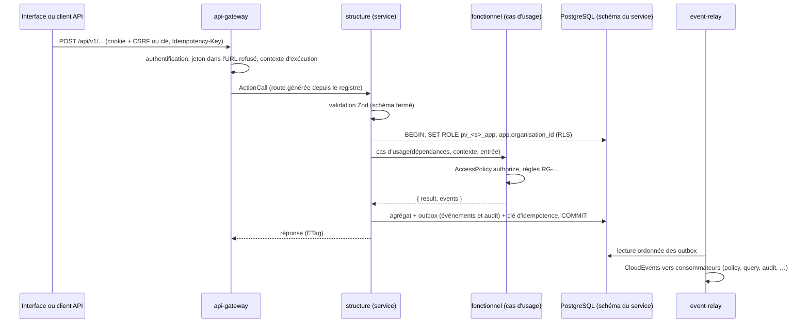

# Architecture du code

## Arborescence

```text
packages/kernel       identifiants typés, Result, ExecutionContext, ports communs, AccessPolicy
packages/contracts    catalogue des permissions, registre d'actions, types d'événements, client identity
packages/ops          configuration, journal catalogué, serveur HTTP (RFC 9457), base, migrateur,
                      secrets, chaîne d'écriture (outbox, idempotence, simulation), client HTTP sortant
                      (délai, reprises bornées, disjoncteur : seul moyen d'appeler un service voisin, RI-SRV-12)
packages/ui           façade DSFR (seul point d'import du système de design)
services/<s>/fonctionnel   couche basse : domaine, ports, cas d'usage (aucune entrée/sortie)
services/<s>/structure     couche moyenne : migrations, dépôts, actions, consommateurs, composition
apps/web              interface React (TanStack Router et Query) via packages/ui
deploy/units/pv-app   unité de déploiement : câblage de tous les services
deploy/compose        image OCI et composition
tools/                référence générée, tests de fumée
```

## Flux d'une écriture



## Services du MVP

| Service | Schéma | Rôle |
|---|---|---|
| `identity` | `identity` | Organisations, utilisateurs, sessions, MFA, invitations, rôles, clés API |
| `policy` | `policy` | Projection des attributions et décision d'autorisation locale |
| `portfolio` | `portfolio` | Projets et cycle de vie, équipes, purge |
| `workflow` | `workflow` | Packs méthodologiques, workflows versionnés immuables |
| `workitem` | `workitem` | Éléments, hiérarchie, transitions, rang, commentaires, historique |
| `query` | `query` | Backlog, board, recherche plein texte, journal d'activité |
| `audit` | `audit` | Journal d'audit chaîné et vérifiable |
| `event-relay` | `events` | Relais des outbox, lettres mortes |
| `api-gateway` | — | Routes générées, authentification, CSRF |

Chaque service est seul propriétaire de son schéma (RI-SRV-01) ; les données d'autres services lui parviennent par événements et sont conservées en projections locales.

## Commandes

| Commande | Effet |
|---|---|
| `pnpm install --frozen-lockfile` | Installation figée |
| `pnpm typecheck` | Types en mode strict (couche fonctionnelle vérifiée sans types Node) |
| `pnpm test` | Tests unitaires |
| `pnpm lint` | Lint et seuils de code |
| `pnpm reference` | Régénère `docs/reference/actions.md` |
| `pnpm build:web` | Construit l'interface |
| `docker compose -f deploy/compose/compose.yaml up --build` | Pile complète locale |
