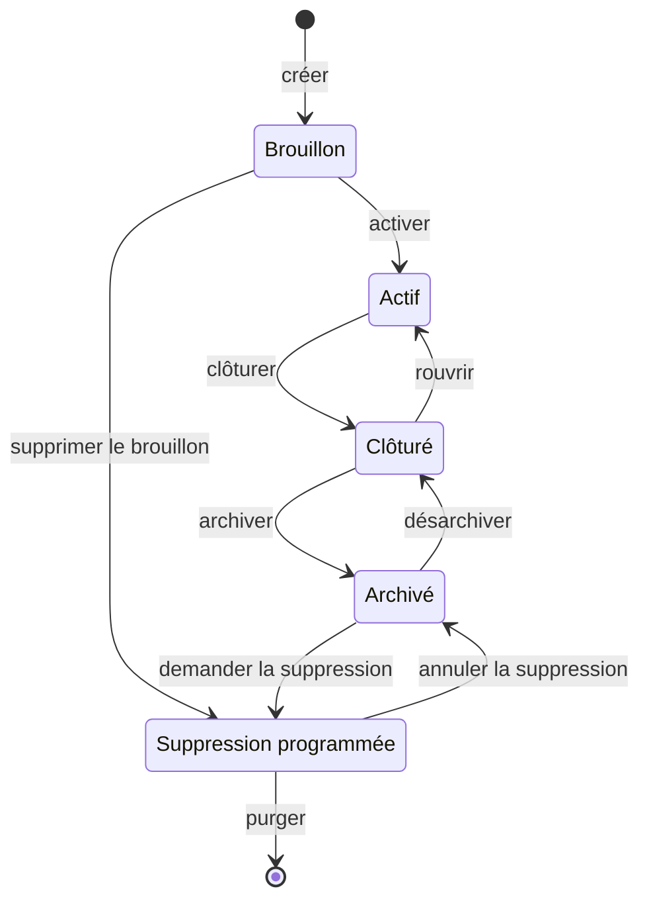
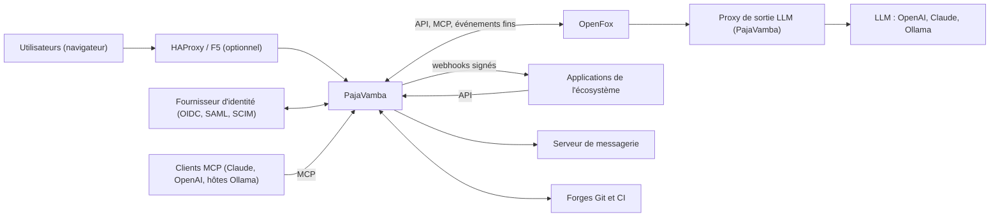
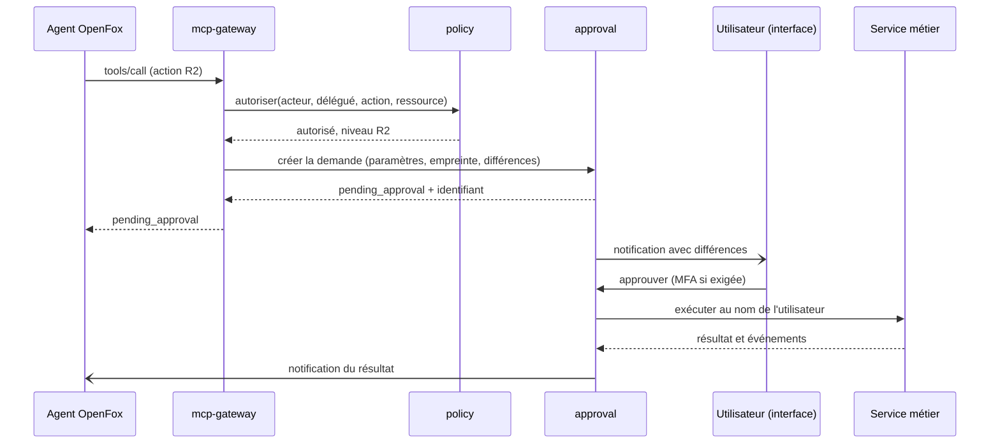
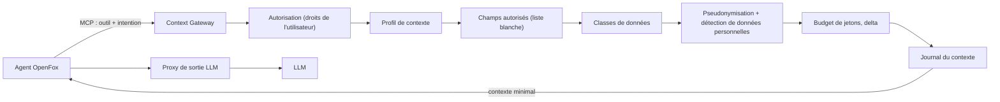

# PajaVamba — Spécifications techniques

| Élément | Valeur |
|---|---|
| Version du document | 0.1.0 |
| Date | 29/09/2026 |
| Statut | Référence de démarrage du développement |
| Document associé | `PajaVamba_Regles_Immuables.md` (prévaut en cas de divergence) |
| Langue | Français |
| Emplacement cible dans le dépôt | `docs/specifications/technique/specifications-techniques.md` |

## Sommaire

0. Objet, conventions et hypothèses
1. Vision, principes et référentiels
2. Architecture métier et processus
3. Architecture fonctionnelle et fonctionnalités
4. Architecture solution et répartition des services
5. Architecture technique
6. Données et champs
7. Rôles et habilitations
8. Modalités de connexion
9. Secrets, jetons, clés et identifiants
10. API
11. MCP
12. Séparation et imbrication avec OpenFox
13. Compatibilité LLM (OpenAI, Claude, Ollama)
14. Plugins et écosystème
15. Journalisation
16. Sécurité
17. Conformité réglementaire (RGAA, RGS, RGPD, RGI, IA)
18. Ergonomie, expérience utilisateur et thème DSFR
19. Codage, état de l'art et revue de code
20. Nommage
21. Documentation et manuels
22. Versionnement et livrables Windows, Linux, macOS
23. Dépôt GitHub, CI/CD et gouvernance
24. Plan de réalisation et définition de « terminé »
25. Points à confirmer
Annexes A à F

---

## 0. Objet, conventions et hypothèses

### 0.1 Objet

Ce document décrit ce qu'est PajaVamba et comment il doit être construit. Il constitue l'entrée de référence du développement : architecture métier, fonctionnelle, solution et technique, données, habilitations, connexion, secrets, API, MCP, plugins, journalisation, sécurité, conformité, ergonomie, codage, nommage, documentation, versionnement et livraison.

Les règles non négociables sont regroupées dans `PajaVamba_Regles_Immuables.md`. En cas de divergence entre les deux documents, les règles immuables prévalent.

### 0.2 Conventions de rédaction

| Terme | Signification |
|---|---|
| « doit » / « ne doit jamais » | Exigence obligatoire |
| « devrait » | Recommandation forte ; tout écart est justifié par une ADR |
| « peut » | Option |
| `EXG-<CAT>-<NNN>` | Exigence technique, identifiant stable jamais réutilisé |
| `RG-<DOM>-<NNN>` | Règle de gestion, identifiant stable jamais réutilisé |
| `ADR-<NNNN>` | Décision d'architecture |
| MVP / v1 / v2 | Phase de livraison d'une fonctionnalité |

Tous les exemples utilisent des valeurs fictives.

### 0.3 Hypothèses retenues pour le démarrage

Ces choix s'appliquent dès le premier commit. Leur modification passe par une ADR acceptée.

| # | Hypothèse |
|---|---|
| H01 | Identifiants de code en anglais ; commentaires, documentation, messages, libellés d'interface, messages d'erreur et noms de tests en français ; glossaire bilingue faisant le lien. |
| H02 | Noms des dossiers d'architecture en français : `structure/`, `fonctionnel/`, `domaine/`, `cas-usage/`, `ports/`. |
| H03 | Services développés dans un monorepo et déployés au démarrage en unités regroupant plusieurs services (§4.3), séparables sans modification de code. |
| H04 | Bus d'événements sur PostgreSQL (outbox transactionnel + relais), derrière un port remplaçable par un broker. |
| H05 | Une clé API active par utilisateur (fonctionnement de type Grist), sans expiration par défaut, avec plafond de durée imposable par l'organisation. |
| H06 | Clé de projet immuable. |
| H07 | Interface web React + Vite ; système de design DSFR, consommé uniquement via une façade de composants (`packages/ui`). |
| H08 | Dépôt public GitHub ; documentation publiée sur GitHub Pages. |
| H09 | Licence du cœur à déterminer (AGPL-3.0 ou Apache-2.0) ; SDK, contrats et outillage de plugins sous Apache-2.0. |
| H10 | Python exclu du code livré et de ses dépendances d'exécution ; des outils de CI tiers exécutés en conteneur (Semgrep, Schemathesis) sont admis. |
| H11 | PostgreSQL : version majeure supportée la plus récente au démarrage, figée par ADR. Node.js : LTS active, figée par ADR. Rust : édition 2024, toolchain stable épinglée (`rust-toolchain.toml`). |
| H12 | Aucune intelligence artificielle n'est implémentée dans PajaVamba : elle est entièrement déléguée à OpenFox. |

---

## 1. Vision, principes et référentiels

### 1.1 Vision

PajaVamba est une plateforme open source de gestion du travail et d'agilité à l'échelle. Elle réunit : gestion des éléments de travail, Scrum, Kanban, Scrumban, SAFe et modèles personnalisés, portefeuille, programmes, roadmap, dépendances, risques, capacité, workflows et références vers la connaissance projet.

PajaVamba est la **source de vérité** du travail. L'intelligence (recherche sémantique, synthèse, corrélation, agents) est fournie par **OpenFox**, système externe et indépendant, avec lequel PajaVamba communique uniquement par contrats.

PajaVamba n'est ni un fork de Jira, ni un fork de Taiga, ni un clone de SAFe. Il reprend l'ADN agile de Taiga, la richesse fonctionnelle de Jira et les concepts d'agilité à l'échelle de SAFe, dans une architecture moderne.

### 1.2 Principes directeurs

| # | Principe |
|---|---|
| P01 | OpenFox n'est pas forké et évolue indépendamment. |
| P02 | PajaVamba ne dépend jamais de l'implémentation interne d'OpenFox, uniquement de contrats d'intégration versionnés. |
| P03 | TypeScript par défaut, Rust par nécessité, PostgreSQL comme unique base de données. |
| P04 | Python n'est pas utilisé dans le produit. |
| P05 | Le WorkItem (élément de travail) est l'objet fondamental ; ses types sont configurables. |
| P06 | Les méthodologies sont des modèles configurables ; SAFe est natif mais non exclusif. |
| P07 | PajaVamba est la source de vérité ; OpenFox est la couche d'intelligence. |
| P08 | Toute action d'un agent respecte les permissions, les politiques, la validation humaine et l'audit de PajaVamba. |
| P09 | **Règle d'or** : ne jamais envoyer au LLM tout ce que l'on possède ; lui envoyer uniquement ce dont il a besoin, au moment où il en a besoin. |
| P10 | Architecture hexagonale, dépendances à sens unique, cœur métier pur. |
| P11 | Découpage en services fonctionnels et techniques communiquant uniquement par contrats. |
| P12 | Une action est définie une seule fois et exposée identiquement en interface, API et MCP. |
| P13 | Le code produit la documentation de l'état ; la documentation rédigée porte l'intention. |
| P14 | Sécurité, accessibilité et protection des données dès la conception et par défaut. |
| P15 | Aucune mise à jour ne remet à blanc les données ni l'historique d'un projet. |

### 1.3 Hors périmètre

| Élément | Raison |
|---|---|
| LLM, RAG, embeddings, mémoire d'agent | Délégués à OpenFox |
| Fournisseur d'identité maison | Délégué à un IdP (Authentik, Keycloak, Entra ID, etc.) ; seuls les comptes locaux et le serveur d'autorisation OAuth de l'API sont portés, via des bibliothèques éprouvées |
| Wiki complet | Références (`KnowledgeRef`) vers des outils de connaissance existants |
| Évaluation individuelle de la performance, classement de personnes | Interdit (RGPD, règlement européen sur l'IA, éthique) |
| Solution Train SAFe | Hors périmètre initial |
| GraphQL | Non retenu ; REST filtrable et événements suffisent |
| Application mobile native | PWA en v2 |
| Facturation, gestion commerciale | Hors sujet |

### 1.4 Référentiels applicables

| Domaine | Référentiel |
|---|---|
| Accessibilité | RGAA 4.1.2 (ou version en vigueur), EN 301 549, WCAG 2.1 niveau AA ; critères WCAG 2.2 appliqués par anticipation lorsque cités |
| Sécurité | RGS v2.0, recommandations ANSSI (authentification, TLS, mécanismes cryptographiques, journalisation), OWASP ASVS niveau 2 (version en vigueur), OWASP Top 10, OWASP Top 10 pour les applications LLM |
| Données personnelles | RGPD, loi Informatique et Libertés, recommandations CNIL (journalisation, mots de passe, sécurité) |
| Interopérabilité | RGI v2.0 |
| Design | Système de Design de l'État (DSFR) |
| Intelligence artificielle | Règlement européen sur l'IA |
| Contrats | OpenAPI 3.1, AsyncAPI 3, JSON Schema 2020-12, CloudEvents 1.0, Model Context Protocol, OAuth 2.1, OpenID Connect, SAML 2.0, SCIM 2.0, RFC 9457, Standard Webhooks |
| Versionnement | SemVer 2.0, Conventional Commits |

---

## 2. Architecture métier et processus

### 2.1 Acteurs

| Acteur | Description | Rôle(s) par défaut |
|---|---|---|
| Membre d'équipe | Réalise le travail | Contributeur |
| Scrum Master / coach | Anime l'équipe, facilite le flux | Scrum Master |
| Product Owner | Gère le backlog et la valeur | Product Owner |
| Responsable de projet | Configure et administre le projet | Administrateur de projet |
| RTE (Release Train Engineer) | Anime le train et le PI | RTE |
| Product Manager | Porte les features et la vision programme | Product Manager |
| Responsable de portefeuille | Arbitre les investissements | Responsable de portefeuille |
| Administrateur d'organisation | Gère accès, SSO, politiques | Administrateur |
| Propriétaire d'organisation | Administrateur avec droits de suppression et de transfert | Propriétaire |
| Auditeur | Contrôle, lecture du journal d'audit | Auditeur |
| Lecteur | Consultation | Lecteur |
| Invité externe | Partenaire, accès limité et temporaire | Invité |
| Exploitant / support | Exploite l'instance | Rôles d'exploitation (hors organisation) |
| Agent OpenFox | Agit au nom d'un utilisateur | Délégation (§7.8) |
| Application / plugin | Intégration de l'écosystème | Compte de service ou installation de plugin |

### 2.2 Carte des capacités métier

| Domaine | Capacités |
|---|---|
| Organiser | Organisations, portefeuilles, value streams, trains (ART), produits, projets, équipes, appartenances |
| Planifier | Backlog, priorisation (WSJF), estimation, sprints, PI, capacité, releases, roadmap |
| Exécuter | Éléments de travail, boards, workflows, commentaires, pièces jointes, relations |
| Coordonner | Dépendances, risques (ROAM), objectifs de PI, vote de confiance |
| Piloter | Rapports, métriques de flux, prédictibilité, tableaux de bord |
| Gouverner | Rôles, habilitations, validations humaines, audit, politiques |
| Intégrer | API, MCP, webhooks, plugins, import et export |
| Assister (via OpenFox) | Recherche, synthèse, suggestions, actions déléguées |
| Clôturer | Clôture, archivage, suppression, réversibilité des données |

### 2.3 Niveaux d'organisation

```text
Organisation (locataire, isolation des données)
└─ Portefeuille
   └─ Value stream (flux de valeur)
      └─ Train (ART) / Programme
         └─ Projet ──── Équipes
            └─ Itérations (PI → sprints) ou flux Kanban
               └─ Éléments de travail (hiérarchie configurable)
```

Un projet peut exister sans portefeuille ni train (usage Scrum ou Kanban simple). Une équipe peut travailler sur plusieurs projets ; un projet peut mobiliser plusieurs équipes.

### 2.4 Cycle de vie du projet



| Transition | Permission (niveau) | Conditions | Effets |
|---|---|---|---|
| Créer | `project:create` (R1) | Clé unique et valide ; nom renseigné | Projet en brouillon, visible des seuls administrateurs du projet et membres invités |
| Activer | `project:activate` (R1) | Modèle méthodologique choisi ; workflow publié pour chaque type ; au moins une équipe ou un membre | Visible selon sa visibilité ; notifications actives ; événement `pv.portfolio.project.activated.v1` |
| Supprimer le brouillon | `project:delete` (R3) | Brouillon | Suppression programmée avec délai de grâce réduit (7 jours) |
| Clôturer | `project:close` (R2) | Aucun élément non terminé (terminé, annulé ou transféré) ; aucune itération active ; dépendances résolues, annulées ou transférées ; risques clos ou transférés ; aucune demande de validation en attente ; bilan de clôture saisi | Lecture seule ; bilan et métriques figés ; jetons courts du projet révoqués ; webhooks, automatisations et comptes de service suspendus |
| Rouvrir | `project:reopen` (R2) | Dans les 90 jours suivant la clôture (configurable) ; justification | Projet actif ; webhooks et automatisations réactivés après confirmation ; comptes de service à réactiver manuellement |
| Archiver | `project:archive` (R2) | Projet clôturé | Lecture seule totale ; masqué des listes par défaut ; API et MCP limités aux lectures (R0) ; installations de plugins retirées du projet ; OpenFox notifié et tenu de purger ses données dérivées |
| Désarchiver | `project:unarchive` (R3) | Administrateur d'organisation | Retour à l'état clôturé |
| Demander la suppression | `project:delete` (R3) | Administrateur d'organisation ; MFA récente ; export proposé | Délai de grâce de 30 jours ; projet inaccessible sauf aux administrateurs |
| Annuler la suppression | `project:delete` (R3) | Avant l'échéance | Retour à l'état archivé |
| Purger | Système | Échéance atteinte | Suppression physique des données, pièces jointes, index et vues ; audit conservé avec références pseudonymisées ; événement de purge transmis à OpenFox et aux plugins |

L'assistant de clôture liste les points bloquants et propose des actions groupées (terminer, annuler, transférer vers un autre projet). Aucune clôture forcée n'est possible.

La conservation des projets archivés suit la politique de l'organisation (défaut : aucune purge automatique, alerte à 5 ans).

### 2.5 Processus métier

| # | Processus | Déclencheur | Acteurs | Étapes principales | Événements clés |
|---|---|---|---|---|---|
| P01 | Mise en service d'une organisation | Installation | Exploitant, propriétaire | Initialisation de l'instance ; création du propriétaire (compte local ou IdP) ; configuration SSO ; politiques (MFA, sessions, clés, IA) ; création des groupes | `organization.created`, `identity_provider.configured` |
| P02 | Arrivée d'un utilisateur | SCIM, première connexion SSO, invitation | IdP, administrateur | Création ou provisioning ; rattachement groupes → rôles et équipes ; enrôlement MFA ; notification de bienvenue | `user.provisioned`, `membership.activated` |
| P03 | Création d'un projet | Demande | Responsable de projet | Brouillon ; choix du modèle ; clé ; visibilité ; équipes ; rôles ; workflows ; champs ; activation | `project.created`, `project.activated` |
| P04 | Alimentation du backlog | Continu | PO, équipe | Création ou import ; hiérarchie ; critères d'acceptation ; estimation ; priorisation (rang, WSJF) | `work_item.created`, `work_item.ranked`, `work_item.estimated` |
| P05 | Cycle de sprint | Calendrier | SM, PO, équipe | Planification (capacité, engagement) ; démarrage ; suivi du board ; revue ; rétrospective (hors outil, lien possible) ; clôture avec report explicite des éléments non terminés ; calcul de la vélocité | `iteration.started`, `iteration.closed` |
| P06 | Flux Kanban | Continu | Équipe | Limites WIP ; tirage ; suivi du cycle time et du flux cumulé | `work_item.transitioned`, `wip_limit.exceeded` |
| P07 | PI Planning | Calendrier du train | RTE, PM, équipes | Préparation des features ; capacité des équipes ; tableau programme ; dépendances ; risques ROAM ; objectifs de PI (engagés, non engagés, valeur planifiée) ; vote de confiance ; engagement | `pi.planning_started`, `pi_objective.committed`, `confidence_vote.closed` |
| P08 | Kanban de portefeuille | Idée | Responsable de portefeuille | Funnel → Revue → Analyse → Backlog portefeuille → Réalisation → Terminé ; business case ; WSJF ; budgets par value stream | `work_item.transitioned` (niveau portefeuille) |
| P09 | Gestion des dépendances | Identification | Équipes, RTE | Création ; responsable ; échéance ; suivi ; résolution ; alertes de retard | `dependency.created`, `dependency.resolved`, `dependency.at_risk` |
| P10 | Gestion des risques | Identification | Tous | Création ; probabilité × impact ; ROAM ; atténuation ; clôture | `risk.created`, `risk.roamed`, `risk.closed` |
| P11 | Action assistée par l'IA | Demande utilisateur | Utilisateur, agent OpenFox | Intention ; contexte minimal ; proposition ; prévisualisation ; validation humaine si requise ; exécution au nom de l'utilisateur ; audit ; annulation possible | `approval.requested`, `approval.decided`, `agent_action.executed` |
| P12 | Installation d'un plugin | Besoin d'intégration | Administrateur | Catalogue ; lecture du manifeste ; consentement (permissions, classes de données) ; configuration ; activation par projet ; supervision ; désinstallation | `plugin.installed`, `plugin.consented`, `plugin.disabled` |
| P13 | Clôture et archivage | Fin de projet | Responsable de projet, administrateur | Assistant de clôture ; bilan ; clôture ; archivage ; conservation ; suppression éventuelle | `project.closed`, `project.archived`, `project.purged` |
| P14 | Mobilité et départ | IdP, RH, administrateur | Administrateur | Changement d'équipe ou de rôle ; désactivation ; révocation immédiate (sessions, clés, jetons) ; transfert des éléments assignés ; pseudonymisation différée | `user.deactivated`, `api_key.revoked` |
| P15 | Demande RGPD | Personne concernée | DPO, administrateur | Export des données ; rectification ; effacement (pseudonymisation dans l'historique) | `data_subject_request.completed` |
| P16 | Incident et support | Alerte, signalement | Support, exploitant | Code d'erreur ; runbook ; activation de debug limitée et justifiée ; résolution ; retour d'expérience | `debug.activated`, `debug.expired` |

Chaque processus fait l'objet d'une page de la documentation fonctionnelle et d'au moins un scénario Gherkin exécutable.

### 2.6 Règles de gestion initiales

Le catalogue est tenu dans le code (registre des règles, §19.9) et publié automatiquement. Liste initiale :

| Identifiant | Règle |
|---|---|
| RG-ORG-001 | Une organisation a toujours au moins un propriétaire actif. |
| RG-ORG-002 | Le slug d'organisation est unique dans l'instance (`^[a-z0-9-]{3,40}$`). |
| RG-PRJ-001 | La clé de projet est unique dans l'organisation, au format `^[A-Z][A-Z0-9]{1,9}$`, et immuable. |
| RG-PRJ-002 | L'identifiant public d'un projet est immuable et jamais réattribué. |
| RG-PRJ-003 | Seules les transitions du cycle de vie décrites au §2.4 sont possibles. |
| RG-PRJ-004 | Un projet clôturé, archivé ou en suppression programmée est en lecture seule. |
| RG-PRJ-005 | La clôture est refusée tant qu'une condition du §2.4 n'est pas remplie. |
| RG-PRJ-006 | La réouverture n'est possible que dans le délai configuré (défaut : 90 jours). |
| RG-PRJ-007 | La purge n'intervient qu'à l'échéance du délai de grâce (défaut : 30 jours ; 7 jours pour un brouillon). |
| RG-PRJ-008 | Un projet classé sensible n'accepte pas les clés API personnelles (seuls les comptes de service et les jetons courts sont admis), sauf politique contraire explicite. |
| RG-WI-001 | La clé d'un élément est `<clé du projet>-<n>`, `n` séquentiel par projet, jamais réutilisé. |
| RG-WI-002 | Le parent d'un élément doit être d'un type autorisé par la hiérarchie en vigueur. |
| RG-WI-003 | La hiérarchie ne contient jamais de cycle. |
| RG-WI-004 | Un élément appartient à un seul projet ; son déplacement crée une nouvelle clé, l'ancienne redirige vers la nouvelle. |
| RG-WI-005 | Un changement de statut suit une transition de la version de workflow rattachée à l'élément. |
| RG-WI-006 | Les champs personnalisés sont validés selon leur définition ; un champ obligatoire est requis à la création. |
| RG-WI-007 | Un élément confidentiel n'est visible qu'avec la permission `work_item:read_restricted`. |
| RG-WI-008 | Un élément supprimé reste 30 jours en corbeille avant purge. |
| RG-WI-009 | Toute valeur produite ou modifiée par un agent est marquée comme telle (provenance). |
| RG-WF-001 | Une version de workflow publiée est immuable. |
| RG-WF-002 | Chaque état appartient à une catégorie : à faire, en cours, terminé. |
| RG-WF-003 | La migration d'éléments vers une nouvelle version de workflow exige un mapping explicite des états. |
| RG-WF-004 | Le dépassement d'une limite WIP est signalé ; il est bloquant si la colonne est configurée ainsi. |
| RG-WF-005 | Une transition marquée « validation requise » passe toujours par une demande de validation humaine. |
| RG-PLAN-001 | Les sprints d'une même équipe ne se chevauchent pas ; leurs dates sont exprimées dans le fuseau de l'équipe. |
| RG-PLAN-002 | Une équipe a au plus un sprint actif. |
| RG-PLAN-003 | À la clôture d'un sprint, chaque élément non terminé est explicitement reporté au sprint suivant ou renvoyé au backlog. |
| RG-PLAN-004 | Une itération d'innovation et de planification n'est pas comptée dans la capacité de livraison planifiée. |
| RG-PLAN-005 | Capacité d'une équipe = Σ (jours disponibles × allocation × facteur de focus) de ses membres. |
| RG-PLAN-006 | WSJF = (valeur métier + criticité temporelle + réduction du risque ou opportunité) / taille, sur une échelle de Fibonacci relative. |
| RG-PLAN-007 | Les sprints d'un PI sont inclus dans les dates du PI. |
| RG-DEP-001 | Une dépendance a une source, une cible, un type, un statut, un responsable et une échéance. |
| RG-DEP-002 | Une dépendance ne peut relier un objet à lui-même ; les cycles sont signalés. |
| RG-DEP-003 | Une dépendance ouverte dont l'échéance dépasse la fin de l'itération de l'élément dépendant est signalée « à risque ». |
| RG-RSK-001 | Sévérité = probabilité (1-5) × impact (1-5). |
| RG-RSK-002 | Un risque de PI doit avoir un statut ROAM avant la fin du PI Planning. |
| RG-OBJ-001 | Valeur métier planifiée d'un objectif de PI : 1 à 10 ; réalisée : 0 à 10. |
| RG-OBJ-002 | Prédictibilité = valeur réalisée (objectifs engagés et non engagés) / valeur planifiée (objectifs engagés). |
| RG-OBJ-003 | Le vote de confiance (1 à 5) est individuel mais seule la distribution agrégée par équipe et par train est conservée ; il n'est jamais délégable à un agent. |
| RG-APR-001 | Un agent ou un plugin ne peut jamais approuver une demande de validation. |
| RG-APR-002 | Une demande de validation est liée à l'empreinte exacte de ses paramètres ; toute modification crée une nouvelle demande. |
| RG-APR-003 | Une demande de validation expire après 24 heures (configurable). |
| RG-IAM-001 | Droits effectifs d'un agent ou d'un plugin agissant pour un utilisateur = droits de l'utilisateur ∩ droits de l'agent ou du plugin. |
| RG-IAM-002 | Un refus explicite prévaut sur toute autorisation. |
| RG-IAM-003 | Les actions R3 ne sont jamais accessibles par clé, jeton, agent ou plugin. |
| RG-IAM-004 | Un accès invité a une expiration obligatoire (défaut : 90 jours, maximum : 180 jours). |
| RG-IAM-005 | La désactivation d'un utilisateur révoque immédiatement ses sessions, sa clé et ses jetons. |
| RG-IA-001 | Aucune donnée de classe S ou X n'est transmise à un fournisseur LLM non autorisé pour cette classe. |
| RG-IA-002 | Aucune métrique ni évaluation individuelle de performance n'est calculée ni affichée. |
| RG-NOT-001 | Les notifications de sécurité ne sont pas désactivables. |
| RG-PLG-001 | Un plugin n'obtient jamais plus que les permissions et classes de données consenties ; toute augmentation exige un nouveau consentement. |

---

## 3. Architecture fonctionnelle et fonctionnalités

### 3.1 Blocs fonctionnels

| Bloc | Service propriétaire | Contenu |
|---|---|---|
| Identité et accès | `identity` | Organisations, utilisateurs, groupes, rôles, attributions, IdP, sessions, clés, jetons, comptes de service |
| Structure organisationnelle | `portfolio` | Portefeuilles, value streams, trains, produits, projets (cycle de vie), équipes |
| Travail | `workitem` | Types, hiérarchies, éléments, champs personnalisés, relations, commentaires, pièces jointes, étiquettes |
| Processus | `workflow` | Workflows versionnés, états, transitions, automatisations, modèles méthodologiques |
| Planification | `planning` | Itérations (sprints, PI), releases, capacité, boards, roadmap |
| Coordination | `dependency-risk` | Dépendances, risques, objectifs de PI, votes de confiance |
| Gouvernance des actions | `approval` | Demandes de validation humaine, exécution différée |
| Information | `notification` | Préférences, notifications |
| Écosystème | `extension` | Plugins, installations, consentements, webhooks, liens externes |
| Restitution | `query` | Vues consolidées, recherche, journal d'activité, rapports |

### 3.2 Fonctionnalités et phasage

| Domaine | Fonctionnalité | Phase |
|---|---|---|
| Connexion | Comptes locaux (argon2id), OpenID Connect, MFA (TOTP, WebAuthn/passkeys), sessions, déconnexion | MVP |
| Connexion | SAML 2.0, provisioning SCIM 2.0, déconnexion back-channel | v1 |
| Accès | Organisations, appartenances, groupes, rôles par défaut et personnalisés, attributions par portée, refus explicites | MVP |
| Accès | Clé API personnelle, jetons courts par projet, comptes de service de projet | MVP |
| Accès | Élévation temporaire, campagnes de revue des accès, rapport d'accès | v1 |
| Projets | Création, configuration, cycle de vie complet (brouillon → purge), assistant de clôture, export complet | MVP |
| Équipes | Équipes, appartenances, allocation, fuseau, jours travaillés | MVP |
| Éléments | Création, édition, types, hiérarchie configurable, champs personnalisés, étiquettes, commentaires, mentions, observateurs, pièces jointes, relations, historique, corbeille, confidentialité | MVP |
| Éléments | Opérations en masse (plafonnées), déplacement entre projets | MVP |
| Workflows | Éditeur, états et catégories, transitions, conditions déclaratives, permissions, validation requise, versions | MVP |
| Workflows | Automatisations par règles, validateurs et post-fonctions de plugins | v1 |
| Planification | Backlog ordonné, estimation, sprints, boards Scrum et Kanban, limites WIP | MVP |
| Planification | Roadmap et timeline, releases avancées, suivi du temps | v1 |
| Méthodes | Modèles Scrum, Kanban, Scrumban, Personnalisé | MVP |
| Méthodes | Modèle SAFe : PI, PI Planning, objectifs, vote de confiance, WSJF, capacité détaillée, ROAM | v1 |
| Méthodes | Kanban de portefeuille avancé, budgets par value stream, business case, garde-fous, OKR | v2 |
| Coordination | Dépendances (vue tabulaire et graphe), risques ROAM | v1 |
| Recherche | Filtres structurés, recherche plein texte (français) | MVP |
| Recherche | Langage de requête PVQL, filtres enregistrés | v1 |
| Recherche | Recherche sémantique via OpenFox (activation par organisation) | v1 |
| Rapports | Burndown, burnup, vélocité d'équipe | MVP |
| Rapports | Flux cumulé, cycle time, lead time, métriques de flux, prédictibilité, tableaux de bord | v1 |
| Notifications | In-app et email, préférences, résumé périodique | MVP |
| Intégration | API REST v1, OpenAPI, Swagger UI, webhooks, flux SSE, SDK TypeScript et Rust | MVP |
| Intégration | Serveur MCP (outils générés, validation humaine) | MVP |
| Intégration | Intégrations Git (GitHub, GitLab, Forgejo) et CI | v1 |
| Import/export | Import CSV, export CSV/JSON, export complet de projet | MVP |
| Import/export | Import Jira et Taiga, export ODS et XLSX | v1 |
| Plugins | Applications externes OAuth | MVP |
| Plugins | Extensions d'interface (iframe), actions de plugins | v1 |
| Plugins | Extensions hébergées WASM, catalogue public | v2 |
| OpenFox | Adaptateur, Context Gateway, profils de contexte, proxy de sortie LLM, prévisualisation, validation humaine, annulation | MVP |
| Administration | Console d'organisation et de projet, politiques, journal d'activité, audit | MVP |
| Exploitation | Santé, métriques, niveaux de journalisation modifiables à chaud, debug limité | MVP |
| Interface | DSFR, thème clair et sombre, accessibilité RGAA, raccourcis clavier | MVP |
| Interface | PWA hors ligne, anglais | v2 |
| Livraison | Archives portables Windows, Linux, macOS ; images OCI ; compose | MVP |
| Livraison | Chart Helm | v1 |

### 3.3 Modèles méthodologiques (packs)

Un pack est une définition déclarative versionnée (fichier TypeScript validé par schéma, exporté en JSON). Il regroupe : types d'éléments, hiérarchie, workflows, champs, boards, rapports et correspondance des rôles. Un projet référence un pack et sa version ; il peut ensuite personnaliser sa configuration.

| Pack | Types par défaut (niveau hiérarchique) |
|---|---|
| Scrum | Epic (1) → User story, Anomalie (2) → Tâche (3) |
| Kanban | Epic (1) → Élément, Anomalie (2) |
| Scrumban | Identique à Kanban, avec sprints optionnels |
| SAFe | Epic de portefeuille (1) → Capability (2, optionnel) → Feature (3) → User story, Enabler, Anomalie (4) → Tâche (5) |
| Personnalisé | Défini par l'organisation |

Workflows par défaut :

| Type | États (catégorie) |
|---|---|
| Éléments d'équipe | Backlog (à faire) → Prêt (à faire) → En cours (en cours) → En revue (en cours) → En validation (en cours) → Terminé (terminé) ; Annulé (terminé) |
| Epic | Idée → Analyse → Revue portefeuille → Approuvé → Réalisation → Terminé ; Annulé |
| Anomalie | Nouveau → Qualifié → En cours → En revue → Résolu → Clos ; Rejeté |

Les libellés des types et des états sont modifiables par projet ; leurs clés techniques ne le sont pas.

### 3.4 Hiérarchie configurable

- Une hiérarchie est une liste ordonnée de niveaux (profondeur maximale : 7) ; chaque niveau liste les types autorisés et les types parents admis.
- La hiérarchie est une configuration versionnée, jamais du code métier figé.
- Le chemin de chaque élément est matérialisé (`ltree`) pour les requêtes d'arbre.
- Un élément peut ne pas avoir de parent, sauf si le type l'exige.

### 3.5 Moteur de workflow

- États avec catégorie ; limites WIP ; ordre d'affichage.
- Transitions depuis un état ou depuis tout état, avec : permission requise, conditions déclaratives (champ renseigné, rôle, sous-éléments terminés, dépendances résolues), validateurs, post-fonctions (assignation, mise à jour de champ, notification), écran de saisie, validation humaine requise.
- Versions : brouillon → publiée (immuable) → retirée. Chaque élément référence la version en vigueur lors de sa création ; migration explicite avec correspondance des états.
- Automatisations (v1) : déclencheur (type d'événement), conditions, actions, exécutées sous un compte de service du projet, soumises aux permissions et à l'audit.
- Les conditions et automatisations sont exprimées dans un langage déclaratif validé par schéma : aucun code arbitraire n'est exécuté.

### 3.6 SAFe (v1)

| Fonction | Contenu |
|---|---|
| PI | Itération de niveau train contenant des sprints (en général 4 sprints + 1 itération d'innovation et de planification) |
| PI Planning | Tableau features × équipes × itérations, dépendances visibles, capacité par équipe, charge planifiée |
| Objectifs de PI | Engagés et non engagés, valeur métier planifiée et réalisée |
| Vote de confiance | Par équipe et par train, distribution agrégée uniquement |
| ROAM | Resolved, Owned, Accepted, Mitigated sur les risques du PI |
| WSJF | Cost of Delay / Job Size, champs dédiés, score calculé, échelle de Fibonacci relative |
| Capacité | Membres × jours disponibles × allocation × facteur de focus ; vélocité historique proposée comme repère |
| Kanban de portefeuille (v2) | Funnel, Revue, Analyse, Backlog portefeuille, Réalisation, Terminé ; business case ; budgets ; garde-fous |
| Métriques | Prédictibilité, métriques de flux (durée, vélocité, charge, efficacité, distribution, prédictibilité) |

SAFe est une marque déposée de Scaled Agile, Inc. L'usage du nom et des contenus est à vérifier ; la terminologie de l'interface reste configurable (§25).

### 3.7 Rapports et métriques

- Niveaux : équipe, projet, train, portefeuille. **Jamais au niveau d'une personne.**
- Chaque graphique est accompagné d'une alternative tabulaire accessible et d'un export CSV.
- Les rapports sont calculés dans PajaVamba (vues de `query`) ; l'IA n'est jamais utilisée pour calculer un chiffre.

### 3.8 Notifications

- Canaux : in-app, email (MVP) ; webhooks pour les intégrations.
- Déclencheurs : assignation, mention, changement d'état d'un élément observé, demande de validation, échéance de dépendance, fin de sprint, événements de sécurité.
- Préférences par utilisateur (canal, fréquence immédiate ou résumé) ; notifications de sécurité non désactivables.
- Contenu minimal : clé et titre de l'élément, jamais la description ni les commentaires dans un email.

### 3.9 Import, export et réversibilité

- Export complet de projet : archive ZIP contenant un JSON versionné et documenté, les pièces jointes et un manifeste d'intégrité (SHA-256).
- Export tabulaire : CSV (RFC 4180, UTF-8), JSON ; ODS et XLSX en v1.
- Import CSV (MVP), Jira et Taiga (v1) : correspondance explicite (types, workflows, champs, utilisateurs, pièces jointes, historique), mode simulation, rapport de correspondance, import idempotent et reprenable.

### 3.10 Fonctionnalités assistées par l'IA (fournies par OpenFox)

| Fonctionnalité | Profil de contexte (§12.3) | Autonomie par défaut |
|---|---|---|
| Recherche en langage naturel | `search_assist` | Lecture |
| Synthèse de sprint | `sprint_digest` | Lecture |
| Détection de risques de dépassement | `sprint_risk_review` | Lecture |
| Analyse du graphe de dépendances | `dependency_analysis` | Lecture |
| Reformulation de critères d'acceptation | `story_refinement` | Proposition |
| Décomposition d'un élément | `story_split` | Proposition |
| Préparation de PI Planning | `pi_preparation` | Proposition |
| Actions déléguées (créer, transitionner, assigner…) | selon l'action | Selon la matrice d'autonomie (§12.6) |

---

## 4. Architecture solution et répartition des services

### 4.1 Vue de contexte



### 4.2 Services

Chaque service fonctionnel suit l'architecture hexagonale (§5.3), possède son schéma PostgreSQL et publie ses événements. Aucun service n'accède au schéma d'un autre. Les services techniques ne contiennent aucune règle métier et ne sont jamais propriétaires de données métier.

**Services fonctionnels** :

| Service | Langage | Schéma | Responsabilités | Événements émis (exemples) |
|---|---|---|---|---|
| `identity` | TS | `identity` | Organisations, utilisateurs, appartenances, groupes, rôles, attributions, IdP, MFA, sessions, clés API, jetons courts, comptes de service, serveur d'autorisation OAuth | `user.provisioned`, `role.assigned`, `api_key.revoked` |
| `portfolio` | TS | `portfolio` | Portefeuilles, value streams, trains, produits, projets et cycle de vie, équipes, appartenances aux équipes | `project.created`, `project.closed`, `team.member_added` |
| `workitem` | TS | `workitem` | Types, hiérarchies, éléments, champs personnalisés, relations, commentaires, métadonnées de pièces jointes, étiquettes, observateurs, références de connaissance | `work_item.created`, `work_item.updated`, `comment.added` |
| `workflow` | TS | `workflow` | Workflows et versions, états, transitions, automatisations, packs méthodologiques ; évaluation des transitions | `workflow.published`, `automation.executed` |
| `planning` | TS | `planning` | Itérations, releases, capacité, boards, roadmap | `iteration.started`, `iteration.closed` |
| `dependency-risk` | TS | `dependency_risk` | Dépendances, risques, objectifs de PI, votes de confiance agrégés | `dependency.created`, `risk.roamed` |
| `approval` | TS | `approval` | Demandes de validation, exécution différée au nom de l'utilisateur | `approval.requested`, `approval.decided` |
| `notification` | TS | `notification` | Préférences, règles, notifications in-app | `notification.created` |
| `extension` | TS | `extension` | Catalogue, installations, consentements, configuration, stockage clé-valeur des plugins, abonnements webhooks, liens externes | `plugin.installed`, `plugin.disabled` |
| `query` | TS | `query` | Vues de lecture consolidées, recherche plein texte, journal d'activité (niveau fonctionnel), rapports | — (consommateur) |

**Services techniques** :

| Service | Langage | Schéma | Responsabilités |
|---|---|---|---|
| `api-gateway` | TS | — | Point d'entrée HTTP : authentification (vérification via `identity`), limitation de débit, routage, agrégation pour l'interface, CORS, en-têtes de sécurité |
| `mcp-gateway` | TS | — | Serveur MCP : outils générés depuis le registre d'actions, liste dynamique, découverte progressive |
| `policy` | Rust | `policy` | Évaluation RBAC/ABAC (Cedar), référence des politiques ; bibliothèque WASM pour évaluation locale dans les services TS |
| `context-gateway` | Rust | `context` | Règle d'or : profils, minimisation, pseudonymisation, budget, journal du contexte |
| `llm-egress-proxy` | Rust | `egress` | Dernier contrôle avant le LLM, détention des clés fournisseurs, routage par sensibilité |
| `openfox-adapter` | TS | — | Seul composant connaissant OpenFox ; traduction des contrats ; aucun état métier |
| `event-relay` | TS | `events` | Lecture des outbox, distribution, reprises, lettres mortes, rejeu |
| `audit` | TS | `audit` | Journal d'audit chaîné et ancré |
| `realtime` | TS | — | WebSocket, diffusion de signaux d'invalidation filtrés par les droits |
| `delivery` | TS | `delivery` | Emails, webhooks sortants signés (reprises, protection SSRF) |
| `integration` | TS | `integration` | Git, CI, webhooks entrants, connecteurs |
| `import` | TS | `import` | Imports Jira, Taiga, CSV |
| `files` | TS | `files` | Pièces jointes : stockage compatible S3 ou système de fichiers, contrôle de type, antivirus optionnel |
| `plugin-host` (v2) | Rust | — | Exécution des extensions WASM en bac à sable |

**Composants Rust transverses** : `pv-pii` (détection de données personnelles, partagé par `context-gateway` et `llm-egress-proxy`), `pv-audit-verify` (vérification de la chaîne d'audit), `pv-supervisor` (commande `pajavamba` du mode portable), `pv-mcp-bridge` (pont stdio ↔ HTTP pour clients MCP locaux).

### 4.3 Unités de déploiement initiales

| Unité | Services | Processus |
|---|---|---|
| `pv-edge` | `api-gateway`, `mcp-gateway`, `realtime` | Node.js |
| `pv-core` | `identity`, `portfolio`, `workitem`, `workflow`, `planning`, `dependency-risk`, `approval`, `notification`, `extension` | Node.js |
| `pv-read` | `query` | Node.js |
| `pv-async` | `event-relay`, `audit`, `delivery`, `integration`, `import`, `files`, `openfox-adapter` | Node.js |
| `pv-policy` | `policy` | Rust |
| `pv-ai-guard` | `context-gateway`, `llm-egress-proxy` | Rust (deux binaires) |
| `pv-db` | PostgreSQL (+ PgBouncer en topologie serveur) | — |
| `apps/web` | Interface compilée (fichiers statiques servis par `pv-edge` ou le reverse proxy) | — |

Règles :

- Le regroupement est une configuration de déploiement, jamais une dépendance de code.
- Au sein d'une unité, chaque service garde ses routes, son schéma, son rôle PostgreSQL, son pool de connexions et ses files.
- Les appels entre services d'une même unité passent par le client généré du contrat, avec un transport en mémoire qui sérialise les messages : le contrat reste identique à celui d'un appel réseau.
- Toute unité peut être scindée ou répliquée selon la charge mesurée.

### 4.4 Communication

- **Synchrone** (HTTP JSON, contrat OpenAPI interne) uniquement lorsqu'une réponse immédiate est requise. **Au plus un saut synchrone** derrière la passerelle ; aucune chaîne de services.
- **Asynchrone** par événements pour tout le reste : outbox transactionnel par service, relais, consommateurs idempotents, ordre garanti par agrégat.
- **Aucune transaction distribuée** : les traitements multi-services sont des sagas avec compensation.
- **Aucun import de code** entre services : uniquement `packages/kernel` et `packages/contracts`.

### 4.5 Données

- Un cluster PostgreSQL au démarrage, **un schéma par service**, un rôle d'exécution et un rôle de migration par service.
- Aucune clé étrangère ni jointure entre schémas ; les références inter-services sont des identifiants.
- `organisation_id` sur toute table métier, avec Row-Level Security forcée.
- CQRS léger : les services d'écriture publient des événements ; `query` construit les vues consolidées (jointures inter-contextes précalculées).
- Réplicas de lecture pour `query` ; PgBouncer ; partitionnement temporel des tables volumineuses (outbox, audit, journal d'activité).
- Évolution possible vers une base dédiée par organisation, sans changement de code métier.

### 4.6 Prévention des goulots d'étranglement

| Risque | Réponse |
|---|---|
| Autorisation à chaque requête | Cedar compilé en WASM et évalué localement ; cache de décisions invalidé par événements ; autorisation par lot ; `policy` reste la référence |
| Lectures lourdes (boards, tableaux de bord) | Uniquement via `query`, pagination par curseur, vues matérialisées, réplicas |
| Écritures concurrentes | Verrouillage optimiste par agrégat (`version`, `ETag`), aucun verrou global |
| Audit | Écrit dans l'outbox du service, dans la transaction métier ; chaîné de façon asynchrone par `audit` |
| Journalisation | Écriture asynchrone et non bloquante, évacuée hors du chemin des requêtes |
| Connexions PostgreSQL | Pool plafonné par service, PgBouncer en mode transaction |
| Pics de charge | Files par type de tâche, contre-pression, limitation de débit par organisation, par client et par action, priorités (interactif > intégrations > agents) |
| Services voisins lents | Délais, reprises bornées, disjoncteur, cloisonnement (fournis par OPS) |
| Intégrations externes | Isolées dans `integration`, `delivery`, `import` ; leurs lenteurs n'atteignent jamais les services métier |
| Plugins | Pools d'exécution séparés par plugin et par organisation, quotas |
| Charge liée à l'IA | `context-gateway` et `llm-egress-proxy` dimensionnés indépendamment |

Tous les services sont sans état et se répliquent horizontalement.

### 4.7 Topologies de déploiement

| Topologie | Usage | Composition |
|---|---|---|
| T1 — Poste | Évaluation, développement, usage individuel | Mode portable ; écoute sur la boucle locale (`http://127.0.0.1:8080`, contexte sécurisé des navigateurs) ; toute écoute réseau exige TLS ; PostgreSQL utilisateur ; stockage fichiers local |
| T2 — Petit serveur | Petite équipe | Mode portable ou conteneurs rootless (Podman) ; reverse proxy existant |
| T3 — Multi-instances | Organisation, production | HAProxy et/ou F5 → N instances `pv-edge` ; unités répliquées ; PostgreSQL primaire + réplicas ; PgBouncer ; stockage compatible S3 ; collecteur OpenTelemetry ; OpenFox séparé ; LLM local possible sur machine GPU dédiée |
| T4 — Kubernetes | Option | Chart Helm (v1) ; Kubernetes n'est jamais requis |

Répartiteur de charge : terminaison TLS au répartiteur ou en passthrough ; liste explicite des proxys de confiance pour `X-Forwarded-For` ; sondes sur `/readyz` ; aucune affinité de session requise (services sans état), sauf connexions WebSocket.

---

## 5. Architecture technique

### 5.1 Stack

| Domaine | Choix |
|---|---|
| Langages | TypeScript (mode strict) ; Rust (édition 2024) |
| Base de données | PostgreSQL (unique), extensions `ltree`, `pg_trgm`, `citext`, `unaccent` |
| Runtime | Node.js LTS |
| Monorepo | pnpm workspaces + Nx ; workspace Cargo |
| Serveur HTTP (TS) | Fastify + fournisseur de types Zod |
| Validation | Zod (couche moyenne uniquement) |
| Accès aux données (TS) | Kysely + `pg` |
| Migrations | Fichiers SQL versionnés exécutés par le migrateur fourni par OPS (verrou consultatif, table d'historique, sommes de contrôle) ; bibliothèque sous-jacente choisie par ADR |
| Tâches asynchrones | pg-boss |
| Temps réel | WebSocket + PostgreSQL `LISTEN/NOTIFY` |
| Autorisation | Cedar (`cedar-policy` en Rust ; build WASM pour TS) |
| Serveur d'autorisation OAuth/OIDC | `oidc-provider` (bibliothèque certifiée OpenID) |
| SAML | `@node-saml/node-saml` (à confirmer par ADR) |
| MFA | WebAuthn (`@simplewebauthn/server`) ; TOTP RFC 6238 (bibliothèque éprouvée, ADR) |
| Hachage des mots de passe | argon2id |
| MCP | SDK TypeScript officiel du protocole |
| Journalisation (TS) | pino (asynchrone) + export OpenTelemetry, encapsulés dans OPS |
| Rust | tokio, axum, tower, hyper/reqwest, sqlx, serde, thiserror, tracing, opentelemetry, wasmtime |
| Interface | React, Vite, TanStack Router, TanStack Query, React Aria (composants complexes), `@gouvfr/dsfr` + `@codegouvfr/react-dsfr` via `packages/ui`, FormatJS (ICU MessageFormat) |
| Graphiques | Bibliothèque SVG accessible (candidat : DSFR Chart), alternative tabulaire obligatoire |
| Tests | Vitest, fast-check, Stryker, Playwright, axe-core, playwright-bdd (Gherkin français), Pact, Schemathesis (conteneur), k6, Testcontainers (PostgreSQL réel), `cargo test`, proptest, cucumber-rs, cargo-mutants |
| Qualité | ESLint (typescript-eslint `strict-type-checked`, jsdoc, sonarjs), Prettier, dependency-cruiser, Semgrep, CodeQL, SonarQube, clippy, rustfmt, cargo-deny, cargo-audit, gitleaks |
| Documentation | VitePress, TypeDoc, `cargo doc`, tbls, Mermaid, Spectral, markdownlint, cspell, lychee |
| Conteneurs | Images OCI minimales, utilisateur non root ; Podman rootless, Docker ; Helm (v1) |
| Secrets | OpenBao (serveur) ; SOPS + age (configuration) ; fichiers `*_FILE` |
| Stockage d'objets | Compatible S3 au choix de l'exploitant ; système de fichiers en mode portable |

### 5.2 Organisation du monorepo

```text
pajavamba/
├─ apps/
│  └─ web/                          # interface React + DSFR
├─ services/                        # services TypeScript
│  └─ <service>/
│     ├─ structure/                 # couche moyenne
│     │  ├─ src/
│     │  │  ├─ http/                # routes Fastify, schémas Zod, conversions
│     │  │  ├─ actions/             # déclarations du registre d'actions
│     │  │  ├─ evenements/          # catalogue : schémas, messages, classes
│     │  │  ├─ persistance/         # dépôts Kysely, unité de travail, outbox
│     │  │  ├─ integration/         # clients des autres services
│     │  │  ├─ politique/           # adaptateur vers le moteur de politiques
│     │  │  └─ composition/         # racine de composition (câblage manuel)
│     │  ├─ migrations/             # SQL versionné du schéma du service
│     │  ├─ tests/                  # intégration (PostgreSQL réel), contrats
│     │  └─ package.json
│     └─ fonctionnel/               # couche basse (cœur)
│        ├─ src/
│        │  ├─ domaine/             # entités, objets valeur, règles, événements
│        │  ├─ cas-usage/           # un cas d'usage par action
│        │  ├─ ports/               # interfaces requises
│        │  └─ regles/              # registre des règles de gestion (RG-…)
│        ├─ tests/                  # unitaires, propriétés, Gherkin
│        └─ package.json            # aucune dépendance d'exécution
├─ crates/                          # Rust
│  ├─ pv-ops/                       # équivalent Rust de la couche OPS
│  ├─ pv-policy-domain/ pv-policy-adapters/ pv-policy/
│  ├─ pv-context-domain/ pv-context-adapters/ pv-context-gateway/
│  ├─ pv-egress-domain/ pv-egress-adapters/ pv-llm-egress/
│  ├─ pv-pii/
│  ├─ pv-audit-verify/
│  ├─ pv-plugin-host/               # v2
│  ├─ pv-supervisor/                # commande `pajavamba` (mode portable)
│  ├─ pv-mcp-bridge/
│  └─ pajavamba-sdk/                # SDK Rust généré
├─ packages/
│  ├─ ops/                          # couche haute TS, commune à tous les services
│  ├─ kernel/                       # types purs partagés, zéro dépendance
│  ├─ contracts/                    # OpenAPI, AsyncAPI, JSON Schema, registres générés
│  ├─ ui/                           # façade de composants (DSFR + React Aria)
│  ├─ sdk-ts/                       # SDK TypeScript généré
│  └─ plugin-cli/                   # outillage des auteurs de plugins
├─ tools/                           # générateurs (documentation, traçabilité), scripts CI
├─ deploy/
│  ├─ portable/                     # empaquetage Windows, Linux, macOS
│  ├─ compose/                      # Podman / Docker
│  └─ helm/                         # v1
├─ docs/                            # documentation (§21)
└─ .github/                         # workflows, modèles, CODEOWNERS
```

### 5.3 Architecture hexagonale

#### 5.3.1 Couches

| Couche | Emplacement | Contenu | Ne contient jamais |
|---|---|---|---|
| Haute (OPS) | `packages/ops`, `crates/pv-ops` | Démarrage et arrêt propres, configuration validée, journaux structurés, traces et métriques, `/healthz` et `/readyz`, identifiant de corrélation, erreurs standardisées (RFC 9457), client HTTP avec délais, reprises et disjoncteur, pool de connexions, en-têtes de sécurité, limitation de débit, idempotence, migrateur | Connaissance d'un domaine métier |
| Moyenne (structure) | `services/<s>/structure` | Routes et contrat OpenAPI, validation Zod des entrées et sorties, conversion API ↔ domaine, déclaration des actions, catalogue d'événements, racine de composition, dépôts, transactions, migrations, clients d'intégration, outbox, adaptateur de politique | Règle métier |
| Basse (fonctionnel) | `services/<s>/fonctionnel` | Entités, objets valeur, règles métier, événements du domaine, cas d'usage, ports | Import de framework, de base de données, de HTTP, de bibliothèque de journalisation, de Zod |
| Noyau partagé | `packages/kernel` | Identifiants typés, `Result`, `ExecutionContext`, types d'événements de base, erreurs métier de base | Toute dépendance |
| Contrats | `packages/contracts` | Artefacts générés, types des contrats | Logique |

#### 5.3.2 Règle de dépendance

| Depuis ↓ / vers → | kernel | contracts | ops | fonctionnel/domaine | fonctionnel/cas-usage | structure | autre service |
|---|---|---|---|---|---|---|---|
| `fonctionnel/domaine` | ✓ | ✗ | ✗ | ✓ (même service) | ✗ | ✗ | ✗ |
| `fonctionnel/cas-usage` | ✓ | ✗ | ✗ | ✓ | ✓ | ✗ | ✗ |
| `structure` | ✓ | ✓ | ✓ | ✓ | ✓ | ✓ | ✗ |
| `ops` | ✗ | ✗ | — | ✗ | ✗ | ✗ | ✗ |
| `contracts` | ✓ | — | ✗ | ✗ | ✗ | ✗ | ✗ |
| `apps/web` | ✓ | ✓ | ✗ | ✗ | ✗ | ✗ | ✗ |

`ops` ne dépend d'aucun code du projet ; il dépend de bibliothèques tierces (OpenTelemetry, pilote PostgreSQL, Fastify). La couche fonctionnelle n'a aucune dépendance déclarée dans son `package.json` : tout import non déclaré échoue à la compilation.

#### 5.3.3 Ports minimaux de la couche basse

| Port | Rôle |
|---|---|
| `Clock` | Heure courante (interdiction de `Date.now` dans le cœur) |
| `IdGenerator` | Génération d'UUIDv7 (interdiction de `Math.random` et `crypto` dans le cœur) |
| `UnitOfWork` | Frontière transactionnelle |
| `AccessPolicy` | Décision d'autorisation (RBAC + ABAC) pour une action sur une ressource |
| Dépôts par agrégat | Lecture et écriture des agrégats |
| Ports d'intégration spécifiques | Déclarés au besoin (ex. `TransitionValidator` pour les plugins) |

#### 5.3.4 Contexte d'exécution et cas d'usage

```ts
/** Contexte transmis explicitement à chaque cas d'usage. */
interface ExecutionContext {
  readonly organisationId: OrganisationId;
  readonly actor: Actor;              // utilisateur, compte de service ou système
  readonly via?: Delegate;            // agent OpenFox ou plugin agissant pour l'acteur
  readonly channel: Channel;          // ui | api | mcp | plugin | system
  readonly correlationId: CorrelationId;
}

/** Résultat d'un cas d'usage : jamais d'effet de bord caché. */
interface UseCaseOutput<T> {
  readonly result: T;
  readonly events: readonly DomainEvent[];
}

type UseCase<I, O> = (
  context: ExecutionContext,
  input: I,
) => Promise<Result<UseCaseOutput<O>, DomainError>>;
```

Déroulé d'une écriture :

1. La couche moyenne valide l'entrée (Zod) et construit l'`ExecutionContext`.
2. Elle ouvre l'unité de travail : `SET LOCAL app.organisation_id`, `SET LOCAL app.actor_id`.
3. Le cas d'usage demande la décision d'autorisation au port `AccessPolicy`, applique les règles, retourne `{ result, events }`.
4. La couche moyenne persiste l'agrégat, écrit les événements et l'entrée d'audit dans l'outbox, dans la même transaction.
5. Validation de la transaction, puis réponse.

Un cas d'usage correspond à exactement une action du registre. L'API REST, le serveur MCP et l'interface appellent les mêmes cas d'usage.

#### 5.3.5 Erreurs

- Erreurs métier : type `Result` avec `DomainError` (code stable, paramètres typés). Aucune exception pour une erreur métier.
- Erreurs techniques : exceptions interceptées par la couche moyenne et converties par OPS en RFC 9457 ; le message d'origine n'est jamais renvoyé ni journalisé tel quel (§15).

#### 5.3.6 Racine de composition

Chaque service possède `structure/src/composition/root.ts` qui câble manuellement adaptateurs et cas d'usage. Aucun décorateur, aucun conteneur d'injection de dépendances.

### 5.4 Architecture de l'interface web

```text
apps/web/src/
├─ domaine/        # état et logique purs (sans React, sans réseau)
├─ adaptateurs/    # client API généré, stockage de session, télémétrie
├─ composants/     # composants applicatifs, uniquement via packages/ui
├─ pages/          # routes (TanStack Router)
└─ i18n/           # messages ICU (fr-FR)
```

- Types et client générés depuis l'OpenAPI ; aucun appel réseau hors de `adaptateurs/`.
- État serveur via TanStack Query ; invalidation par signaux temps réel.
- Aucun import direct du DSFR ni de React Aria hors de `packages/ui`.
- Aucune donnée personnelle en `localStorage` ; brouillons de saisie en `sessionStorage`, effacés à la déconnexion.
- Télémétrie navigateur via un endpoint dédié qui applique le catalogue et rejette les données personnelles.
- Mêmes règles dependency-cruiser que les services.

### 5.5 Composants Rust

- Workspace Cargo ; par service : crate `*-domain` (sans entrée/sortie ; dépendances autorisées limitées à `serde` et `thiserror`), crate `*-adapters`, crate binaire.
- `#![forbid(unsafe_code)]` dans tous les crates, sauf dérogation par ADR dans un crate dédié.
- Contrat avec TypeScript par schémas (OpenAPI, JSON Schema), jamais par liaison native (napi-rs exclu au démarrage).
- `crates/pv-ops` applique le même contrat que `packages/ops` : schéma de journal, catalogue, sondes de santé, configuration validée, OpenTelemetry.

### 5.6 PostgreSQL

| Sujet | Règle |
|---|---|
| Schémas | Un par service, nommé comme le service en `snake_case` |
| Rôles | `pv_<service>_migrator` (DDL sur son schéma) ; `pv_<service>_app` (DML uniquement, sans `BYPASSRLS`, non superutilisateur) |
| RLS | Activée et forcée (`FORCE ROW LEVEL SECURITY`) sur toute table portant `organisation_id` ; politique `organisation_id = current_setting('app.organisation_id')::uuid` |
| Intégrité | Clés étrangères composites `(organisation_id, id)` à l'intérieur d'un schéma ; aucune clé étrangère entre schémas |
| Types | `uuid` (UUIDv7 généré par l'application), `timestamptz` (UTC), `date` + fuseau explicite pour les dates métier, `text` + `CHECK` de longueur, `citext` pour les emails, `jsonb` validé par schéma, `ltree` ; énumérations en `text` + `CHECK` (pas de type `ENUM`) |
| Index | Toute clé étrangère indexée ; GIN sur `jsonb` interrogé ; index partiels pour les états courants |
| Commentaires | `COMMENT ON` en français obligatoire sur chaque table et colonne |
| Migrations | Vers l'avant uniquement ; motif expansion → migration des données → contraction sur plusieurs versions ; aucune suppression de données dans la même version que le changement de code ; `DROP` et `TRUNCATE` interdits sans ADR ; test de montée de version depuis la version précédente avec jeu de données réaliste |
| Partitionnement | Mensuel pour outbox, audit, journal d'activité |
| Connexions | Pool plafonné par service ; PgBouncer en mode transaction (compatible `SET LOCAL`) ; connexion directe pour `LISTEN/NOTIFY` |
| Lecture | Réplicas pour `query` |
| Sauvegarde | pgBackRest ou équivalent, archivage WAL, restauration à un instant donné |

### 5.7 Événements

- Format CloudEvents 1.0 JSON.
- Attributs : `id` (UUIDv7), `source` (`/pajavamba/<service>`), `type` (`pv.<service>.<objet>.<verbe_passé>.v<N>`), `subject` (identifiant de la ressource), `time`, `datacontenttype`, `dataschema`, extensions `pvorganisation`, `pvactor`, `pvvia`, `pvaggregateversion`, `traceparent`.
- Événements internes : données nécessaires aux consommateurs internes, jamais de texte libre inutile.
- Événements externes (OpenFox, webhooks, SSE) : **fins** (identifiants, type, version, noms des champs modifiés) ; le détail se récupère via l'API sous contrôle des droits.
- Livraison au moins une fois ; consommateurs idempotents (table `processed_events` par consommateur) ; ordre garanti par agrégat ; reprises avec attente exponentielle ; lettres mortes ; outil de rejeu.
- Schémas publiés en AsyncAPI et JSON Schema ; compatibilité vérifiée en CI.

### 5.8 Temps réel

- WebSocket authentifié (session ou jeton court) ; abonnements par projet, board ou élément.
- Les messages sont des **signaux d'invalidation** (type et identifiants), jamais du contenu : le client relit via l'API, où les droits s'appliquent.
- Diffusion multi-instances via `LISTEN/NOTIFY`.

### 5.9 Tâches asynchrones

- pg-boss ; une file par type de tâche ; priorités ; concurrence plafonnée ; limitation par organisation.
- Toute tâche est idempotente et reprenable.

### 5.10 Fichiers

- Envoi en flux via l'API ; taille maximale configurable (défaut : 50 Mo).
- Détection du type réel, liste de types interdits (exécutables, scripts), antivirus optionnel (état `pending`, `clean`, `infected`, `skipped`).
- Clé de stockage aléatoire ; le nom d'origine n'apparaît jamais dans le chemin.
- Téléchargement via URL signée de courte durée (5 minutes) ou flux contrôlé par l'API.

### 5.11 Recherche

- Plein texte : `tsvector` avec configuration française et `unaccent` ; `pg_trgm` pour les clés et titres approximatifs.
- PVQL (v1) : langage de requête analysé en arbre syntaxique puis compilé en SQL paramétré ; aucune concaténation de chaîne ; analyseur candidat à Rust.
- Recherche sémantique déléguée à OpenFox (§12.5).

### 5.12 Configuration

- Schéma de configuration validé au démarrage (Zod dans OPS, serde en Rust) ; arrêt immédiat si invalide.
- Sources : variables `PV_<SERVICE>_<PARAMETRE>`, fichier, secrets via `*_FILE` ou coffre.
- Paramètres modifiables à chaud : niveau de journalisation par service, activation du debug limitée, limites de débit, interrupteurs d'urgence (stockés en base, diffusés par `NOTIFY`).
- La référence de configuration est générée depuis le schéma et publiée dans le manuel d'exploitation.

### 5.13 Observabilité

- OpenTelemetry pour traces, métriques et journaux ; propagation W3C `traceparent` jusqu'à OpenFox, aux plugins et aux webhooks.
- Métriques : débit, erreurs et durée par route ; saturation des pools et files ; compteurs métier sans donnée personnelle.
- `/healthz` (vivacité) et `/readyz` (disponibilité : base, dépendances indispensables) sur chaque service.

### 5.14 Exigences non fonctionnelles

| Identifiant | Exigence | Cible |
|---|---|---|
| EXG-VOL-001 | Palier petit | 10 000 éléments, 50 utilisateurs |
| EXG-VOL-002 | Palier moyen | 100 000 éléments, 500 utilisateurs |
| EXG-VOL-003 | Palier grand | 1 000 000 d'éléments, 5 000 utilisateurs, 200 équipes |
| EXG-PERF-001 | Lecture API (palier moyen) | p95 < 200 ms |
| EXG-PERF-002 | Écriture API | p95 < 300 ms |
| EXG-PERF-003 | Board de 500 cartes | affichage complet < 1 s |
| EXG-PERF-004 | Recherche | p95 < 500 ms |
| EXG-PERF-005 | Propagation vers les vues de lecture | p95 < 2 s |
| EXG-PERF-006 | Effet d'une révocation (clé, jeton, rôle) | < 5 s |
| EXG-PERF-007 | Surcoût du Context Gateway (hors LLM) | p95 < 150 ms |
| EXG-WEB-001 | Web Vitals (p75) | LCP < 2,5 s ; INP < 200 ms ; CLS < 0,1 |
| EXG-WEB-002 | JavaScript initial | ≤ 300 ko compressé |
| EXG-DISP-001 | Disponibilité (T3) | 99,5 % mensuelle |
| EXG-SAV-001 | Perte de données maximale (RPO) | 5 minutes |
| EXG-SAV-002 | Durée de reprise (RTO) | 1 heure |

Les tests de charge (k6) vérifient ces cibles par service en CI.

---

## 6. Données et champs

### 6.1 Classes de données

| Classe | Code | Exemples | Journaux fonctionnel et technique | Debug | IA |
|---|---|---|---|---|---|
| Publique | P | Libellé d'un état, nom d'un pack | Oui | Oui | Oui |
| Interne | I | Clé, statut, estimation, titre | Identifiants et valeurs énumérées uniquement ; jamais de texte libre | Masquée sauf liste blanche | Selon profil |
| Personnelle | D | Nom, email, IP, assignation | Identifiant opaque uniquement | Masquée | Pseudonymisée |
| Sensible | S | Champs RH, sécurité, confidentiels | Jamais | Masquée | Jamais vers un fournisseur externe ; modèle local uniquement si autorisé |
| Secret | X | Empreintes de clés, secrets IdP, clés de chiffrement | Jamais | Jamais | Jamais |

Le **texte libre** (titres, descriptions, critères, commentaires, noms de fichiers) est classé I mais traité comme susceptible de contenir des données personnelles : jamais journalisé, toujours soumis au détecteur de données personnelles avant tout envoi à l'IA.

Les identifiants opaques sont des données pseudonymes, donc personnelles au sens du RGPD : ils ont une durée de conservation et sont rendus non rattachables par suppression de la table de correspondance.

### 6.2 Niveaux de divulgation à l'IA

| Niveau | Contenu |
|---|---|
| N0 | Identifiants, clés, titres |
| N1 | Statut, catégorie, type, priorité, responsable pseudonymisé, dates, estimation, itération, équipe |
| N2 | Description, critères d'acceptation, champs personnalisés autorisés |
| N3 | Commentaires, historique, métadonnées de pièces jointes (le contenu des pièces jointes n'est jamais transmis par défaut) |
| — | Jamais transmis |

### 6.3 Identifiants

| Identifiant | Format | Exposition | Exemple fictif |
|---|---|---|---|
| Clé primaire | UUIDv7 généré par l'application | Interne | — |
| Identifiant public | Encodage base58 (alphabet Bitcoin) de l'UUIDv7, 22 caractères | API, URL | `3vQB7B6MrGQZaxCuFg4oh1` |
| Clé de projet | `^[A-Z][A-Z0-9]{1,9}$`, unique par organisation, immuable | Interface, API, URL | `PAJA` |
| Clé d'élément | `<clé projet>-<n>` | Interface, API | `PAJA-123` |
| Clé d'équipe | `^[A-Z][A-Z0-9]{1,5}$` | Interface | `ALPHA` |
| Slug d'organisation | `^[a-z0-9-]{3,40}$` | URL | `ministere-exemple` |
| Identifiant public de clé ou de jeton | 8 caractères base58 | Interface, audit | `7Hq2ZkPa` |
| Identifiant de corrélation | UUIDv7, en-tête `X-Request-Id` | Journaux, erreurs | — |
| Trace | W3C `traceparent` | Journaux, traces | — |
| Clé d'idempotence | UUID fourni par le client, en-tête `Idempotency-Key`, conservée 24 h | API | — |
| Version d'agrégat | Entier, exposé en `ETag` | API | `"17"` |

Les identifiants de projet et les clés ne sont pas des secrets. Un projet inexistant et un projet inaccessible produisent la même réponse 404.

### 6.4 Colonnes communes

| Colonne | Type | Description | Classe | IA |
|---|---|---|---|---|
| `id` | `uuid` | Clé primaire (UUIDv7) | I | N0 (forme publique) |
| `organisation_id` | `uuid` | Organisation propriétaire (RLS) | I | — |
| `created_at` | `timestamptz` | Date de création | I | N1 |
| `created_by` | `uuid` | Auteur | D | N1 pseudonymisé |
| `updated_at` | `timestamptz` | Dernière modification | I | N1 |
| `updated_by` | `uuid` | Auteur de la dernière modification | D | N1 pseudonymisé |
| `version` | `integer` | Version d'agrégat (verrouillage optimiste) | I | — |

Chaque schéma de service contient en outre : `outbox_events`, `processed_events`, `idempotency_keys`.

### 6.5 Dictionnaire des données initial

Colonnes : type, obligatoire (O), description, classe, niveau IA. Les colonnes communes ne sont pas répétées.

#### 6.5.1 Service `identity`

**`organisations`**

| Champ | Type | O | Description | Classe | IA |
|---|---|---|---|---|---|
| `slug` | text | O | Identifiant lisible unique dans l'instance | P | — |
| `name` | text (1-120) | O | Nom affiché | I | — |
| `status` | text | O | `active`, `suspended`, `pending_deletion` | I | — |
| `locale` | text | O | Langue par défaut (`fr-FR`) | P | — |
| `time_zone` | text | O | Fuseau IANA par défaut | P | — |

**`users`** (global à l'instance ; l'accès passe par `memberships`)

| Champ | Type | O | Description | Classe | IA |
|---|---|---|---|---|---|
| `email` | citext | O | Adresse électronique | D | — |
| `display_name` | text (1-120) | O | Nom affiché | D | N1 pseudonymisé |
| `status` | text | O | `active`, `suspended`, `deactivated` | I | — |
| `locale` | text | O | Langue | P | — |
| `time_zone` | text | O | Fuseau IANA | P | — |
| `theme` | text | O | `system`, `light`, `dark` | P | — |
| `password_hash` | text | — | Empreinte argon2id (comptes locaux) | X | — |
| `external_subject` | text | — | Identifiant chez l'IdP | D | — |
| `identity_provider_id` | uuid | — | IdP d'origine | I | — |
| `last_login_at` | timestamptz | — | Dernière connexion | D | — |
| `deactivated_at` | timestamptz | — | Date de désactivation | I | — |
| `pseudonymized_at` | timestamptz | — | Date de pseudonymisation RGPD | I | — |

**`memberships`** : `user_id` (D), `org_role` (`owner`, `admin`, `auditor`, `member`, `guest`), `status` (`invited`, `active`, `suspended`), `expires_at` (obligatoire pour `guest`), `invited_by` (D).

**`groups`** / **`group_members`** : `name`, `description`, `source` (`local`, `idp`, `scim`), `external_id` ; `group_id`, `user_id`.

**`roles`**

| Champ | Type | O | Description | Classe | IA |
|---|---|---|---|---|---|
| `key` | text | O | Clé technique (`project_admin`) | P | — |
| `name` | text | O | Libellé français | P | — |
| `scope_type` | text | O | `organisation`, `portfolio`, `value_stream`, `art`, `project`, `team` | P | — |
| `permissions` | text[] | O | Permissions atomiques (§7.3) | P | — |
| `is_system` | boolean | O | Rôle fourni (non supprimable) | P | — |

**`role_assignments`**

| Champ | Type | O | Description | Classe | IA |
|---|---|---|---|---|---|
| `role_id` | uuid | O | Rôle attribué | I | — |
| `principal_type` | text | O | `user`, `group`, `service_account` | I | — |
| `principal_id` | uuid | O | Bénéficiaire | D | — |
| `scope_type` / `scope_id` | text / uuid | O | Portée | I | — |
| `effect` | text | O | `allow`, `deny` | I | — |
| `granted_by` | uuid | O | Auteur de l'attribution | D | — |
| `reason` | text (≤ 500) | — | Justification (obligatoire pour élévation et refus) | I | — |
| `expires_at` | timestamptz | — | Expiration (élévation temporaire, invité) | I | — |

**`service_accounts`** : `project_id`, `name`, `description`, `status` (`active`, `suspended`, `disabled`).

**`api_keys`**

| Champ | Type | O | Description | Classe | IA |
|---|---|---|---|---|---|
| `public_id` | text (8) | O | Partie publique affichable | I | — |
| `secret_hash` | bytea | O | HMAC-SHA-256 du jeton avec poivre serveur | X | — |
| `kind` | text | O | `personal`, `service_account`, `scim` | I | — |
| `owner_id` | uuid | O | Utilisateur ou compte de service | D | — |
| `organisation_id` | uuid | — | Nul pour une clé personnelle (valable dans toutes les organisations de l'utilisateur) | I | — |
| `name` | text (1-80) | O | Nom donné par le propriétaire | I | — |
| `read_only` | boolean | O | Lecture seule | I | — |
| `expires_at` | timestamptz | — | Expiration | I | — |
| `ip_allowlist` | cidr[] | — | Adresses autorisées | D | — |
| `last_used_at` | timestamptz | — | Dernier usage | I | — |
| `last_used_ip` | inet | — | Dernière adresse (conservée 90 jours) | D | — |
| `revoked_at` / `revoked_by` / `revocation_reason` | | — | Révocation | I/D/I | — |

**`project_access_tokens`** : `public_id`, `secret_hash` (X), `user_id` ou `service_account_id` (D), `project_id`, `mode` (`read`, `write`), `issued_from` (`api_key`, `session`, `oauth`), `delegate_id` (agent ou plugin, si émis pour un délégué), `expires_at` (≤ 24 h), `revoked_at`.

**`sessions`** : `secret_hash` (X), `user_id` (D), `current_organisation_id`, `last_seen_at`, `expires_at`, `idle_expires_at`, `mfa_verified_at`, `ip` (D), `user_agent` (D), `revoked_at`.

**`identity_providers`** : `type` (`oidc`, `saml`), `name`, `issuer` ou métadonnées, `client_id`, `client_secret_enc` (X), `verified_domains` (text[]), `group_mapping` (jsonb), `jit_enabled`, `enabled`.

**`mfa_factors`** : `user_id`, `type` (`totp`, `webauthn`), `secret_enc` (X, TOTP), `credential_public_key` (I, WebAuthn), `label`, `last_used_at`. **`recovery_codes`** : empreintes argon2id (X), `used_at`.

**`organisation_policies`** : `mfa_policy` (`optional`, `required_admins`, `required_all`), `session_absolute_ttl`, `session_idle_ttl`, `api_key_policy` (`allowed`, `read_only`, `forbidden`), `api_key_max_ttl_days`, `project_token_max_ttl`, `ip_allowlist`, `guest_max_days`, `mcp_api_keys_allowed`, `cors_allowed_origins`, `retention_settings` (jsonb).

#### 6.5.2 Service `portfolio`

**`projects`**

| Champ | Type | O | Description | Classe | IA |
|---|---|---|---|---|---|
| `key` | text | O | Clé unique et immuable (`PAJA`) | I | N0 |
| `name` | text (1-120) | O | Nom | I | N0 |
| `description` | text (≤ 10 000, Markdown) | — | Présentation | I (texte libre) | N2 |
| `status` | text | O | `draft`, `active`, `closed`, `archived`, `pending_deletion` | I | N1 |
| `visibility` | text | O | `private`, `internal`, `public` | I | — |
| `sensitivity` | text | O | `standard`, `sensitive` | I | — |
| `methodology_pack_key` / `methodology_pack_version` | text / int | O | Modèle méthodologique | P | N1 |
| `portfolio_id`, `art_id`, `product_id` | uuid | — | Rattachements | I | N0 |
| `lead_user_id` | uuid | — | Responsable | D | N1 pseudonymisé |
| `time_zone` | text | O | Fuseau du projet | P | — |
| `start_date`, `target_end_date` | date | — | Dates prévisionnelles | I | N1 |
| `closed_at`, `closed_by` | | — | Clôture | I / D | N1 |
| `closure_summary` | text (≤ 10 000) | — | Bilan de clôture | I (texte libre) | N2 |
| `closure_metrics` | jsonb | — | Métriques figées à la clôture | I | N1 |
| `archived_at`, `archived_by` | | — | Archivage | I / D | — |
| `deletion_scheduled_for` | timestamptz | — | Échéance de purge | I | — |
| `api_key_policy` | text | O | `inherit`, `allowed`, `read_only`, `forbidden` | I | — |
| `ai_policy` | text | O | `inherit`, `disabled`, `restricted` | I | — |
| `next_item_number` | bigint | O | Prochain numéro d'élément | I | — |

**`portfolios`**, **`value_streams`** (`kind` : `operational`, `development`), **`art_programs`** (`value_stream_id`, `rte_user_id` D), **`products`** : `name`, `description` (I, N2), `status`.

**`teams`** : `key`, `name`, `art_id`, `kind` (`scrum`, `kanban`, `scrumban`, `other`), `time_zone`, `working_days` (smallint[] 1-7), `default_focus_factor` (numeric(3,2), défaut 0,80), `status`.

**`team_memberships`** : `team_id`, `user_id` (D), `team_role` (`member`, `scrum_master`, `product_owner`, `other`), `allocation_percent` (1-100), `valid_from`, `valid_to`.

**`project_teams`** : `project_id`, `team_id`.

#### 6.5.3 Service `workitem`

**`work_items`**

| Champ | Type | O | Description | Classe | IA |
|---|---|---|---|---|---|
| `project_id` | uuid | O | Projet | I | N0 |
| `key` | text | O | Clé (`PAJA-123`) | I | N0 |
| `number` | bigint | O | Numéro dans le projet | I | N0 |
| `type_id` | uuid | O | Type d'élément | I | N0 |
| `title` | text (1-255) | O | Titre | I (texte libre) | N0 |
| `description` | text (≤ 65 535, Markdown) | — | Description | I (texte libre) | N2 |
| `acceptance_criteria` | text (≤ 20 000) | — | Critères d'acceptation (Gherkin ou Markdown) | I (texte libre) | N2 |
| `state_id` | uuid | O | État courant | I | N1 |
| `state_category` | text | O | `todo`, `in_progress`, `done` | P | N1 |
| `workflow_version_id` | uuid | O | Version de workflow rattachée | I | — |
| `resolution` | text | — | `done`, `cancelled`, `duplicate`, `wont_do` | P | N1 |
| `priority` | text | O | Clé de priorité (défaut `medium`) | P | N1 |
| `parent_id` | uuid | — | Parent | I | N0 |
| `path` | ltree | O | Chemin hiérarchique | I | — |
| `assignee_id` | uuid | — | Responsable | D | N1 pseudonymisé |
| `reporter_id` | uuid | O | Rapporteur | D | N1 pseudonymisé |
| `team_id` | uuid | — | Équipe | I | N1 |
| `iteration_id` | uuid | — | Itération | I | N1 |
| `release_id` | uuid | — | Release | I | N1 |
| `estimate` | numeric(8,2) | — | Estimation | I | N1 |
| `estimate_unit` | text | — | `points`, `hours`, `days`, `tshirt` | P | N1 |
| `remaining_estimate` | numeric(8,2) | — | Reste à faire | I | N1 |
| `wsjf_business_value`, `wsjf_time_criticality`, `wsjf_risk_reduction`, `wsjf_job_size` | smallint | — | Composantes WSJF (Fibonacci) | I | N1 |
| `wsjf_score` | numeric(8,2) | — | Score calculé (RG-PLAN-006) | I | N1 |
| `start_date`, `due_date` | date | — | Dates | I | N1 |
| `resolved_at` | timestamptz | — | Date de résolution | I | N1 |
| `rank` | text | O | Rang lexicographique dans le backlog | I | — |
| `confidentiality` | text | O | `normal`, `restricted` | I | — |
| `custom_fields` | jsonb | — | Valeurs des champs personnalisés | Selon définition | Selon définition |
| `created_via` | text | O | `ui`, `api`, `mcp`, `import`, `plugin`, `automation` | P | — |
| `ai_provenance` | jsonb | — | Champs produits ou modifiés par un agent : agent, approbateur, date | I | — |
| `deleted_at`, `deleted_by` | | — | Corbeille | I / D | — |

**`work_item_types`** : `project_id` (nul pour un type de pack), `key`, `name`, `description`, `icon`, `level`, `allowed_parent_type_keys` (text[]), `workflow_id`, `field_definition_ids` (uuid[]), `is_enabler`, `status`.

**`hierarchy_configs`** : `project_id`, `version`, `levels` (jsonb), `status` (`draft`, `published`, `retired`).

**`custom_field_definitions`**

| Champ | Type | O | Description | Classe | IA |
|---|---|---|---|---|---|
| `key` | text | O | `^[a-z][a-z0-9_]{1,40}$` | P | — |
| `name` | text | O | Libellé | P | — |
| `type` | text | O | `text`, `long_text`, `number`, `date`, `datetime`, `user`, `users`, `select`, `multi_select`, `url`, `boolean`, `team` | P | — |
| `options` | jsonb | — | Valeurs possibles | I | — |
| `required` | boolean | O | Obligatoire à la création | P | — |
| `data_class` | text | O | `P`, `I`, `D`, `S` — **obligatoire** | P | — |
| `ai_exposure` | text | O | `N0` à `N3` ou `none` | P | — |
| `searchable` | boolean | O | Indexé pour la recherche | P | — |
| `help_text` | text | — | Aide en français | P | — |

**`relations`** : `source_id`, `target_id`, `type` (`relates_to`, `duplicates`, `clones`, `split_from`). Le blocage est une dépendance (`dependency-risk`).

**`comments`** : `work_item_id`, `author_id` (D, N3 pseudonymisé), `body` (≤ 20 000, I texte libre, N3), `created_via`, `edited_at`, `deleted_at`, `ai_provenance`.

**`attachments`** : `work_item_id`, `file_id`, `file_name` (≤ 255, I texte libre, N3), `media_type`, `size_bytes`, `sha256`, `uploaded_by` (D).

**`labels`** / **`work_item_labels`** ; **`watchers`** (`work_item_id`, `user_id` D) ; **`knowledge_refs`** (`work_item_id`, `url`, `title`, `system`).

#### 6.5.4 Service `workflow`

- **`workflows`** : `project_id`, `key`, `name`.
- **`workflow_versions`** : `workflow_id`, `version`, `status` (`draft`, `published`, `retired`), `published_at`, `published_by`.
- **`states`** : `version_id`, `key`, `name`, `category`, `wip_limit`, `wip_blocking`, `position`.
- **`transitions`** : `version_id`, `key`, `name`, `from_state_id` (nul = depuis tout état), `to_state_id`, `required_permission`, `conditions` (jsonb, langage déclaratif), `validators` (jsonb), `post_functions` (jsonb), `requires_approval`, `screen_fields` (text[]).
- **`automation_rules`** (v1) : `project_id`, `name`, `trigger_event_type`, `conditions`, `actions`, `run_as_service_account_id`, `enabled`, `last_run_at`, `failure_count`.
- **`methodology_packs`** : `key`, `version`, `name`, `definition` (jsonb validé), `status`, `is_system`.

#### 6.5.5 Service `planning`

- **`iterations`** : `project_id`, `art_id`, `team_id`, `parent_id` (PI), `kind` (`sprint`, `pi`, `ip_iteration`), `name`, `goal` (≤ 2 000, I, N1), `start_date`, `end_date`, `time_zone`, `status` (`planned`, `active`, `closed`), `closed_at`.
- **`releases`** : `project_id`, `name`, `version_label`, `target_date`, `status` (`planned`, `released`, `cancelled`), `released_at`, `notes` (I, N2).
- **`capacities`** : `iteration_id`, `team_id`, `user_id` (D, nul pour une capacité d'équipe globale), `available_days`, `allocation_percent`, `focus_factor`, `planned_load`. Aucun motif d'absence n'est stocké.
- **`boards`** : `project_id`, `team_id`, `kind` (`scrum`, `kanban`), `name`, `columns` (jsonb : états → colonnes, WIP), `swimlanes` (`none`, `assignee`, `epic`, `priority`, `team`), `filter` (PVQL), `card_fields` (text[]).

#### 6.5.6 Service `dependency-risk`

**`dependencies`** : `source_type` et `target_type` (`work_item`, `team`, `project`), `source_id`, `target_id`, `kind` (`blocks`, `requires`, `delivers_to`), `status` (`open`, `in_progress`, `resolved`, `cancelled`), `owner_id` (D, N1 pseudonymisé), `due_date`, `pi_id`, `risk_id`, `resolution` (≤ 2 000, I, N2), `resolved_at`.

**`risks`** : `scope_type` (`project`, `art`, `portfolio`, `pi`), `scope_id`, `title` (I, N0), `description` (I, N2), `probability` (1-5), `impact` (1-5), `severity` (calculée, 1-25), `roam_status` (`unassessed`, `resolved`, `owned`, `accepted`, `mitigated`), `owner_id` (D), `mitigation` (I, N2), `status` (`open`, `closed`), `due_date` ; table de liaison `risk_work_items`.

**`pi_objectives`** : `pi_id`, `team_id`, `title` (I, N0), `description` (I, N2), `committed`, `planned_business_value` (1-10), `actual_business_value` (0-10), `status`.

**`confidence_votes`** : `pi_id`, `team_id` (nul = train), `distribution` (smallint[5], nombre de votes par note), `voter_count`, `closed_at`. Aucun vote individuel n'est stocké.

#### 6.5.7 Services `approval`, `notification`, `extension`, `files`

- **`approval_requests`** : `action_id`, `target` (jsonb : type, identifiant), `parameters_enc` (chiffré), `parameters_hash`, `diff` (jsonb), `risk_level`, `requested_by_user_id` (D), `via_type` (`agent`, `plugin`), `via_id`, `approver_rule` (jsonb), `status` (`pending`, `approved`, `rejected`, `expired`, `executed`, `failed`, `cancelled`), `expires_at`, `decided_by` (D), `decided_at`, `decision_comment`, `executed_at`, `execution_result`, `idempotency_key`.
- **`notification_preferences`** : `user_id`, `event_type`, `channel`, `frequency`. **`notifications`** : `user_id`, `type`, `resource_ref`, `message_key`, `params` (identifiants uniquement), `read_at` (conservation 90 jours).
- **`plugins`**, **`plugin_versions`** (`manifest`, `signature`, `sbom_ref`), **`plugin_installations`** (`plugin_id`, `version`, `status` : `installed`, `enabled`, `disabled`, `suspended` ; `consented_permissions`, `consented_data_classes`, `consented_by`, `consented_at`, `project_scope`, `config`, `secrets_enc` X), **`plugin_kv`** (`installation_id`, `key`, `value`, `size_bytes`), **`webhooks`** (`owner_type`, `owner_id`, `url`, `event_types`, `included_fields`, `secret_enc` X, `status`, `failure_count`, `disabled_reason`), **`external_links`** (`work_item_id`, `installation_id`, `system`, `remote_id`, `remote_url`, `direction` : `pull`, `push`, `both` ; `sync_state`, `last_synced_at`, `last_error_code`).
- **`files`** : `storage_key` (X), `size_bytes`, `media_type`, `sha256`, `scan_status`, `deleted_at`.

#### 6.5.8 Services `query`, `audit`, `context`, `egress`

- **`query.activity_entries`** (journal fonctionnel consultable) : `project_id`, `occurred_at`, `event_code`, `message_key`, `params` (P et I uniquement), `actor_ref` (identifiant opaque), `via_ref`, `correlation_id`.
- **`query.search_documents`** : `resource_type`, `resource_id`, `project_id`, `tsv` (tsvector), `acl_scope`.
- **`audit.audit_entries`** : `seq` (bigint), `occurred_at`, `actor_type`, `actor_id` (D, pseudonymisable), `on_behalf_of` (D), `via_type`, `via_id`, `channel`, `action`, `resource_type`, `resource_id`, `decision` (`allow`, `deny`), `policy_ids`, `approval_id`, `request_id`, `trace_id`, `ip` (D), `user_agent` (D), `changes` (noms des champs et empreintes des valeurs ; jamais de valeur D, S ou X en clair), `prev_hash`, `hash`, `anchored_at`.
- **`context.context_profiles`** : `intent`, `version`, `status`, `purpose`, `tools`, `field_allowlist`, `classes_allowed`, `pseudonymize`, `disclosure_max`, `max_items`, `max_tokens`, `retention`, `providers_allowed`.
- **`context.context_deliveries`** : `session_id`, `intent`, `profile_version`, `user_id` (D), `via_agent`, `fields`, `data_classes`, `item_count`, `token_estimate`, `content_sha256`, `provider_route`, `content_enc` (optionnel, 7 jours).
- **`context.pseudonym_maps`** : `session_id`, `pseudonym`, `real_ref_enc`, `expires_at`.
- **`context.ai_policies`** : `enabled` (interrupteur d'urgence), `providers_by_class`, `autonomy_matrix`, `preview_required`, `semantic_indexing_enabled`.
- **`egress.egress_log`** : `session_id`, `provider`, `model`, `request_bytes`, `token_estimate`, `pii_findings_count`, `decision` (`allowed`, `blocked`, `redacted`), `reason_code`, `latency_ms`.

### 6.6 Conservation des données (valeurs par défaut)

| Donnée | Durée | Configurable |
|---|---|---|
| Projets archivés | Illimitée, alerte à 5 ans | Oui |
| Corbeille des éléments | 30 jours | Oui |
| Notifications | 90 jours | Oui |
| Sessions expirées | 30 jours | Non |
| Jetons courts expirés | 7 jours | Non |
| Dernière IP d'usage d'une clé | 90 jours | Oui |
| Utilisateur désactivé | Pseudonymisation à 12 mois | Oui |
| Journal fonctionnel | 12 mois | Oui |
| Journal technique | 90 jours | Oui |
| Journal debug | 7 jours | Oui (30 jours maximum) |
| Audit de sécurité | 12 mois (minimum 6 mois) | Oui |
| Journal du contexte IA (métadonnées) | 12 mois | Oui |
| Contenu du contexte IA (chiffré, optionnel) | 7 jours | 30 jours maximum |
| Clés d'idempotence | 24 heures | Non |
| Événements d'outbox publiés | 30 jours | Oui |

### 6.7 Documentation des données par le code

- Chaque champ des schémas Zod porte une description en français et des métadonnées : `dataClass`, `aiExposure`, `retention`, `loggable`.
- Chaque table et colonne porte un `COMMENT ON` en français dans sa migration.
- Le dictionnaire des données (§21) est généré depuis ces sources ; la CI échoue si une colonne n'a pas de commentaire, si un champ n'a pas de classe, ou si un champ déclaré transmissible à l'IA n'apparaît dans aucun profil de contexte (et réciproquement).

---

## 7. Rôles et habilitations

### 7.1 Modèle d'identité

| Objet | Description |
|---|---|
| Utilisateur | Compte unique par personne ; statut actif, suspendu, désactivé |
| Organisation | Périmètre d'isolation des données |
| Appartenance | Lien utilisateur ↔ organisation avec rôle d'organisation |
| Groupe | Ensemble d'utilisateurs, synchronisable avec l'annuaire, pour attribuer des droits en masse |
| Équipe | Notion métier (Scrum, Kanban, train), distincte du groupe |
| Invité | Accès limité à des projets nommés, avec expiration obligatoire |
| Compte de service | Identité technique rattachée à un projet ; jamais un compte humain partagé |
| Délégué | Agent OpenFox ou plugin agissant au nom d'un utilisateur ou d'un compte de service |

### 7.2 Portées et héritage

```text
Organisation
  └─ Portefeuille ─ Value stream ─ Train
        └─ Projet
              └─ Équipe
                    └─ Élément de travail
```

- Un rôle s'attribue à une portée et s'hérite vers le bas.
- Un refus explicite (`effect = deny`) prévaut sur toute autorisation (RG-IAM-002).
- Les permissions atomiques sont regroupées en rôles ; une organisation peut créer ses propres rôles à partir du catalogue.
- Le schéma de permissions d'un projet est réutilisable comme modèle pour d'autres projets.

### 7.3 Catalogue des permissions et niveaux de risque

| Niveau | Signification | Canal |
|---|---|---|
| R0 | Lecture, recherche, calcul | Tous |
| R1 | Écriture réversible | Tous ; annulation possible |
| R2 | Écriture sensible | Tous ; validation humaine obligatoire si l'appel est délégué (MCP, agent, plugin) |
| R3 | Administration des accès et de la sécurité | Interface uniquement, session avec MFA récente ; jamais par clé, jeton, agent ou plugin |

| Permission | Description | Niveau |
|---|---|---|
| `organisation:read` | Lire les informations de l'organisation | R0 |
| `organisation:configure` | Modifier les paramètres et politiques de l'organisation | R3 |
| `user:manage` | Inviter, désactiver, réactiver des utilisateurs | R3 |
| `group:manage` | Gérer les groupes | R3 |
| `role:manage` | Créer des rôles, attribuer, retirer, refuser | R3 |
| `identity_provider:configure` | Configurer SSO, SCIM, domaines | R3 |
| `policy:configure` | Modifier les politiques ABAC | R3 |
| `audit:read` | Lire le journal d'audit | R3 |
| `log:read_functional` | Lire le journal d'activité | R0 |
| `log:read_technical` | Lire le journal technique | R3 |
| `log:read_debug` | Lire le journal debug | R3 |
| `debug:activate` | Activer le debug limité | R3 |
| `ai:use` | Utiliser les fonctions assistées par OpenFox | R0 |
| `ai:configure` | Configurer l'IA (fournisseurs, profils, autonomie, interrupteur) | R3 |
| `api_key:manage_own` | Créer, régénérer, révoquer sa clé | R3 |
| `service_account:manage` | Gérer les comptes de service et leurs clés | R3 |
| `plugin:install` | Installer, consentir, désinstaller un plugin | R3 |
| `plugin:configure` | Configurer un plugin installé | R3 |
| `webhook:manage` | Gérer les abonnements webhooks | R2 |
| `export:project` | Exporter un projet | R2 |
| `export:bulk` | Export massif multi-projets | R3 |
| `portfolio:read` / `portfolio:manage` | Portefeuilles, value streams, trains | R0 / R1 |
| `project:read` | Lire un projet | R0 |
| `project:create` | Créer un projet | R1 |
| `project:update` | Modifier les informations d'un projet | R1 |
| `project:configure` | Types, hiérarchie, champs, boards | R2 |
| `project:manage_members` | Membres et rôles du projet | R3 |
| `project:activate` | Activer un projet | R1 |
| `project:close` / `project:reopen` / `project:archive` | Cycle de vie | R2 |
| `project:unarchive` / `project:delete` | Cycle de vie | R3 |
| `team:read` / `team:manage` | Équipes | R0 / R1 |
| `team:manage_members` | Appartenances aux équipes (confèrent des droits) | R3 |
| `work_item:read` | Lire les éléments | R0 |
| `work_item:read_restricted` | Lire les éléments confidentiels | R0 |
| `work_item:create` / `work_item:update` | Créer, modifier | R1 |
| `work_item:transition` | Changer d'état (R2 si la transition exige une validation) | R1 |
| `work_item:assign` | Assigner | R1 |
| `work_item:comment` | Commenter | R1 |
| `work_item:attach` | Joindre un fichier | R1 |
| `work_item:rank` | Ordonner le backlog | R1 |
| `work_item:delete` | Supprimer (corbeille) | R2 |
| `work_item:bulk_update` | Opérations en masse | R2 |
| `work_item:move` | Déplacer vers un autre projet | R2 |
| `workflow:configure` | Créer et publier des workflows | R2 |
| `iteration:read` / `iteration:manage` | Itérations | R0 / R1 |
| `iteration:start` / `iteration:close` | Démarrer, clôturer un sprint | R1 |
| `pi:plan` | Planifier un PI | R1 |
| `pi:update_dates` | Modifier les dates d'un PI | R2 |
| `release:manage` | Releases | R1 |
| `capacity:manage` | Capacité | R1 |
| `board:configure` | Boards | R1 |
| `dependency:read` / `dependency:manage` | Dépendances | R0 / R1 |
| `risk:read` / `risk:manage` | Risques | R0 / R1 |
| `objective:manage` | Objectifs de PI | R1 |
| `confidence_vote:cast` | Voter | R3 (acte personnel, non délégable) |
| `approval:decide` | Approuver ou rejeter une demande | R3 |
| `report:read` | Rapports | R0 |
| `notification:manage_own` | Préférences de notification | R1 |

Chaque action du registre référence exactement une permission. Le niveau d'une action peut être durci par l'organisation, jamais assoupli sous le niveau du catalogue.

### 7.4 Rôles par défaut

| Portée | Rôles |
|---|---|
| Organisation | Propriétaire, Administrateur, Auditeur, Membre |
| Portefeuille / value stream | Responsable de portefeuille, Analyste de portefeuille |
| Train | RTE, Architecte système, Product Manager |
| Projet | Administrateur de projet, Product Owner, Contributeur, Lecteur |
| Équipe | Scrum Master, Membre d'équipe, Observateur |
| Externe | Invité |

Matrice par défaut (✓ = accordé ; L = lecture seule ; — = non) :

| Permission (groupe) | Admin org | Auditeur | Resp. portefeuille | RTE | Admin projet | PO | Scrum Master | Contributeur | Lecteur | Invité |
|---|---|---|---|---|---|---|---|---|---|---|
| Administration organisation, utilisateurs, groupes, rôles, IdP, politiques | ✓ | — | — | — | — | — | — | — | — | — |
| Audit, journaux technique et debug | — | ✓ | — | — | — | — | — | — | — | — |
| Configuration IA, plugins, comptes de service | ✓ | — | — | — | Comptes de service du projet | — | — | — | — | — |
| Portefeuille | ✓ | L | ✓ | L | L | L | L | L | L | — |
| Trains, PI, objectifs, vote (organisation) | ✓ | L | ✓ | ✓ | L | ✓ (objectifs) | ✓ | vote | L | — |
| Projet : création, cycle de vie, configuration | ✓ | L | ✓ (création) | — | ✓ | — | — | — | L | — |
| Projet : membres et rôles | ✓ | — | — | — | ✓ | — | — | — | — | — |
| Éléments : lecture | ✓ | L | ✓ | ✓ | ✓ | ✓ | ✓ | ✓ | ✓ | Projets nommés |
| Éléments : écriture, transition, commentaire | — | — | ✓ | ✓ | ✓ | ✓ | ✓ | ✓ | — | Selon invitation |
| Éléments : suppression, masse, déplacement | — | — | — | — | ✓ | ✓ | ✓ | — | — | — |
| Workflows | ✓ | — | — | — | ✓ | — | — | — | — | — |
| Itérations, capacité, boards | — | L | L | ✓ | ✓ | ✓ | ✓ | L | L | — |
| Dépendances, risques | — | L | ✓ | ✓ | ✓ | ✓ | ✓ | ✓ | L | — |
| Rapports, journal d'activité | ✓ | ✓ | ✓ | ✓ | ✓ | ✓ | ✓ | ✓ | ✓ | — |
| Export de projet | ✓ | — | — | — | ✓ | ✓ | — | — | — | — |
| Webhooks du projet | ✓ | — | — | — | ✓ | — | — | — | — | — |
| Approbation des demandes | ✓ | — | ✓ | ✓ | ✓ | ✓ | ✓ | Ses propres demandes | — | — |

Le Propriétaire dispose des droits de l'Administrateur, plus la suppression de l'organisation et le transfert de propriété. L'Administrateur gère les accès sans voir obligatoirement le contenu métier (séparation des pouvoirs) : son accès aux éléments dépend de ses rôles de projet.

### 7.5 Contrôle d'accès par attributs (ABAC)

Le moteur Cedar complète les rôles avec des attributs : confidentialité, classe des champs, appartenance à l'équipe propriétaire, état du workflow, canal, fraîcheur de la MFA, réseau. Exemples :

```cedar
// RG-WI-007 : un élément confidentiel exige la permission dédiée
forbid (principal, action == Action::"work_item:read", resource)
when { resource.confidentiality == "restricted" }
unless { principal.permissions.contains("work_item:read_restricted") };

// RG-IAM-003 : les actions R3 sont réservées à l'interface avec MFA récente
forbid (principal, action in Action::"niveau_R3", resource)
unless { context.channel == "ui" && context.mfa_age_seconds <= 900 };

// Exemple de règle de workflow : seul un Product Owner du projet approuve une Epic
forbid (principal, action == Action::"work_item:transition", resource)
when { resource.type_key == "epic" && context.target_state == "approved" }
unless { principal in resource.project.product_owners };
```

Les politiques sont versionnées dans le dépôt, testées (jeux de décisions attendues) et publiées dans la documentation.

### 7.6 Évaluation

- Toujours côté serveur, sur chaque requête et sur l'instance ciblée ; jamais dans l'interface.
- Évaluation locale (WASM) avec cache invalidé par événements (`role.assigned`, `membership.changed`, `team.member_added`…) ; `policy` reste la référence.
- Filtrage des champs selon leur classe après décision.
- Tous les refus sont audités.

### 7.7 Cycle de vie des accès

| Étape | Mécanisme |
|---|---|
| Arrivée | SCIM, première connexion SSO (JIT) ou invitation ; rattachement automatique par règles (groupe IdP → groupe, équipe, rôle) |
| Mobilité | Changement d'équipe ou de rôle, historisé et audité |
| Élévation temporaire (v1) | Droit sensible accordé pour une durée limitée après approbation, expiration automatique |
| Revue des accès (v1) | Campagne périodique : chaque responsable confirme ou retire les accès de son périmètre |
| Rapport d'accès | « Qui a accès à quoi », exportable |
| Départ | Désactivation ; révocation immédiate des sessions, clé et jetons ; transfert des éléments assignés ; pseudonymisation différée (12 mois par défaut) |

### 7.8 Délégation (agents, plugins, comptes de service)

- Chaque appel porte l'acteur (`actor`) et, le cas échéant, le délégué (`via`).
- Droits effectifs = droits de l'acteur ∩ scopes du délégué ∩ politique de l'organisation et du projet (RG-IAM-001).
- Un délégué ne dépasse jamais l'utilisateur, avant comme après retrait d'un rôle.
- Tout appel reçu par le serveur MCP est traité comme délégué.
- Hors session utilisateur (tâches planifiées), un agent utilise un compte de service du projet aux droits explicites et bornés.

---

## 8. Modalités de connexion

### 8.1 Authentification des personnes

| Mécanisme | Détail |
|---|---|
| OpenID Connect | Par organisation ; code d'autorisation + PKCE ; vérification `state`, `nonce`, `iss`, `aud`, signature ; correspondance groupes IdP → groupes et rôles |
| SAML 2.0 (v1) | Assertions signées, vérification d'audience, protection contre le rejeu |
| Comptes locaux | argon2id (paramètres minimaux : 19 Mio, 2 itérations, parallélisme 1, à réévaluer) ; longueur minimale 12 caractères ; vérification contre une liste de mots de passe compromis embarquée ; aucun renouvellement périodique imposé ; désactivables dès qu'un SSO est configuré |
| MFA | WebAuthn / passkeys (recommandé) et TOTP ; 10 codes de récupération à usage unique ; obligatoire selon la politique (tous, administrateurs, par rôle) |
| Domaines | Vérification par enregistrement DNS TXT avant association à un IdP |
| Protection | Limitation de débit par compte et par adresse ; ralentissement progressif (aucun verrouillage définitif, pour éviter le déni de service) ; messages d'échec identiques quel que soit le motif |
| Compte de secours | Compte local par organisation, clé matérielle obligatoire, alerte et audit à chaque usage, utilisable si l'IdP est indisponible |

IdP de référence pour les déploiements outillés : Authentik ; tout IdP OIDC ou SAML conforme est accepté. L'annuaire LDAP ou Active Directory est raccordé via l'IdP, jamais directement.

### 8.2 Provisioning

- SCIM 2.0 (v1) : `/scim/v2/Users`, `/scim/v2/Groups`, jeton dédié `pvb_scim_` ; la suppression côté annuaire désactive l'utilisateur.
- JIT à la première connexion SSO (option par IdP).
- Invitation par email avec lien à usage unique (validité 72 heures).

### 8.3 Sessions de l'interface

| Paramètre | Valeur |
|---|---|
| Cookie | `__Host-pv_session`, `Secure`, `HttpOnly`, `SameSite=Lax`, `Path=/` |
| Identifiant | 256 bits aléatoires, stocké sous forme d'empreinte |
| Durée | 12 heures absolue, 30 minutes d'inactivité (configurables par l'organisation) |
| CSRF | `SameSite` + jeton `X-CSRF-Token` sur toute requête modifiante authentifiée par cookie |
| MFA récente | Exigée depuis moins de 15 minutes pour les actions R3 |
| Révocation | Par l'utilisateur (liste de ses sessions), par l'administrateur, à la désactivation |
| Déconnexion | Révocation serveur ; déconnexion initiée auprès de l'IdP OIDC ; back-channel en v1 |
| Sessions simultanées | Limite configurable |

### 8.4 Accès programmatique : clé personnelle + identifiant de projet (type Grist)

- Chaque utilisateur dispose d'**une clé API personnelle** (H05), gérée dans son profil. Elle n'encode aucun droit.
- Le projet est désigné dans l'URL par son identifiant public ou sa clé :

```http
GET /api/v1/projects/3vQB7B6MrGQZaxCuFg4oh1/work-items
Authorization: Bearer pvb_key_7Hq2ZkPa_<secret>_<somme>
```

- À chaque appel : droits effectifs = rôles actuels de l'utilisateur sur ce projet + ABAC. Un rôle retiré ou un utilisateur désactivé prend effet immédiatement (EXG-PERF-006).
- La clé est affichée une seule fois ; la régénération invalide immédiatement l'ancienne.
- Options : lecture seule, expiration, liste d'adresses IP. L'organisation peut les rendre obligatoires et plafonner la durée.
- La clé n'est acceptée qu'en en-tête `Authorization`. Une clé présente dans l'URL ou en paramètre provoque un refus 400 et un événement d'audit.
- Politique par projet (`api_key_policy`) : autorisée, lecture seule, interdite. Un projet sensible refuse les clés personnelles par défaut (RG-PRJ-008).

### 8.5 Jeton court par projet

```http
POST /api/v1/projects/PAJA/access-tokens
Authorization: Bearer pvb_key_…
Content-Type: application/json

{ "mode": "read", "ttlSeconds": 900, "label": "widget tableau de bord" }
```

- Format `pvb_prj_`, lié à un seul projet et à un mode (`read` ou `write`), durée par défaut 15 minutes, maximum 24 heures.
- C'est ce jeton, et non la clé, qui est confié à un widget, un script ponctuel, une extension d'interface ou un agent.
- Il ne peut jamais ouvrir un autre projet ni un mode supérieur à celui demandé.

### 8.6 Comptes de service

- Créés par un administrateur de projet, rattachés au projet, clé `pvb_svc_` (durée maximale 365 jours, défaut 90 jours).
- Destinés à la CI, aux automatisations et aux intégrations : l'accès ne dépend pas d'une personne qui part.
- Désactivés à la clôture du projet.

### 8.7 OAuth 2.1 pour les applications, plugins, clients MCP et OpenFox

- Serveur d'autorisation porté par `identity` avec `oidc-provider`.
- Flux : code d'autorisation + PKCE (applications, plugins, clients MCP interactifs) ; `client_credentials` (intégrations sous compte de service) ; échange de jetons RFC 8693 (délégation à OpenFox) ; jetons de rafraîchissement avec rotation.
- Jetons d'accès opaques `pvb_oat_`, durée 15 minutes, liés à l'audience (RFC 8707) ; introspection par `api-gateway`.
- Scopes = permissions du catalogue ; écran de consentement en français listant permissions et classes de données.
- Enregistrement des clients : préalable, par un administrateur. L'enregistrement dynamique est désactivé par défaut (activable par organisation, ADR).

### 8.8 Chaîne de vérification d'une requête

1. Extraction du jeton (en-tête uniquement) ; contrôle du préfixe et de la somme de contrôle (rejet sans accès à la base si invalide).
2. Recherche par empreinte (cache court invalidé par événement).
3. Jeton non révoqué ni expiré ; adresse conforme ; limite de débit respectée.
4. Utilisateur (ou compte de service) actif ; organisation active.
5. Résolution du projet dans le contexte des droits de l'appelant (404 identique si inexistant ou inaccessible, temps de réponse comparable).
6. Politique du projet (clés autorisées, lecture seule, sensibilité).
7. Décision RBAC + ABAC ; refus des actions R3 hors interface.
8. Exécution ; filtrage des champs par classe ; audit.

---

## 9. Secrets, jetons, clés et identifiants

### 9.1 Inventaire

| Secret | Préfixe | Porteur | Durée | Stockage | Usage |
|---|---|---|---|---|---|
| Clé API personnelle | `pvb_key_` | Utilisateur | Illimitée par défaut, plafond d'organisation | HMAC-SHA-256 + poivre | API, MCP, tous projets accessibles |
| Clé de compte de service | `pvb_svc_` | Projet | 90 jours par défaut, 365 maximum | HMAC-SHA-256 + poivre | Intégrations, CI |
| Jeton court de projet | `pvb_prj_` | Utilisateur ou compte de service | 15 minutes par défaut, 24 heures maximum | HMAC-SHA-256 + poivre | Widget, agent, script ponctuel |
| Jeton d'accès OAuth | `pvb_oat_` | Client OAuth | 15 minutes | HMAC-SHA-256 + poivre | Délégation (OpenFox, plugins, clients MCP) |
| Jeton de rafraîchissement | `pvb_ort_` | Client OAuth | 30 jours glissants, rotation à chaque usage | HMAC-SHA-256 + poivre | Renouvellement |
| Jeton SCIM | `pvb_scim_` | IdP | 365 jours | HMAC-SHA-256 + poivre | Provisioning |
| Secret de webhook | `pvb_whs_` | Abonnement | Rotation manuelle ; ancien et nouveau valides 24 heures | Chiffré (clé d'organisation) | Signature HMAC-SHA-256 |
| Session | — | Navigateur | 12 h / 30 min d'inactivité | Empreinte SHA-256 | Interface |
| Codes de récupération MFA | — | Utilisateur | Usage unique | argon2id | Récupération |
| Secrets TOTP, secrets clients IdP, secrets de plugins | — | Organisation | — | Chiffrés (clé d'organisation) | — |
| Clés de signature OIDC (JWKS) | — | Instance | Rotation 90 jours | Coffre | Jetons d'identité |
| Clés des fournisseurs LLM | — | Instance ou organisation | Selon fournisseur | Coffre, **uniquement** accessibles à `llm-egress-proxy` | Appels LLM |
| Identifiants PostgreSQL | — | Service | Rotation planifiée | Coffre ou fichiers `*_FILE` | Base |
| Poivre des empreintes | — | Instance | Rotation avec double poivre transitoire | Coffre | Empreintes de jetons |
| Clé de chiffrement de clés (KEK) | — | Instance | Rotation annuelle | Coffre (OpenBao Transit) ; fichier protégé en mode portable | Chiffrement des clés d'organisation |
| Signature des livrables | — | Projet GitHub | Sans clé longue durée | Signature cosign sans clé (OIDC GitHub) | Livrables, images |

### 9.2 Format des jetons

```text
pvb_<type>_<identifiant public : 8 caractères base58>_<secret : 43 caractères base62>_<somme de contrôle : 6 caractères base62>
```

- Secret : 32 octets issus d'un générateur cryptographiquement sûr.
- Somme de contrôle : CRC32 de la chaîne qui précède, permettant un rejet immédiat des jetons mal formés et la détection fiable par les outils de scan.
- Expression de détection (secret scanning GitHub, gitleaks) :

```text
pvb_(key|svc|prj|oat|ort|scim|whs)_[1-9A-HJ-NP-Za-km-z]{8}_[0-9A-Za-z]{43}_[0-9A-Za-z]{6}
```

### 9.3 Stockage et chiffrement

- Jetons : seule l'empreinte HMAC-SHA-256 (avec poivre serveur) est stockée ; la valeur n'est affichée qu'une fois.
- Chiffrement applicatif (secrets de plugins, secrets IdP, TOTP, champs de classe S, contenu optionnel du contexte IA) : chiffrement d'enveloppe AES-256-GCM ; une clé de données par organisation, elle-même chiffrée par la KEK ; données associées = organisation + table + colonne + identifiant de ligne (empêche la substitution).
- Chiffrement au repos du stockage et des sauvegardes ; TLS pour tous les flux, y compris internes en topologie T3.

### 9.4 Coffre et configuration

| Topologie | Coffre |
|---|---|
| T1 / T2 portable | Fichiers générés à l'installation dans le répertoire de données de l'utilisateur, permissions restreintes au compte (0600 ou ACL Windows équivalentes) ; SOPS + age pour la configuration versionnée |
| T3 / T4 | OpenBao (moteur Transit pour la KEK, secrets dynamiques PostgreSQL possibles) ; fichiers montés `*_FILE` |

Aucun secret ne figure en clair dans une variable d'environnement de production, un fichier versionné, une image, un journal ou un message d'erreur. Aucun mot de passe par défaut : tous les secrets sont générés à l'installation.

### 9.5 Rotation et révocation

- Procédures documentées dans le manuel d'exploitation pour chaque secret de l'inventaire.
- Révocation effective en moins de 5 secondes malgré les caches (invalidation par événement).
- Alertes : nouvelle adresse IP, volume anormal, refus répétés, clé inutilisée depuis 90 jours.

### 9.6 Détection des fuites

- Motif personnalisé déclaré dans le secret scanning GitHub et la protection des pushs ; règle gitleaks en pré-commit et en CI.
- Test à valeurs sentinelles : un faux jeton injecté ne doit apparaître dans aucun journal, aucune réponse d'erreur, aucune trace.

### 9.7 Identifiants non secrets

L'identifiant public et la clé d'un projet, la clé d'un élément et l'identifiant public d'un jeton ne sont pas des secrets. Ils n'accordent aucun accès. Les ressources inaccessibles répondent comme des ressources inexistantes (404).

---

## 10. API

### 10.1 Principes

- **Registre d'actions unique** : chaque action est déclarée une fois (identifiant, permission, niveau de risque, validation requise, réversibilité, schémas d'entrée et de sortie, classes de données en sortie, description française). L'API REST, le serveur MCP, le SDK et la documentation en sont **générés**.
- **Parité** : toute action de l'interface passe par l'API publique ; l'interface n'utilise aucune API privée. Les actions R3 existent dans l'API mais n'acceptent qu'une session d'interface avec MFA récente.
- La CI échoue si une action n'a pas de route, d'outil MCP, de test de permission ou de documentation.

Déclaration type (couche moyenne) :

```ts
export const transitionWorkItem = defineAction({
  id: 'work_item.transition',
  permission: 'work_item:transition',
  risk: 'R1',                         // R2 si la transition exige une validation
  approval: 'when-transition-requires',
  reversible: true,
  input: TransitionWorkItemInput,     // schéma Zod décrit en français
  output: WorkItemSummary,
  outputDataClasses: ['I', 'D'],
  description: 'Fait passer un élément de travail dans un nouvel état selon son workflow.',
  rules: ['RG-WI-005', 'RG-WF-005'],
});
```

### 10.2 Conventions

| Sujet | Convention |
|---|---|
| Base | `https://{hote}/api/v1` |
| Format | JSON UTF-8 ; champs en `camelCase` ; énumérations en `snake_case` |
| Chemins | Noms au pluriel en `kebab-case` ; actions non CRUD : `POST /…/{id}/actions/{nom-action}` |
| Dates | ISO 8601 UTC (`2026-09-29T08:30:00Z`) ; dates métier `YYYY-MM-DD` |
| Pagination | Par curseur : `?limit=50&cursor=…` (maximum 200) ; réponse `{ "data": [...], "page": { "nextCursor": "…", "limit": 50 } }` |
| Filtres et tri | Paramètres déclarés par route ; `sort=-updatedAt,rank` ; `q=` (PVQL, v1) |
| Sélection de champs | `fields=key,title,state` |
| Concurrence | `ETag` en réponse ; `If-Match` obligatoire sur `PATCH` et `DELETE` ; 412 si version périmée |
| Idempotence | `Idempotency-Key` obligatoire sur toute écriture `POST` ; conservée 24 heures ; rejeu = même réponse |
| Simulation | `?dryRun=true` sur toute écriture : validations et différences, sans effet |
| Corrélation | `X-Request-Id` (généré si absent) ; `traceparent` |
| Langue | `Accept-Language: fr-FR` (messages d'erreur en français) |
| Limites de débit | En-têtes `RateLimit-*` et `Retry-After` ; défauts : 600 lectures/min et 120 écritures/min par clé ; plafonds par organisation ; opérations en masse ≤ 500 éléments |
| Dépréciation | En-têtes `Deprecation` et `Sunset` |

### 10.3 Ressources principales

| Route | Méthodes | Permission principale |
|---|---|---|
| `/me`, `/me/projects` | GET | — |
| `/me/api-key` | GET (métadonnées), POST, DELETE | `api_key:manage_own` (R3, interface) |
| `/organization` | GET | `organisation:read` |
| `/portfolios`, `/value-streams`, `/arts`, `/products` | GET, POST, PATCH | `portfolio:*` |
| `/projects` | GET, POST | `project:read`, `project:create` |
| `/projects/{projectRef}` | GET, PATCH | `project:read`, `project:update` |
| `/projects/{projectRef}/actions/activate` (idem `close`, `reopen`, `archive`) | POST | `project:*` |
| `/projects/{projectRef}/access-tokens` | POST | Tout membre du projet |
| `/projects/{projectRef}/members` | GET ; POST, DELETE (R3) | `project:manage_members` |
| `/projects/{projectRef}/teams`, `/teams/{teamRef}` | GET, POST, PATCH | `team:*` |
| `/projects/{projectRef}/work-item-types`, `/custom-fields`, `/hierarchy` | GET, POST, PATCH | `project:configure` |
| `/projects/{projectRef}/workflows`, `/workflows/{id}/versions` | GET, POST ; `…/actions/publish` | `workflow:configure` |
| `/projects/{projectRef}/work-items` | GET, POST | `work_item:read`, `work_item:create` |
| `/projects/{projectRef}/work-items/{itemKey}` | GET, PATCH, DELETE | `work_item:*` |
| `/projects/{projectRef}/work-items/{itemKey}/transitions` | GET (transitions possibles) | `work_item:read` |
| `/projects/{projectRef}/work-items/{itemKey}/actions/transition` (idem `assign`, `rank`, `move`) | POST | `work_item:*` |
| `/projects/{projectRef}/work-items/{itemKey}/comments`, `/attachments`, `/relations`, `/watchers`, `/history` | GET, POST, DELETE | `work_item:*` |
| `/projects/{projectRef}/work-items/bulk-operations` | POST | `work_item:bulk_update` (R2) |
| `/projects/{projectRef}/iterations`, `/iterations/{id}/actions/start` (idem `close`) | GET, POST, PATCH | `iteration:*` |
| `/projects/{projectRef}/releases`, `/capacities`, `/boards` | GET, POST, PATCH | `release:manage`, `capacity:manage`, `board:configure` |
| `/projects/{projectRef}/dependencies`, `/risks` | GET, POST, PATCH | `dependency:*`, `risk:*` |
| `/arts/{artRef}/pis`, `/pis/{id}/objectives`, `/pis/{id}/dependencies`, `/pis/{id}/risks` | GET, POST, PATCH | `pi:plan`, `objective:manage` |
| `/approvals`, `/approvals/{id}` | GET ; décision en interface uniquement | `approval:decide` (R3) |
| `/search` | GET | `work_item:read` |
| `/projects/{projectRef}/reports/{reportKey}` | GET | `report:read` |
| `/projects/{projectRef}/exports` → `/jobs/{id}` | POST, GET | `export:project` (R2) |
| `/projects/{projectRef}/webhooks` | GET, POST, PATCH, DELETE | `webhook:manage` (R2) |
| `/events/stream` | GET (SSE) | Lecture selon droits |
| `/activity` | GET | `log:read_functional` |

`{projectRef}` accepte l'identifiant public ou la clé du projet ; `{itemKey}` accepte la clé d'élément ou l'identifiant public.

### 10.4 Erreurs

Format RFC 9457 :

```json
{
  "type": "https://<organisation-github>.github.io/pajavamba/reference/erreurs/workitem.transition_not_allowed",
  "title": "Transition non autorisée",
  "status": 409,
  "detail": "La transition « Terminer » n'est pas possible depuis l'état « Backlog ».",
  "instance": "urn:pv:request:0192f7c4-…",
  "code": "workitem.transition_not_allowed",
  "traceId": "4bf92f3577b34da6a3ce929d0e0e4736",
  "errors": [{ "pointer": "/transitionKey", "code": "invalid_value", "message": "Transition inconnue." }]
}
```

| Statut | Usage |
|---|---|
| 400 | Requête mal formée, jeton dans l'URL |
| 401 | Absence ou invalidité d'authentification |
| 403 | Authentifié mais non autorisé sur une ressource dont l'existence est connue de l'appelant |
| 404 | Ressource inexistante **ou** inaccessible |
| 409 | Conflit métier (règle de gestion) |
| 412 | Version périmée (`If-Match`) |
| 422 | Validation des données |
| 428 | `If-Match` ou `Idempotency-Key` manquant |
| 429 | Limite de débit |
| 202 | Action en attente de validation humaine (`pending_approval`) ou tâche asynchrone |
| 500 / 503 | Erreur technique (aucun détail interne) / indisponibilité |

Chaque code d'erreur a une page de documentation générée (cause, action utilisateur, action support).

### 10.5 Versionnement de l'API

- Version majeure dans le chemin (`/api/v1`) ; version sémantique du contrat dans l'OpenAPI.
- Dans une version majeure : ajouts uniquement (champs, routes, valeurs d'énumération documentées comme extensibles).
- Changement cassant = nouvelle version majeure ; la précédente est maintenue au moins 12 mois ; en-têtes `Deprecation` et `Sunset`.
- `openapi-diff` en CI classe chaque changement ; un changement cassant sans montée de version fait échouer la CI.

### 10.6 Webhooks et flux

- Signature selon la spécification Standard Webhooks : en-têtes `webhook-id`, `webhook-timestamp`, `webhook-signature` (HMAC-SHA-256) ; tolérance de 5 minutes.
- Contenu : événement CloudEvents **fin** ; les champs supplémentaires éventuels sont déclarés à l'abonnement et limités aux classes consenties.
- Reprises exponentielles pendant 24 heures ; désactivation automatique après échecs répétés, avec notification.
- Protection SSRF : HTTPS obligatoire (HTTP admis uniquement vers `localhost` en développement) ; résolution DNS vérifiée ; adresses privées, de bouclage et de métadonnées bloquées sauf liste blanche d'administrateur ; aucune redirection suivie ; délai de 10 secondes ; lecture de réponse limitée à 64 Kio.
- Flux SSE `/api/v1/events/stream` : filtré par les droits, reprise par `Last-Event-ID`, battements de cœur.

### 10.7 CORS

- Liste blanche d'origines par organisation (site de documentation, éditeur Swagger auto-hébergé, extensions d'interface).
- Aucun `Access-Control-Allow-Origin: *` avec identifiants ; aucun cookie accepté en contexte cross-origin : seul le jeton `Bearer` y est admis.

### 10.8 SDK

- TypeScript (`@pajavamba/sdk`, npm) et Rust (`pajavamba-sdk`, crates.io), **générés** depuis l'OpenAPI à chaque release ; aucun code de SDK écrit à la main.

### 10.9 OpenAPI et Swagger

- L'OpenAPI 3.1 est généré depuis les schémas Zod, avec descriptions en français et exemples issus des tests.
- Publication par la CI sur GitHub Pages : `https://<organisation-github>.github.io/pajavamba/openapi/<version>/openapi.yaml`, alias `latest` et `next`.
- Le site de documentation embarque **Swagger UI** alimenté par ce fichier, avec un lien « Ouvrir dans l'éditeur » (`?url=` vers le fichier publié, version épinglée).
- L'OpenAPI déclare un serveur paramétrable (`https://{hote}/api/v1`) et le schéma de sécurité `bearerAuth` ; la clé se saisit via *Authorize* et reste en mémoire du navigateur.
- Une clé PajaVamba ne doit jamais être saisie dans un éditeur hébergé par un tiers (`editor.swagger.io`) : pour tester avec une vraie clé, utiliser le Swagger UI du site de documentation ou l'image `swaggerapi/swagger-editor` exécutée localement. Cette consigne figure dans le manuel développeur.
- Contrôles CI : Spectral (règles de style du projet), vérification que l'URL publiée répond avec le bon type de contenu et l'en-tête CORS.

---

## 11. MCP

### 11.1 Principes

- Le serveur MCP (`mcp-gateway`) est un adaptateur du registre d'actions : il n'implémente aucune logique métier.
- OpenFox et tout client MCP accèdent à **toutes les actions permises par les habilitations de l'utilisateur**, à l'exception des actions R3.
- Toute sortie passe par le Context Gateway (§12.3) : minimisation, pseudonymisation, marquage du contenu non fiable.

### 11.2 Transport et points d'accès

| Point d'accès | Portée |
|---|---|
| `/mcp` | Organisation : outils transverses (recherche, portefeuille, trains) ; chaque appel désigne explicitement le projet visé |
| `/mcp/projects/{projectRef}` | Borné à un projet : seules ses actions sont listées et exécutables |

- Transport « Streamable HTTP » ; version du protocole épinglée (la plus récente stable au démarrage), montée de version par ADR.
- Pont `pv-mcp-bridge` (stdio ↔ HTTP) pour les clients locaux ne supportant que stdio ; il lit la clé depuis le trousseau du système ou une variable d'environnement, jamais depuis un fichier de configuration en clair.

### 11.3 Authentification

- OAuth 2.1 conforme à la spécification d'autorisation MCP : métadonnées de ressource protégée publiées (`/.well-known/oauth-protected-resource`), jetons liés à l'audience du serveur MCP, délégation `pvb_oat_`.
- Alternatives : clé personnelle ou jeton court de projet en `Bearer` (clients sans OAuth), si la politique de l'organisation l'autorise (`mcp_api_keys_allowed`).
- Un jeton court de projet n'est accepté que sur le point d'accès de ce projet.

### 11.4 Outils

- Générés depuis le registre : nom = identifiant d'action avec `.` remplacé par `_` (`work_item.transition` → `work_item_transition`) ; description française incluant le niveau de risque ; `inputSchema` et `outputSchema` issus des schémas Zod ; contenu structuré en sortie.
- Annotations MCP dérivées du niveau : `readOnlyHint` (R0), `destructiveHint` (R2), `idempotentHint`, `openWorldHint` (actions de plugins vers des systèmes tiers).
- `tools/list` ne renvoie que les actions exerçables par l'utilisateur dans la portée ; notification `tools/list_changed` lorsque ses droits changent.
- **Découverte progressive** (règle d'or) : un noyau d'outils fréquents est exposé par défaut ; les autres sont regroupés en ensembles thématiques (travail, planification, programme, portefeuille, rapports) activés à la demande par `toolset_enable`. Pour les clients ne gérant pas `list_changed`, les méta-outils `action_search`, `action_describe` et `action_invoke` donnent accès aux mêmes actions avec les mêmes contrôles.
- Outils de lecture étroits orientés intention (`iteration_digest`, `work_item_list_blocked`, `dependency_summary`) ; aucun outil de type « tout le contexte du projet ».
- Aucun « prompt » MCP n'est exposé. Des ressources MCP en lecture peuvent être exposées (v1), soumises aux mêmes contrôles.

### 11.5 Validation humaine



- La décision est prise dans l'interface PajaVamba, hors du canal de l'agent.
- La demande est liée à l'empreinte exacte des paramètres (RG-APR-002) et expire (RG-APR-003).
- Un agent ne peut jamais approuver (RG-APR-001).

### 11.6 Garde-fous

- Paramètres `dryRun` et `idempotencyKey` sur toute écriture.
- Plafonds : objets par action, appels par minute et par session (défaut 60), lots (une validation couvre un lot listé).
- **Suspicion d'injection** : toute écriture qui suit, dans la même session, la lecture de contenu rédigé par un tiers ou provenant d'un plugin passe en validation humaine, même si elle est R1.
- Le texte libre renvoyé est encadré et marqué `untrusted` dans le contenu structuré.
- Interrupteur d'urgence par utilisateur, organisation et agent.
- Outil `action_undo` pour annuler une action R1 à partir du journal d'événements.
- Audit de chaque appel : utilisateur, agent, session, outil, empreinte des paramètres, décision, validation associée, résultat.

### 11.7 Compatibilité des clients

| Client | Mode |
|---|---|
| Claude (applications Claude, Claude Code) | Serveur MCP distant (Streamable HTTP + OAuth) ou pont stdio |
| OpenAI (outil MCP distant de l'API, connecteurs) | Serveur MCP distant |
| Hôtes MCP utilisant des modèles Ollama | Serveur distant ou pont stdio |
| OpenFox | Client MCP principal, délégation OAuth |

La CI exécute une suite de conformité avec l'outil d'inspection MCP de référence et des scénarios par client.

---

## 12. Séparation et imbrication avec OpenFox

### 12.1 Séparation des responsabilités

| PajaVamba | OpenFox |
|---|---|
| Source de vérité : statuts, responsables, backlogs, sprints, PI, dépendances, risques, dates, décisions structurées | Recherche sémantique, compréhension, synthèse, corrélation, recommandations, génération, agents |
| Droits, politiques, validation humaine, audit | Orchestration des agents, mémoire, connecteurs, appels LLM |
| Calculs déterministes (capacité, métriques, WSJF, chemin critique) | Aucun calcul de référence |
| Aucune IA embarquée | Aucun accès direct à la base de PajaVamba |

OpenFox n'est jamais source de vérité. Toute information issue d'OpenFox et affichée dans PajaVamba est revérifiée (droits) et marquée (provenance).

### 12.2 Contrat d'intégration

| Surface | Sens | Contenu |
|---|---|---|
| API REST (OpenAPI) | OpenFox → PajaVamba | Lectures et actions, sous délégation |
| MCP | OpenFox → PajaVamba | Outils générés, validation humaine |
| Événements fins (CloudEvents, AsyncAPI) | PajaVamba → OpenFox | Identifiants, types, versions ; aucun contenu |
| `openfox-adapter` | Interne | Seul composant qui connaît OpenFox ; traduit le contrat |

- Versionnement sémantique ; politique de dépréciation N-1 ; tests de contrat (Pact) contre une matrice de versions d'OpenFox supportées.
- Si OpenFox évolue, seul l'adaptateur évolue ; le modèle métier de PajaVamba ne change pas.
- OpenFox est un **client** de l'API et du MCP, pas un plugin. L'`openfox-adapter` sert de premier plugin de référence pour éprouver le modèle d'extension.

### 12.3 Règle d'or : le Context Gateway



| Mécanisme | Règle |
|---|---|
| Tirage, jamais poussée | PajaVamba n'envoie aucun contexte de sa propre initiative ; l'agent le demande via MCP au moment du besoin |
| Événements fins | Identifiant, type, version ; le détail est récupéré via le gateway |
| Outils étroits | Orientés intention ; chaque appel déclare une intention (`purpose`), vérifiée et journalisée (limitation des finalités) |
| Profils de contexte | Déclaratifs et versionnés : outils, champs autorisés (liste blanche), classes admises, champs pseudonymisés, niveau de divulgation maximal, plafonds (éléments, jetons), conservation, fournisseurs admis ; tout ce qui n'est pas listé est refusé |
| Divulgation progressive | N0 ou N1 par défaut ; niveau supérieur demandé explicitement, pour des éléments précis |
| Calcul chez PajaVamba | Comptages, capacité, chemin critique, métriques, WSJF sont calculés par PajaVamba ; seul le résultat est transmis |
| Pseudonymisation réversible | Personnes et équipes remplacées par `USER_7`, `TEAM_3` ; table de correspondance conservée dans PajaVamba, portée par session, avec expiration ; réponse réhydratée au retour |
| Détection de données personnelles | `pv-pii` (expressions régulières + reconnaissance d'entités) sur tout texte libre avant envoi |
| Budget et delta | Plafonds par intention, requête et utilisateur ; classement et top-k plutôt que troncature ; suivi par session de ce qui a été livré (identifiant + version) et envoi des seules différences |
| Journal du contexte | Intention, utilisateur, champs, classes, nombre d'éléments, estimation de jetons, empreinte, route fournisseur ; contenu optionnel chiffré et de courte conservation |
| Transparence | Prévisualisation de ce qui sera transmis (activable par organisation) ; tableau de bord administrateur pour détecter les profils trop larges |
| Routage par sensibilité | Par organisation : classes autorisées à quitter le périmètre et fournisseurs admis ; classe S vers modèle local uniquement ou bloquée ; interrupteur d'urgence coupant tout envoi |

Exemple de profil :

```yaml
intent: sprint_risk_review
version: 1
purpose: "Identifier les risques de dépassement du sprint"
tools: [iteration_digest, work_item_list_blocked]
fields:
  work_item: [key, title, state_category, estimate, remaining_estimate, blocked_by]
  exclude: [description, comments, attachments]
classes_allowed: [P, I]
pseudonymize: [user, team]
disclosure_max: N1
limits: { max_items: 50, max_tokens: 4000 }
retention: no_store
providers_allowed: [local, eu]
```

### 12.4 Proxy de sortie LLM

Le gateway maîtrise ce que reçoit OpenFox, pas ce qu'OpenFox transmet ensuite. Le proxy de sortie, déployé et contrôlé avec PajaVamba, ferme ce dernier maillon :

- OpenFox est configuré pour appeler les LLM **uniquement** via le proxy ; les clés des fournisseurs sont détenues par le proxy et injectées par lui : OpenFox ne les connaît pas, ce qui rend le contournement impossible sans action de l'exploitant.
- Contrôles : liste blanche de fournisseurs et de modèles par organisation et par classe, plafond de taille, second passage de détection de données personnelles (masquage ou blocage), journalisation des métadonnées, délais, disjoncteur, budget par organisation.
- Le proxy ne traduit pas les formats d'API : il les contrôle et les relaie.

Clauses du contrat d'intégration avec OpenFox : aucune persistance au-delà de la conservation du profil ; aucun enrichissement avec d'autres sources de PajaVamba hors gateway ; purge des données dérivées à l'archivage ou à la purge d'un projet ; déclaration des fournisseurs LLM utilisés.

### 12.5 Recherche sémantique (v1)

- Désactivée par défaut ; activée par organisation avec un profil `semantic_indexing` limité (par exemple titres et descriptions, N0-N2, classes P et I).
- L'indexation est alimentée par tirage (événements fins → récupération via le gateway).
- Chaque document indexé porte des métadonnées d'accès (projet, confidentialité).
- **Post-filtrage obligatoire** : tout résultat renvoyé par OpenFox est ré-autorisé par PajaVamba avant affichage.
- Les projets archivés ou purgés sont désindexés.

### 12.6 Identité déléguée et autonomie

- OpenFox reçoit un jeton de délégation court (échange de jetons) lié à l'utilisateur ; droits effectifs = intersection (RG-IAM-001).
- Matrice d'autonomie action × mode (`disabled`, `propose`, `approval`, `auto`), définie par l'organisation, affinée par projet et par rôle ; l'utilisateur peut réduire l'autonomie de son agent, jamais l'augmenter au-delà du plafond.
- Mode `auto` réservé à une liste blanche d'actions R1.

### 12.7 Mode dégradé

- PajaVamba fonctionne intégralement sans OpenFox ; aucune fonction du cœur n'en dépend.
- Si OpenFox est indisponible : les fonctions assistées sont masquées ou signalées indisponibles ; aucune file ne bloque le cœur (délais, disjoncteur).

### 12.8 Provenance

- Tout contenu produit par l'IA est marqué (champ `ai_provenance`, badge « Modifié par OpenFox pour [utilisateur] ») ; les valeurs suggérées sont distinguées des valeurs saisies.
- Les actions R1 d'un agent sont annulables en un clic.

---

## 13. Compatibilité LLM (OpenAI, Claude, Ollama)

PajaVamba n'appelle aucun LLM. La compatibilité porte sur deux points : le proxy de sortie utilisé par OpenFox, et le serveur MCP utilisé par les clients IA.

### 13.1 Proxy de sortie

| Fournisseur | Interfaces relayées par le proxy |
|---|---|
| OpenAI | `/openai/v1/chat/completions`, `/openai/v1/responses` |
| Anthropic (Claude) | `/anthropic/v1/messages` |
| Ollama | `/ollama/api/chat`, `/ollama/api/generate`, et l'interface compatible OpenAI `/ollama/v1/chat/completions` |
| Autres fournisseurs compatibles OpenAI (Mistral, vLLM…) | Via configuration d'une route compatible OpenAI |

- Diffusion en flux (SSE) relayée ; contrôles appliqués sur la requête avant envoi.
- Estimation des jetons prudente (approximation par famille de modèles) pour les budgets.
- Routage par classe de données :

| Classe | Destination par défaut |
|---|---|
| P, I | Fournisseurs autorisés par l'organisation |
| D (pseudonymisée) | Fournisseurs autorisés pour la classe D par l'organisation |
| S | Modèle local (Ollama) uniquement, ou bloqué |
| X | Jamais |

- Les appels à des fournisseurs hors Union européenne constituent des transferts de données au sens du RGPD : ils doivent être encadrés et déclarés (§17.3). La configuration par défaut privilégie un modèle local ou hébergé dans l'Union européenne.

### 13.2 Tests

- Tests de contrat du proxy contre des simulateurs de chaque API.
- Test de fumée optionnel avec un petit modèle Ollama en CI.
- Test à valeurs sentinelles : une donnée de classe S injectée ne doit jamais atteindre un fournisseur externe.

---

## 14. Plugins et écosystème

### 14.1 Trois modèles d'extension

| Modèle | Exécution | Usage | Phase |
|---|---|---|---|
| Application externe | Hors de PajaVamba, chez l'éditeur | Synchronisation avec d'autres applications (Git, messagerie, GED, outils métier) via API, webhooks et OAuth | MVP (modèle par défaut) |
| Extension d'interface | `iframe` isolée dans des emplacements prévus | Panneaux, onglets, widgets de tableau de bord, actions de menu | v1 |
| Extension hébergée | WASM dans `plugin-host` (Wasmtime) | Validateurs de transition, champs calculés, transformations légères | v2 |

### 14.2 Points d'extension

| Point d'extension | Modèle |
|---|---|
| Abonnement à des événements (webhooks) | Externe |
| Actions de plugin (déclarées dans le manifeste, exposées dans le registre, donc en API, MCP et interface) | Externe, hébergé |
| Validateur et post-fonction de transition | Externe (appel synchrone borné) ou hébergé |
| Types de champs personnalisés | Hébergé (v2) |
| Panneau d'élément, onglet de projet, widget de tableau de bord, élément de menu | Interface |
| Liens externes et synchronisation bidirectionnelle | Externe |
| Import et export | Externe |

### 14.3 Manifeste

```yaml
id: fr.exemple.connecteur-ged
name: "Connecteur GED"
version: 1.2.0
publisher: "Éditeur exemple"
pajavamba: ">=1.0 <2.0"
description: "Lie les éléments de travail aux documents de la GED."
permissions:
  - work_item:read
  - work_item:comment
data_classes: [P, I]
events: [pv.workitem.work_item.created.v1, pv.workitem.work_item.transitioned.v1]
actions:
  - id: ged.link_document
    risk: R1
    description: "Associe un document de la GED à un élément."
ui_extensions:
  - slot: work_item.panel
    url: https://ged.exemple.fr/pajavamba/panel
network:
  allowed_hosts: [ged.exemple.fr]
webhook_url: https://ged.exemple.fr/pajavamba/webhook
support: https://ged.exemple.fr/support
licence: Apache-2.0
```

Le manifeste est validé par un schéma JSON publié ; toute clé inconnue est refusée.

### 14.4 Cycle de vie et gouvernance

| Étape | Règle |
|---|---|
| Installation | Par un administrateur d'organisation (R3), portée : organisation ou projets nommés |
| Consentement | Écran listant permissions, classes de données, événements, hôtes réseau ; enregistré et audité |
| Activation | Par projet |
| Mise à jour | Automatique si les permissions sont inchangées ; nouveau consentement sinon (RG-PLG-001) |
| Suspension | Manuelle ou automatique (erreurs répétées, dépassement de quotas, alerte de sécurité) |
| Désinstallation | Révocation des jetons, suppression des abonnements, purge du stockage clé-valeur, notification à l'éditeur |
| Supervision | Tableau par plugin : appels, erreurs, latence, données consommées |

### 14.5 Sécurité et données

- Un plugin est une identité distincte (client OAuth ou installation) ; ses droits = consentement ∩ droits de l'utilisateur pour lequel il agit (RG-IAM-001).
- Actions R3 inaccessibles ; actions R2 soumises à validation humaine.
- Extensions d'interface : `iframe` avec `sandbox` (sans `allow-same-origin` ni `allow-top-navigation`), CSP stricte, communication uniquement par `postMessage` avec origine vérifiée, jeton court de projet fourni par PajaVamba, aucun accès au cookie de session.
- Extensions hébergées : WASM sans accès réseau ni fichier par défaut, limites de mémoire, de temps et de carburant (fuel), fonctions hôtes explicitement listées.
- Les plugins sont des sous-traitants potentiels au sens du RGPD : le consentement mentionne les données transférées et la localisation de l'éditeur.
- Le contenu provenant d'un plugin est marqué non fiable pour les agents (§11.6).

### 14.6 Architecture et prévention des goulots

- `extension` gère catalogue, installations et consentements ; `delivery` émet les webhooks ; `plugin-host` exécute le WASM.
- Appels synchrones vers un plugin (validateurs) : délai maximal 2 secondes, disjoncteur, comportement par défaut déclaré (refuser ou accepter).
- Files, quotas et pools séparés par plugin et par organisation : un plugin lent ou défaillant n'affecte ni le cœur ni les autres plugins.

### 14.7 Outillage des auteurs

- CLI `pajavamba-plugin` (`packages/plugin-cli`) : création d'un squelette, validation du manifeste, exécution locale contre une instance portable, signature, publication.
- SDK TypeScript et Rust ; kit d'interface pour les extensions (jetons de design DSFR, composants de base) ; bac à sable de développement avec données fictives.
- Manuel développeur plugins (§21).

### 14.8 Contrôles CI d'un plugin publié

Validation du manifeste ; analyse de dépendances ; SBOM ; signature ; tests de contrat contre la version déclarée de l'API ; vérification d'accessibilité des extensions d'interface (axe).

---

## 15. Journalisation

### 15.1 Principe

Un **journal structuré unique** par service, émis exclusivement par la couche OPS, avec trois **niveaux de détail** cumulatifs, distincts de la sévérité (`TRACE` à `FATAL`, modèle OpenTelemetry). La couche fonctionnelle ne journalise jamais : elle retourne des événements, que la couche moyenne transmet à OPS.

| Niveau | Public | Contenu | Interdit |
|---|---|---|---|
| Fonctionnel | Métier, administrateurs | « Qui a fait quoi, sur quel objet » : message du catalogue, identifiants, clés, valeurs énumérées | Texte libre, données D en clair, S, X |
| Technique | Support | Fonctionnel + durées, codes d'erreur classés, dépendances, reprises, états des disjoncteurs, tailles | Idem |
| Debug | Développement | Technique + détails d'exécution et paramètres selon la liste blanche de masquage | Données S et X ; données D non masquées |

Trois journaux distincts coexistent : le journal applicatif ci-dessus, le **journal d'audit de sécurité** (chaîné, §16.7) et le **journal du contexte IA** (§12.3). Ils ne se substituent jamais l'un à l'autre.

### 15.2 Catalogue

- Chaque entrée est déclarée dans un catalogue versionné : code, niveau, sévérité, message français paramétré (ICU), paramètres typés avec leur classe, action de support pour les erreurs.

```ts
export const workItemTransitioned = defineLogEvent({
  code: 'work_item.transitioned',
  detailLevel: 'functional',
  severity: 'INFO',
  message: "L'élément {workItemKey} est passé de « {fromState} » à « {toState} ».",
  params: {
    workItemKey: { type: 'string', dataClass: 'I' },
    fromState: { type: 'string', dataClass: 'P' },
    toState: { type: 'string', dataClass: 'P' },
  },
});
```

- Un paramètre de classe S ou X est refusé à la compilation ; un paramètre de classe D n'est admis que sous forme d'identifiant opaque.
- Aucun message libre : un appel hors catalogue échoue au lint.
- Le catalogue est publié dans le manuel d'exploitation.

### 15.3 Format

JSON, une ligne par entrée, modèle de données OpenTelemetry. Attributs obligatoires : `timestamp`, `severity`, `service.name`, `service.version`, `pv.detail_level`, `pv.event_code`, `pv.catalog_version`, `pv.organisation_ref`, `pv.actor_ref`, `pv.via_ref`, `pv.channel`, `pv.correlation_id`, `trace_id`, `span_id`, `body` (message rendu en français).

### 15.4 Acheminement

| Niveau | Destination |
|---|---|
| Fonctionnel | Projeté dans `query.activity_entries` (consultable dans l'interface selon les droits) et exporté en OTLP |
| Technique | OTLP vers le collecteur ; fichiers JSON à rotation en mode portable |
| Debug | Flux séparé (OTLP dédié ou fichiers dédiés), conservation courte |

- Écriture asynchrone, tampon borné, aucun blocage des requêtes ; en cas de saturation, les entrées debug puis techniques sont abandonnées en premier et le nombre d'entrées abandonnées est lui-même mesuré.
- Le backend de stockage des journaux technique et debug est un choix d'exploitation (collecteur OpenTelemetry vers l'outil de l'exploitant) ; aucun n'est imposé au produit.

### 15.5 Activation du debug

- Réservée à `debug:activate` (R3, interface uniquement), avec justification.
- Portée obligatoire : un service, un identifiant de corrélation ou un utilisateur donné ; jamais toute l'instance.
- Durée : 30 minutes par défaut, 4 heures maximum ; expiration automatique.
- Activation, portée et expiration auditées.
- Niveau par défaut en production : fonctionnel + technique.

### 15.6 Masquage

- Masquage par **liste blanche** : seuls les champs explicitement déclarés sont écrits en clair ; tout le reste est remplacé par `[masqué]`.
- Les messages d'exception tiers sont classés (`db.timeout`, `http.upstream_5xx`…) et jamais écrits bruts : ils peuvent contenir des données.
- Protection contre l'injection dans les journaux : échappement des caractères de contrôle, sérialisation JSON stricte.
- Tests à valeurs sentinelles en CI : jetons, emails, contenu de champs S injectés ne doivent apparaître dans aucun journal, à aucun niveau.

### 15.7 Accès et conservation

| Journal | Accès | Conservation par défaut |
|---|---|---|
| Fonctionnel | `log:read_functional` (membres selon portée) | 12 mois |
| Technique | `log:read_technical` (support) | 90 jours |
| Debug | `log:read_debug` (développement) | 7 jours (30 maximum) |
| Audit | `audit:read` (auditeurs) | 12 mois (minimum 6 mois, conformément aux recommandations de la CNIL sur la journalisation) |
| Contexte IA | `ai:configure`, `audit:read` | 12 mois (métadonnées) |

---

## 16. Sécurité

### 16.1 Démarche

- Analyse de risques EBIOS Risk Manager avant la version 1.0, mise à jour à chaque évolution majeure.
- Exigences OWASP ASVS niveau 2 converties en tests automatisés.
- Couverture explicite de l'OWASP Top 10 et de l'OWASP Top 10 pour les applications LLM (injection de prompt, divulgation de données, agentivité excessive).
- Sécurité par défaut : aucune fonction exposée sans authentification, sauf `/healthz`, `/readyz`, métadonnées OAuth et pages de connexion.

### 16.2 Application web

| Mesure | Détail |
|---|---|
| CSP | Stricte avec nonce ; `default-src 'self'` ; `frame-ancestors 'none'` (sauf emplacements d'extensions) ; aucune ressource tierce non déclarée |
| En-têtes | HSTS (1 an, `includeSubDomains`), `X-Content-Type-Options: nosniff`, `Referrer-Policy: strict-origin-when-cross-origin`, `Permissions-Policy` restrictive, `Cross-Origin-Opener-Policy: same-origin` |
| CSRF | §8.3 |
| Entrées | Validation stricte (Zod, schémas fermés), limites de taille, rejet des champs inconnus |
| Sorties | Échappement par défaut (React) ; rendu Markdown avec liste blanche de balises et nettoyage HTML ; aucun `dangerouslySetInnerHTML` hors composant de rendu Markdown audité |
| SQL | Requêtes paramétrées uniquement (Kysely, sqlx) ; PVQL compilé en SQL paramétré |
| SSRF | §10.6 pour tout appel sortant configuré par un utilisateur |
| Fichiers | §5.10 |
| Déni de service | Limites de débit, taille maximale des corps (1 Mio par défaut hors fichiers), délais, pagination obligatoire |
| Énumération | 404 identique pour inexistant et inaccessible ; messages de connexion uniformes |

### 16.3 Cryptographie

- TLS 1.2 minimum, TLS 1.3 privilégié, suites conformes aux recommandations de l'ANSSI.
- Algorithmes : AES-256-GCM, SHA-256 et plus, HMAC-SHA-256, Ed25519 ou ECDSA P-256 pour les signatures, argon2id pour les mots de passe.
- Aucune cryptographie maison ; bibliothèques maintenues et auditées uniquement.
- Générateur aléatoire cryptographiquement sûr pour tout secret.

### 16.4 Chaîne d'approvisionnement

- Fichiers de verrouillage obligatoires (`pnpm-lock.yaml`, `Cargo.lock`) ; installation figée en CI.
- Politique de dépendances : licences autorisées (liste blanche), sources autorisées, vulnérabilités bloquantes (cargo-deny, cargo-audit, analyse npm) ; toute nouvelle dépendance justifiée dans la PR.
- SBOM CycloneDX par livrable ; signature cosign ; attestation de provenance SLSA.
- Actions GitHub épinglées par SHA ; permissions minimales des workflows.
- Images de conteneur minimales, utilisateur non root, système de fichiers en lecture seule, analyse de vulnérabilités.

### 16.5 Tests de sécurité

- SAST : CodeQL, Semgrep (règles projet : secrets, SQL brut, journalisation non cataloguée, accès R3 hors interface).
- DAST : OWASP ZAP sur l'environnement de recette à chaque release.
- Fuzzing de l'API par schéma (Schemathesis) et des analyseurs (PVQL, Markdown, manifestes) avec cargo-fuzz ou fast-check.
- Tests d'autorisation générés : pour chaque action, chaque rôle par défaut, chaque canal, décision attendue vérifiée.
- Test d'intrusion indépendant avant la version 1.0 puis annuellement.

### 16.6 Divulgation des vulnérabilités

- `SECURITY.md` ; signalement privé via GitHub (private vulnerability reporting) ; délai de prise en compte annoncé ; avis de sécurité publiés (GHSA) ; correctifs rétroportés sur les versions supportées.

### 16.7 Audit de sécurité

- Enregistré pour : authentification (succès, échecs), gestion des accès, décisions de refus, actions R2 et R3, actions déléguées, validations, activation du debug, exports, installation de plugins, accès au journal d'audit lui-même.
- Écrit dans l'outbox du service, dans la transaction métier ; chaîné par `audit` (empreinte de l'entrée précédente) ; ancrage périodique de l'empreinte (export horodaté vers un stockage externe en écriture seule) ; vérification par `pv-audit-verify`.
- Lecture seule pour tous ; aucune suppression avant l'échéance de conservation.

### 16.8 Homologation

- Dossier d'homologation RGS préparé : analyse de risques, mesures, risques résiduels, plan d'action, attestation. Voir §17.2.

---

## 17. Conformité réglementaire

### 17.1 RGAA (accessibilité)

- Cible : conformité totale au RGAA 4.1.2 (ou version en vigueur) pour l'interface, les extensions d'interface officielles et la documentation publiée.
- Livrables : déclaration d'accessibilité, schéma pluriannuel de mise en accessibilité, plan d'actions annuel, grille d'audit.
- Exigences de conception :
  - navigation complète au clavier, ordre de tabulation logique, focus toujours visible, liens d'évitement ;
  - structure sémantique (titres hiérarchisés, régions, listes), ARIA uniquement lorsque le HTML natif ne suffit pas ;
  - contrastes conformes (jetons DSFR), information jamais portée par la seule couleur ;
  - zoom à 200 % et affichage à 320 px de large sans perte de contenu ni défilement horizontal ;
  - **alternative au glisser-déposer** sur les boards, le backlog, la roadmap et le tableau de PI : déplacement au clavier et action « Déplacer vers… » ;
  - graphiques accompagnés d'un tableau de données ;
  - mises à jour temps réel annoncées par des régions `aria-live` sobres (regroupées, sans interruption de la saisie) ;
  - formulaires : étiquettes visibles, champs obligatoires signalés, erreurs reliées aux champs et résumées ;
  - raccourcis clavier désactivables et reconfigurables ;
  - aucune limite de temps sans possibilité de prolongation ;
  - documents exportés (PDF de documentation) balisés et accessibles.
- Contrôles : axe-core dans les tests de composants et Playwright (bloquant en CI) ; tests manuels au lecteur d'écran (NVDA, VoiceOver) à chaque release ; audit RGAA externe avant la version 1.0.

### 17.2 RGS (sécurité)

- Homologation de sécurité par l'autorité compétente de chaque organisation utilisatrice ; PajaVamba fournit le dossier type (analyse EBIOS RM, architecture, mesures, journalisation, procédures) dans le manuel d'exploitation.
- Mécanismes cryptographiques, authentification et journalisation conformes aux annexes du RGS et aux guides de l'ANSSI.
- Hébergement : les exigences de qualification (par exemple SecNumCloud) relèvent du choix d'hébergement de l'organisation ; PajaVamba ne crée aucune dépendance à un hébergeur.

### 17.3 RGPD (protection des données)

| Exigence | Mise en œuvre |
|---|---|
| Registre des traitements | Modèle fourni (gestion du travail, gestion des accès, journalisation, assistance IA) |
| Analyse d'impact (AIPD) | Modèle fourni, notamment pour l'assistance IA et la journalisation |
| Minimisation | Classes de données, profils de contexte, journaux sans texte libre, votes agrégés, aucun motif d'absence |
| Protection dès la conception et par défaut | IA désactivée par défaut au niveau des profils étendus ; recherche sémantique désactivée ; conservation minimale |
| Droits des personnes | Export des données d'un utilisateur ; rectification ; effacement par pseudonymisation dans l'historique ; opposition aux traitements IA par utilisateur |
| Conservation | Durées par catégorie (§6.6), purge automatique |
| Sous-traitants | Liste documentée (hébergeur, fournisseurs LLM, éditeurs de plugins) ; consentement des plugins |
| Transferts hors Union européenne | Déclarés par organisation ; routage par défaut vers un modèle local ou hébergé dans l'Union européenne ; encadrement contractuel obligatoire avant activation d'un fournisseur hors Union européenne |
| Cookies | Uniquement strictement nécessaires (session, CSRF, préférences d'affichage) ; aucun traceur tiers ; aucun bandeau requis |
| Violation de données | Procédure de notification sous 72 heures décrite dans le manuel d'exploitation ; journaux d'audit utiles à l'analyse |
| Surveillance des personnes | Aucune métrique individuelle de performance (RG-IA-002) ; vélocité et flux au niveau de l'équipe uniquement |
| Information | Mentions d'information et contact du DPO configurables par organisation |

### 17.4 RGI (interopérabilité)

| Domaine | Standard |
|---|---|
| Encodage | UTF-8 |
| Formats d'échange | JSON (RFC 8259), CSV (RFC 4180), ODS (v1), XLSX (v1), Markdown |
| Dates et durées | ISO 8601 |
| Calendriers | iCalendar (RFC 5545) pour l'export des itérations (v1) |
| API | REST, OpenAPI 3.1, RFC 9457 |
| Événements | CloudEvents 1.0, AsyncAPI 3 |
| Identité | OpenID Connect, SAML 2.0, SCIM 2.0, OAuth 2.1 |
| Transport | HTTPS, TLS 1.2+ |
| Réversibilité | Export complet documenté et versionné (§3.9) ; aucun format propriétaire bloquant |
| Documentation | Dossiers d'architecture et spécifications publiés en format ouvert (Markdown, HTML, PDF) |

### 17.5 Règlement européen sur l'IA

- PajaVamba n'embarque aucun système d'IA ; OpenFox en fournit.
- Obligations de transparence : les interactions et contenus produits par l'IA sont signalés à l'utilisateur (§12.8).
- Usages exclus : évaluation, classement ou surveillance de la performance des personnes ; reconnaissance des émotions.
- Supervision humaine : validation humaine des actions sensibles, annulation, interrupteur d'urgence.

---

## 18. Ergonomie, expérience utilisateur et thème DSFR

### 18.1 Système de design

| Sujet | Règle |
|---|---|
| Référence | Système de Design de l'État (DSFR) : `@gouvfr/dsfr` (styles, scripts, icônes) et `@codegouvfr/react-dsfr` (composants React) |
| Gabarit de référence | Gabarit « Site Blanc DSFR » (`forge.apps.education.fr/epajany/siteblancdsfr`) pour la structure des pages, les formulaires et l'usage des composants |
| Façade | Tout composant visuel est consommé via `packages/ui` ; aucun import direct du DSFR ou de React Aria dans l'application |
| Composants complexes | Non couverts par le DSFR (board avec glisser-déposer, arbre hiérarchique, grille éditable, sélection multiple avec recherche, tableau de PI, graphe de dépendances) : construits avec React Aria dans `packages/ui`, stylés exclusivement avec les jetons DSFR |
| Jetons | Couleurs, espacements, typographie et points de rupture issus des variables DSFR ; aucune couleur ni taille codée en dur ; classes spécifiques préfixées `pv-` |
| Icônes | Jeu d'icônes du DSFR |
| Graphiques | Charte des graphiques DSFR (candidat : DSFR Chart) + alternative tabulaire |
| Thème | Clair, sombre, système, via les paramètres d'affichage du DSFR (`data-fr-scheme`) ; préférence stockée dans le profil |
| Identité | En-tête avec bloc-marque, nom du service « PajaVamba » et sélecteur d'organisation ; pied de page DSFR avec liens obligatoires (accessibilité, mentions légales, données personnelles) |
| Conditions d'usage | Le DSFR et l'identité de l'État sont réservés aux sites de l'État : à vérifier pour chaque déploiement. La façade `packages/ui` permet de substituer un thème neutre sans modifier l'application (§25) |
| Extensions d'interface | Kit de jetons DSFR fourni aux auteurs de plugins |

### 18.2 Structure des écrans

- En-tête DSFR ; fil d'Ariane (organisation › projet › vue › élément) ; menu latéral de navigation du projet ; zone de contenu ; panneau latéral de détail.
- Pages de connexion, d'erreur (404, 403, 500, maintenance) conformes au gabarit.

| Écran | Contenu |
|---|---|
| Accueil | Mes éléments, mes validations en attente, mes notifications, projets récents |
| Liste des projets | Filtres par état (actifs par défaut), recherche |
| Backlog | Liste ordonnée, hiérarchie repliable, estimation et priorisation en ligne |
| Board | Colonnes, couloirs, limites WIP, glisser-déposer + alternative clavier |
| Détail d'un élément | Panneau latéral ou page : champs, description, critères, sous-éléments, relations, dépendances, commentaires, pièces jointes, historique, provenance IA |
| Sprint | Objectif, capacité, engagement, burndown |
| PI Planning (v1) | Tableau features × équipes × itérations, dépendances, objectifs, vote de confiance |
| Roadmap (v1) | Timeline par epic, feature, release |
| Dépendances (v1) | Vue tabulaire (référence accessible) + graphe |
| Risques (v1) | Tableau ROAM + matrice probabilité × impact |
| Rapports | Graphiques + tableaux + export |
| Assistant (OpenFox) | Panneau latéral, prévisualisation du contexte, propositions avec différences |
| Centre de validation | Demandes en attente, différences, décision |
| Journal d'activité | Filtrable par objet, acteur, période |
| Administration du projet | Membres, rôles, équipes, types, champs, workflows, boards, webhooks, plugins, clôture |
| Administration de l'organisation | Utilisateurs, groupes, rôles, SSO, politiques, IA, plugins, audit, journaux, conservation |
| Profil | Préférences (thème, langue, fuseau, notifications, raccourcis), clé API, sessions, MFA |

### 18.3 Principes d'ergonomie

| Principe | Application |
|---|---|
| Cohérence | Mêmes composants, mêmes termes (glossaire), mêmes emplacements d'actions sur tous les écrans |
| Efficacité | Création rapide d'un élément (au plus deux interactions depuis le backlog ou le board) ; édition en ligne ; opérations en masse ; palette de commandes au clavier |
| Réversibilité | Annulation pendant 10 secondes des actions R1 destructives ; corbeille de 30 jours |
| Prévention des erreurs | Confirmation explicite des actions irréversibles avec rappel de l'objet concerné ; simulation (`dryRun`) avant les opérations en masse |
| Retour d'information | Mise à jour optimiste avec retour arrière et message en cas d'échec ; indicateurs de chargement squelettes ; messages de succès sobres |
| Messages d'erreur | En français, disant ce qui s'est passé et comment corriger, avec le code d'erreur et un lien vers la documentation |
| États vides | Explication et action principale proposée |
| Lisibilité des dates | Format français, date relative avec date absolue en info-bulle, fuseau affiché quand il diffère |
| Densité | Modes « confortable » et « compact » |
| Adaptabilité | Mise en page réactive ; consultation et actions légères sur mobile |
| Performance perçue | Budgets du §5.14 ; listes longues virtualisées tout en restant accessibles |
| Aucune fenêtre modale empilée | Une seule modale à la fois ; gestion du focus à l'ouverture et à la fermeture |

### 18.4 Expérience liée à l'IA

- Toute proposition de l'IA est présentée comme une proposition : différences visibles, boutons « Appliquer », « Modifier », « Refuser ».
- Marquage de la provenance sur les valeurs produites par l'IA.
- Prévisualisation de ce qui sera transmis à l'IA (si activée par l'organisation).
- Indication claire de l'indisponibilité d'OpenFox sans bloquer l'usage.
- L'utilisateur peut désactiver l'assistance pour lui-même.

### 18.5 Démarche utilisateur

- Personas issus des acteurs du §2.1 ; parcours clés testés (prise en main, premier projet, sprint, PI Planning, clôture et archivage).
- Tests d'utilisabilité à chaque version mineure sur les parcours modifiés.
- Indicateurs d'usage agrégés et anonymes, sans traceur tiers.

---

## 19. Codage, état de l'art et revue de code

### 19.1 TypeScript

- `tsconfig` : `strict`, `noUncheckedIndexedAccess`, `exactOptionalPropertyTypes`, `noImplicitOverride`, `noPropertyAccessFromIndexSignature`, `noFallthroughCasesInSwitch`, `useUnknownInCatchVariables`, `verbatimModuleSyntax`, `isolatedModules`.
- Modules ES uniquement ; exports nommés (aucun `export default`).
- Interdits : `any`, `as` sans commentaire de justification, `!` (assertion non nulle), `enum` (unions de littéraux à la place), `namespace`, classes utilitaires fourre-tout (`utils`, `helpers`, `common`).
- Identifiants typés (branded types) pour tous les identifiants (`WorkItemId`, `ProjectId`).
- Immutabilité par défaut (`readonly`, `ReadonlyArray`) ; pas de mutation de paramètres.
- `switch` exhaustifs sur les unions (vérification `never`).
- Erreurs métier par `Result` ; exceptions réservées aux erreurs techniques.
- Interdits dans `fonctionnel/` : `Date`, `Date.now`, `Math.random`, `crypto`, `process`, `console`, `setTimeout`, tout module `node:*`, tout accès réseau ou fichier.
- Asynchronisme : pas de promesse flottante (`no-floating-promises`), `await` explicite, annulation par `AbortSignal` dans la couche moyenne.

### 19.2 Lint et seuils

| Règle | Seuil |
|---|---|
| Longueur d'une fonction | ≤ 30 lignes |
| Paramètres | ≤ 3 (au-delà : objet nommé) |
| Complexité cyclomatique | ≤ 10 |
| Complexité cognitive | ≤ 15 |
| Imbrication | ≤ 3 niveaux |
| Longueur d'un fichier | ≤ 300 lignes |
| Duplication | Aucun bloc dupliqué de plus de 10 lignes |
| Nombres et chaînes magiques | Interdits hors constantes nommées |
| Dépendances entre couches | dependency-cruiser bloquant |

Outils : ESLint (`typescript-eslint` strict avec typage, `eslint-plugin-jsdoc`, `eslint-plugin-sonarjs`), Prettier, dependency-cruiser. Toute exception passe par un commentaire `eslint-disable-next-line` justifié et validé en revue.

### 19.3 Rust

- Édition 2024 ; `rustfmt` ; `clippy` avec `-D warnings`, groupes `pedantic` activés.
- `#![forbid(unsafe_code)]` ; `#![deny(missing_docs)]` sur les crates publics.
- Interdits hors tests : `unwrap()`, `expect()` (sauf invariant documenté), `panic!` dans le code de production.
- Erreurs typées avec `thiserror` ; propagation avec `?`.
- Types forts pour les identifiants (newtypes) ; pas de `String` pour un identifiant.
- Asynchrone : `tokio`, aucune opération bloquante dans un contexte asynchrone.
- Mêmes seuils de taille et de complexité que TypeScript (clippy `cognitive_complexity`, `too_many_lines`, `too_many_arguments`).

### 19.4 SQL

- Mots-clés en majuscules, identifiants en `snake_case`.
- Migrations lisibles, une intention par fichier, commentées en français, avec `COMMENT ON`.
- Requêtes complexes versionnées dans des fichiers dédiés et testées.

### 19.5 Commentaires (en français)

- Expliquent le **pourquoi** (intention, contrainte, règle métier), jamais la paraphrase du code.
- Obligatoires : en-tête de chaque module (rôle, couche, règles référencées) ; documentation TSDoc ou rustdoc de chaque élément exporté (rôle, paramètres, retour, erreurs, exemple) ; toute règle de gestion implémentée référence son identifiant.
- Interdits : code commenté, commentaires obsolètes, `TODO` sans ticket (`TODO(#123)` obligatoire).

```ts
/**
 * Clôture un sprint et reporte explicitement les éléments non terminés.
 *
 * Couche : fonctionnel / cas d'usage.
 * Règles : RG-PLAN-002, RG-PLAN-003.
 *
 * @param context - contexte d'exécution (acteur, organisation, corrélation)
 * @param input - sprint à clôturer et destination de chaque élément non terminé
 * @returns le sprint clôturé et les événements `iteration.closed`, `work_item.carried_over`
 */
export const closeSprint: UseCase<CloseSprintInput, ClosedSprint> = async (context, input) => {
  // RG-PLAN-003 : aucun élément non terminé ne reste sans destination explicite,
  // sinon la vélocité du sprint suivant serait faussée.
  // …
};
```

### 19.6 Principes de conception

- Clean code : noms révélant l'intention, fonctions courtes faisant une seule chose, pas d'effet de bord caché, pas d'abstraction prématurée.
- SOLID appliqué avec mesure ; composition plutôt qu'héritage.
- Domaine riche : les invariants vivent dans les entités et objets valeur, pas dans les services.
- Pas de valeur `null` dans le domaine lorsqu'un type optionnel ou une union exprime mieux l'intention.
- Aucune dépendance ajoutée sans justification (fonction, maintenance, licence, taille, sécurité).
- Un skill « clean-code » du projet décrit ces règles avec exemples ; il est versionné dans le dépôt et utilisé par les revues humaines et outillées.

### 19.7 Tests

| Niveau | Outils | Portée | Seuil |
|---|---|---|---|
| Unitaires du cœur | Vitest, `cargo test` | `fonctionnel/` sans aucune entrée/sortie | Couverture de branches ≥ 90 % |
| Propriétés | fast-check, proptest | Règles de calcul (capacité, WSJF, hiérarchie, workflow) | Obligatoires pour tout calcul |
| Mutation | Stryker, cargo-mutants | `fonctionnel/` | Score ≥ 80 % |
| Contrat des ports | Vitest | Même suite exécutée sur l'adaptateur en mémoire et l'adaptateur PostgreSQL | Obligatoire par port |
| Intégration | Vitest + Testcontainers | Couche moyenne sur PostgreSQL réel (RLS incluse) | Chaque route |
| Autorisation | Générés | Action × rôle × canal | 100 % des actions |
| Contrats inter-services et OpenFox | Pact | Consommateurs et fournisseurs | Chaque échange |
| API | Schemathesis | Robustesse contre l'OpenAPI | Chaque release |
| Acceptation | playwright-bdd, cucumber-rs | Scénarios Gherkin en français, reliés aux stories | Chaque critère d'acceptation |
| Bout en bout | Playwright | Parcours clés | Chaque parcours du §18.5 |
| Accessibilité | axe-core | Composants et pages | Zéro violation |
| Charge | k6 | Cibles du §5.14 | Chaque release |
| Sécurité | §16.5 | — | — |
| Montée de version | Scripts CI | Migration depuis la version N-1 avec données | Chaque release |

Noms des tests en français, forme « étant donné…, quand…, alors… ». Tests déterministes : horloge et générateur d'identifiants injectés.

### 19.8 Scénarios Gherkin

```gherkin
# language: fr
Fonctionnalité: Clôture d'un sprint
  Règle: RG-PLAN-003

  Scénario: Un élément non terminé est reporté au sprint suivant
    Étant donné le sprint « Sprint 12 » actif de l'équipe « ALPHA »
    Et l'élément « PAJA-42 » à l'état « En cours » dans ce sprint
    Quand le Scrum Master clôture le sprint en reportant « PAJA-42 » au « Sprint 13 »
    Alors le sprint « Sprint 12 » est clôturé
    Et l'élément « PAJA-42 » appartient au sprint « Sprint 13 »
```

### 19.9 Registre des règles de gestion

- Chaque règle `RG-…` est déclarée dans `fonctionnel/src/regles/` : identifiant, libellé, description, stories liées, ADR éventuelle.
- Le code qui l'implémente et les tests qui la vérifient la référencent.
- La matrice de traçabilité (exigence → story → règle → code → test → documentation) est générée ; la CI échoue si une règle n'a ni implémentation ni test.

### 19.10 Revue de code

- Toute modification passe par une pull request ; aucun push direct sur `main`.
- Une PR = une story ou un correctif ; taille ≤ 400 lignes modifiées hors fichiers générés.
- Modèle de PR : story liée, règles concernées, impact documentation, impact sécurité et données, impact accessibilité, captures pour l'interface, résultat de la simulation de migration.
- Contrôles obligatoires avant fusion : build, lint, types, tests, couverture, mutation, dépendances, SAST, secrets, accessibilité, documentation générée à jour, compatibilité des contrats, conventions de commit.
- Revue par au moins une personne distincte de l'auteur ; relecture humaine obligatoire (CODEOWNERS) pour `packages/ops`, `packages/kernel`, `packages/contracts`, politiques Cedar, migrations, sécurité, profils de contexte, `docs/specifications`, `docs/adr` et le document des règles immuables.
- Un agent d'audit distinct de l'agent auteur peut produire une revue outillée (grille : architecture, règles immuables, sécurité, données, accessibilité, tests, documentation) ; il ne remplace pas la revue humaine sur les zones protégées.
- Fusion par « squash » avec message au format Conventional Commits ; historique linéaire ; commits signés.

---

## 20. Nommage

### 20.1 Code TypeScript et Rust

| Élément | Convention | Exemple |
|---|---|---|
| Variables, fonctions (TS) | `camelCase`, verbe pour les fonctions | `closeSprint`, `plannedCapacity` |
| Types, interfaces, classes | `PascalCase`, sans préfixe `I` | `WorkItem`, `ExecutionContext` |
| Constantes | `UPPER_SNAKE_CASE` | `MAX_BULK_ITEMS` |
| Booléens | Préfixe `is`, `has`, `can`, `should` | `isRestricted` |
| Identifiants typés | `<Entité>Id` | `WorkItemId` |
| Événements du domaine (type) | `<Entité><VerbePassé>` | `WorkItemTransitioned` |
| Erreurs métier | `<Contexte><Motif>Error` | `TransitionNotAllowedError` |
| Rust : fonctions, variables, modules | `snake_case` | `evaluate_policy` |
| Rust : types, traits | `PascalCase` | `ContextProfile` |
| Crates | `pv-<service>-domain`, `pv-<service>-adapters`, `pv-<service>` | `pv-policy-domain` |

### 20.2 Fichiers et dossiers

| Élément | Convention | Exemple |
|---|---|---|
| Dossiers d'architecture | Français (H02) | `structure/`, `fonctionnel/domaine/`, `fonctionnel/cas-usage/` |
| Services | `kebab-case` anglais | `dependency-risk` |
| Fichiers TS | `kebab-case` + suffixe de rôle | `close-sprint.use-case.ts` |
| Suffixes | `.entity.ts`, `.value-object.ts`, `.use-case.ts`, `.port.ts`, `.repository.ts`, `.route.ts`, `.action.ts`, `.schema.ts`, `.event.ts`, `.log-event.ts`, `.rule.ts`, `.policy.cedar`, `.test.ts`, `.feature` | `postgres-work-item.repository.ts` |
| Un concept principal par fichier | — | — |
| Migrations | `V<NNNN>__<description_snake>.sql` | `V0007__add_wsjf_fields.sql` |
| ADR | `ADR-<NNNN>-<titre-kebab>.md` | `ADR-0003-bus-evenements-postgresql.md` |

### 20.3 Base de données

| Élément | Convention | Exemple |
|---|---|---|
| Schéma | Nom du service en `snake_case` | `dependency_risk` |
| Tables | `snake_case` au pluriel | `work_items` |
| Colonnes | `snake_case` ; clé primaire `id` ; clé étrangère `<entité>_id` ; dates `*_at` (instant) ou `*_date` (jour) ; booléens `is_*`, `has_*` ou adjectif | `iteration_id`, `closed_at`, `due_date` |
| Contraintes et index | `pk_<table>`, `fk_<table>_<colonne>`, `ux_<table>_<colonnes>`, `ix_<table>_<colonnes>`, `ck_<table>_<règle>` | `ux_projects_organisation_id_key` |
| Rôles | `pv_<service>_app`, `pv_<service>_migrator` | `pv_workitem_app` |

### 20.4 API, MCP, événements, permissions

| Élément | Convention | Exemple |
|---|---|---|
| Chemins | Pluriel `kebab-case` | `/projects/{projectRef}/work-items` |
| Paramètres et champs JSON | `camelCase` | `nextCursor`, `stateCategory` |
| Valeurs énumérées | `snake_case` | `in_progress` |
| Identifiant d'action | `<ressource>.<action>` en `snake_case` | `work_item.transition` |
| Permission | `<ressource>:<action>` en `snake_case` | `work_item:transition` |
| Outil MCP | Identifiant d'action avec `_` | `work_item_transition` |
| Type d'événement | `pv.<service>.<objet>.<verbe_passé>.v<N>` | `pv.workitem.work_item.transitioned.v1` |
| Code du journal | `<objet>.<verbe_passé>` ou `tech.<domaine>.<motif>` | `work_item.transitioned`, `tech.db.timeout` |
| Code d'erreur | `<service>.<motif>` | `workitem.transition_not_allowed` |
| Préfixes de jetons | `pvb_<type>_` | `pvb_key_` |

### 20.5 Configuration, exigences et gestion de version

| Élément | Convention | Exemple |
|---|---|---|
| Variables d'environnement | `PV_<SERVICE>_<PARAMETRE>` ; globales `PV_<PARAMETRE>` | `PV_WORKITEM_DB_POOL_MAX` |
| Secrets en fichier | Suffixe `_FILE` | `PV_IDENTITY_DB_PASSWORD_FILE` |
| Règles de gestion | `RG-<DOMAINE>-<NNN>` | `RG-PLAN-003` |
| Exigences | `EXG-<CATÉGORIE>-<NNN>` | `EXG-PERF-004` |
| Règles immuables | `RI-<CATÉGORIE>-<NN>` | `RI-SEC-04` |
| Branches | `<type>/<numéro-ticket>-<description-kebab>` | `feat/231-cloture-sprint` |
| Commits | Conventional Commits : type anglais, portée = service, description en français | `feat(planning): clôturer un sprint avec report explicite` |
| Étiquettes Git | `v<MAJEUR>.<MINEUR>.<CORRECTIF>` | `v1.2.0` |
| Classes CSS spécifiques | Préfixe `pv-` | `pv-board-column` |

### 20.6 Termes de l'interface

Les libellés suivent le glossaire (annexe A) ; un même concept porte le même nom partout (interface, documentation, messages, API décrite en français).

---

## 21. Documentation et manuels

### 21.1 Principes

- Toute la documentation est rédigée en français, dans le dépôt GitHub (`docs/`), qui en est la source unique.
- Organisation selon Diátaxis : tutoriels, guides pratiques, référence, explications.
- La référence (API, MCP, événements, erreurs, journal, configuration, données, permissions, règles) est **générée** depuis le code ; la documentation rédigée porte l'intention, les parcours et les décisions.
- Publication par VitePress sur GitHub Pages, une version de la documentation par release (`/v/<version>/`) et `latest`.
- Une PR qui modifie un comportement met à jour la documentation concernée dans la même PR.

### 21.2 Arborescence

```text
docs/
├─ index.md
├─ fonctionnel/                  # guide utilisateur
├─ installation/                 # windows.md, linux.md, macos.md, conteneurs.md, serveur.md
├─ exploitation/                 # manuel d'exploitation, runbooks
├─ developpeur/
│  ├─ api/                       # guide + Swagger UI
│  ├─ mcp/
│  ├─ plugins/
│  └─ contribuer/                # environnement, architecture du code, tests, revue
├─ specifications/
│  ├─ fonctionnelles/            # stories, règles, scénarios Gherkin
│  └─ technique/                 # présent document
├─ architecture/
│  ├─ dag/                       # dossier d'architecture générale
│  └─ dad/                       # dossier d'architecture détaillée (arc42 + C4)
├─ reference/                    # généré : api, mcp, evenements, erreurs, journal, configuration, donnees, permissions, regles, tracabilite
├─ adr/
├─ regles-immuables.md
└─ glossaire.md
```

### 21.3 Contenu des manuels

| Manuel | Contenu |
|---|---|
| Guide fonctionnel | Prise en main (connexion, profil, MFA, clé API) ; premier projet (création, modèle, clé, équipes, workflow, activation) ; backlog ; sprints ; Kanban ; PI et SAFe ; dépendances ; risques ; rapports ; assistance IA et validations ; notifications ; import et export ; **clôture, archivage, suppression** ; questions fréquentes |
| Installation | Pour Windows, Linux et macOS **sans droits administrateur** (§21.4) ; conteneurs rootless ; installation serveur (T3) ; vérification d'intégrité et de signature ; désinstallation |
| Exploitation | Architecture de déploiement ; référence de configuration (générée) ; démarrage et arrêt ; supervision et alertes ; journaux et activation du debug ; sauvegarde et restauration ; montée de version et retour arrière ; rotation des secrets ; runbooks par code d'erreur ; dimensionnement ; durcissement ; dossier type d'homologation ; procédures RGPD (droits, violation de données) ; purge et conservation ; plan de reprise |
| Développeur API | Authentification (clé + projet, jeton court, OAuth) ; conventions ; pagination, concurrence, idempotence, simulation ; erreurs ; webhooks ; SSE ; SDK ; Swagger ; exemples |
| Développeur MCP | Connexion des clients (Claude, OpenAI, hôtes Ollama, pont stdio) ; outils et ensembles ; niveaux de risque ; validation humaine ; bonnes pratiques de contexte ; limites |
| Développeur plugins | Modèles ; points d'extension ; manifeste ; consentement ; sécurité ; CLI ; kit d'interface ; tests ; publication |
| Contribution | Environnement de développement ; architecture du code ; règles immuables ; tests ; revue ; conventions |
| Spécifications | Fonctionnelles (stories, règles, Gherkin) et techniques |
| DAG | Contexte, enjeux, principes, vue d'ensemble, choix structurants, conformité RGI, RGS, RGAA, RGPD |
| DAD | arc42 complet ; C4 niveaux 1 à 3 ; fiche par service (responsabilités, API, événements, données, dépendances, exigences non fonctionnelles) |
| Glossaire et dictionnaire | Termes métier et correspondance avec le code ; dictionnaire des données généré |

### 21.4 Installation sans droits administrateur

| Élément | Windows | Linux | macOS |
|---|---|---|---|
| Livrable | Archive `.zip` | Archive `.tar.gz` | Archive `.tar.gz` |
| Répertoire | `%LOCALAPPDATA%\PajaVamba\` | `~/.local/share/pajavamba/`, `~/.config/pajavamba/`, `~/.local/state/pajavamba/` (XDG) | `~/Library/Application Support/PajaVamba/`, `~/Library/Logs/PajaVamba/` |
| Démarrage automatique | Tâche planifiée de l'utilisateur à l'ouverture de session | `systemd --user` | LaunchAgent de l'utilisateur |
| Signature | Authenticode | cosign | Signature et notarisation Apple |

- Contenu de l'archive : commande `pajavamba` (superviseur Rust), binaires Rust des services, runtime Node.js embarqué et services TypeScript empaquetés, interface compilée, binaires PostgreSQL redistribuables, migrations, configuration d'exemple, licences tierces, SBOM.
- Versions installées côte à côte (`versions/<version>/`) ; la version active est désignée par un fichier `current.txt` (aucun lien symbolique, qui exigerait des privilèges sous Windows).
- Ports supérieurs à 1024 ; écoute sur `127.0.0.1` par défaut ; toute écoute réseau exige TLS.
- Commandes : `pajavamba init` (génère les secrets, initialise PostgreSQL dans le répertoire de l'utilisateur, crée le premier administrateur), `start`, `stop`, `status`, `logs`, `backup`, `restore`, `upgrade`, `rollback`, `doctor`, `config`, `mcp-bridge`, `uninstall` (conserve les données sauf `--purge-data` avec confirmation).
- `upgrade` : sauvegarde automatique, migrations, bascule de `current.txt` ; `rollback` : retour à la version précédente par restauration de la sauvegarde.

### 21.5 Contrôles de la documentation en CI

- Génération de la référence et échec si elle diffère de la version commitée.
- markdownlint, cspell (dictionnaire français + glossaire), lychee (liens), validation des diagrammes Mermaid, Spectral (OpenAPI).
- Front-matter obligatoire : `titre`, `public`, `statut`, `version_min`, `mise_a_jour`.
- Export PDF balisé et accessible des manuels à chaque release.
- Relecture humaine (CODEOWNERS) pour `docs/specifications`, `docs/adr`, `docs/regles-immuables.md`.

---

## 22. Versionnement et livrables Windows, Linux, macOS

### 22.1 Versions

| Objet | Versionnement |
|---|---|
| Produit | SemVer 2.0 ; étiquettes `v<MAJEUR>.<MINEUR>.<CORRECTIF>` ; préversions `-rc.<N>` |
| API | Majeure dans le chemin ; SemVer du contrat dans l'OpenAPI |
| Événements | Version dans le type (`.v<N>`) ; compatibilité vérifiée |
| MCP | Version du protocole épinglée ; outils versionnés avec les actions |
| API de plugins | Plage de compatibilité déclarée dans le manifeste |
| Catalogues (journal, erreurs), packs, profils de contexte | Version propre |
| Schémas de base | Historique des migrations par service |
| Documentation | Une version par release |

- Changelog et étiquettes générés par release-please à partir des Conventional Commits.
- Politique de support : dernière version mineure ; correctifs de sécurité sur la mineure précédente pendant 6 mois ; majeure précédente pendant 12 mois.
- Mise à jour directe supportée depuis toute version de la majeure courante et depuis la dernière mineure de la majeure précédente.
- **Aucune mise à jour ne remet à blanc les données ni l'historique** : migrations vers l'avant uniquement, sauvegarde préalable automatique, test de montée de version depuis N-1 avec données en CI.

### 22.2 Livrables d'une release

| Livrable | Détail |
|---|---|
| Archives portables | `pajavamba-<version>-windows-x64.zip`, `-linux-x64.tar.gz`, `-linux-arm64.tar.gz`, `-macos-arm64.tar.gz` |
| Images OCI | `ghcr.io/<organisation>/pajavamba-<unité>:<version>`, multi-architecture, non root |
| Déploiement | Fichiers compose (Podman / Docker) ; chart Helm (v1) |
| SDK | `@pajavamba/sdk` (npm), `pajavamba-sdk` (crates.io) |
| Outillage | CLI `pajavamba-plugin` ; pont MCP |
| Contrats | OpenAPI, AsyncAPI, schémas JSON (événements, manifeste de plugin) |
| Documentation | Site versionné ; PDF des manuels |
| Sécurité | SBOM CycloneDX par livrable ; `SHA256SUMS` ; signatures cosign ; attestations de provenance SLSA |
| Notes | Notes de version en français, notes de migration, changements de configuration |

### 22.3 Construction

- Construite par GitHub Actions sur runners Windows, Linux et macOS ; matrice de compatibilité des systèmes publiée et testée.
- Construction reproductible dans la mesure du possible (versions figées, horodatage maîtrisé).
- Publication conditionnée à la réussite de tous les contrôles et à l'approbation humaine de l'environnement de release.

---

## 23. Dépôt GitHub, CI/CD et gouvernance

### 23.1 Dépôt

- Monorepo public ; fichiers `README.md`, `LICENSE`, `SECURITY.md`, `CONTRIBUTING.md`, `CODE_OF_CONDUCT.md`, `GOVERNANCE.md`, `CODEOWNERS`.
- Règles de branche (rulesets) sur `main` : PR obligatoire, au moins une approbation, approbation CODEOWNERS sur les zones protégées, contrôles requis, historique linéaire, commits signés, aucun push forcé ni suppression ; étiquettes `v*` protégées.
- Modèles de tickets : story (« En tant que…, je veux…, afin de… », critères Gherkin, règles, données, accessibilité), anomalie, proposition d'ADR ; les failles passent par le signalement privé.
- Étiquettes : type, service, priorité, phase.

### 23.2 Workflows

| Workflow | Déclencheur | Contenu |
|---|---|---|
| `ci.yml` | PR, `main` | Build, lint, types, dependency-cruiser, tests (unitaires, propriétés, intégration, contrats, autorisation, accessibilité, Gherkin), mutation sur le code modifié, SAST, secrets, dépendances, documentation générée, compatibilité des contrats |
| `docs.yml` | `main`, release | Génération et publication de la documentation et de l'OpenAPI sur Pages |
| `release.yml` | Étiquette | Construction multi-plateforme, signature, SBOM, provenance, publication |
| `security.yml` | Planifié | CodeQL, analyse des images, DAST sur recette |
| `nightly.yml` | Planifié | Charge (k6), montée de version, mutation complète, fuzzing |

- Actions épinglées par SHA ; `permissions` minimales par job ; aucun `pull_request_target` exécutant du code de la PR ; publication par OIDC (sans secret longue durée) ; environnements de release avec approbateurs.

### 23.3 Sécurité du dépôt

Secret scanning avec protection des pushs et motif personnalisé des jetons PajaVamba ; Dependabot (alertes et mises à jour groupées) ; CodeQL ; signalement privé des vulnérabilités.

### 23.4 Agents de développement

- Les agents automatisés interviennent uniquement par PR, sous l'identité d'une GitHub App aux permissions minimales.
- Ils ne peuvent ni approuver ni fusionner ; ils sont soumis aux mêmes contrôles et aux mêmes règles immuables.

---

## 24. Plan de réalisation et définition de « terminé »

### 24.1 Lots du MVP

| Lot | Contenu | Résultat vérifiable |
|---|---|---|
| 0 — Socle | Monorepo, CI, `packages/kernel`, `packages/ops`, `packages/contracts`, `packages/ui` (coque DSFR), gabarit de service, migrateur, catalogue de journalisation, erreurs RFC 9457, santé, configuration, `crates/pv-ops`, squelette `pajavamba`, site de documentation | Un service exemple passe toute la CI ; documentation publiée |
| 1 — Identité et accès | `identity` (comptes locaux, OIDC, MFA, sessions, organisations, appartenances, rôles, attributions), `policy` (Cedar), `api-gateway`, clé API, jetons courts, `audit` | Connexion, attribution de rôle, appel API clé + projet, refus audités |
| 2 — Projets et équipes | `portfolio` (projets et cycle de vie, équipes), administration de projet, interface de base | Parcours création → activation → clôture → archivage → suppression |
| 3 — Éléments et workflows | `workitem`, `workflow`, packs Scrum et Kanban, `query` (listes, recherche plein texte, journal d'activité), `realtime`, backlog, board, détail | Création, hiérarchie, transitions, board accessible au clavier |
| 4 — Planification | `planning` (sprints, capacité simple, boards), rapports burndown et vélocité, `notification`, `delivery` | Cycle de sprint complet avec report explicite |
| 5 — Intégration | API publique complète, OpenAPI et Swagger publiés, webhooks, SSE, SDK, `mcp-gateway`, `approval`, `files`, import CSV, export | Client MCP exécutant une action R2 après validation humaine |
| 6 — OpenFox | `openfox-adapter`, `context-gateway`, `llm-egress-proxy`, `pv-pii`, profils initiaux, panneau assistant, prévisualisation, annulation | Synthèse de sprint conforme au profil, journal du contexte, test sentinelle S bloqué |
| 7 — Livraison | Archives Windows, Linux, macOS ; images ; compose ; manuels complets ; audit RGAA ; test d'intrusion ; homologation type | Installation sans droits administrateur sur les trois systèmes ; release 1.0 |

### 24.2 Lots v1 et v2

v1 : SAFe (PI, PI Planning, objectifs, vote, WSJF, ROAM), dépendances et risques, PVQL, tableaux de bord et métriques de flux, roadmap, automatisations, SAML et SCIM, élévation et revue des accès, intégrations Git et CI, imports Jira et Taiga, exports ODS et XLSX, extensions d'interface, recherche sémantique, Helm.
v2 : Kanban de portefeuille avancé, budgets, OKR, plugins WASM, catalogue public, PWA, anglais, base dédiée par organisation, broker externe.

### 24.3 Définition de « terminé » (toute story)

- Critères d'acceptation Gherkin en français exécutés et verts.
- Règles de gestion déclarées au registre, implémentées, testées (y compris par propriétés si calcul).
- Action déclarée au registre avec permission, niveau de risque, schémas, description ; route, outil MCP et test d'autorisation générés.
- Couches respectées (dependency-cruiser), seuils de code respectés, commentaires conformes.
- Champs documentés (classe, exposition IA, conservation) ; `COMMENT ON` présents ; migration testée en montée de version.
- Événements et entrées de journal catalogués ; aucun texte libre journalisé.
- Accessibilité vérifiée (axe + clavier) pour toute interface.
- Documentation fonctionnelle et référence à jour.
- Revue approuvée ; tous les contrôles CI verts.

---

## 25. Points à confirmer

| # | Sujet | Proposition par défaut |
|---|---|---|
| C01 | Licence du cœur | AGPL-3.0 ou Apache-2.0 ; SDK et outillage Apache-2.0 |
| C02 | Conditions d'usage du DSFR (réservé aux sites de l'État) selon les déploiements | Thème DSFR par défaut ; thème neutre via `packages/ui` pour les déploiements hors État |
| C03 | Certificats de signature Windows (Authenticode) et compte développeur Apple | À acquérir avant le lot 7 |
| C04 | Disponibilité du nom et de la marque PajaVamba ; usage du terme SAFe | Vérification INPI / EUIPO ; terminologie configurable |
| C05 | Visibilité du dépôt | Public |
| C06 | Relation avec Forgejo (forge de développement) | GitHub source de vérité ; miroir éventuel |
| C07 | Contrat d'OpenFox (versions supportées, capacités, licence, conservation) | Matrice de versions et clauses du §12.4 |
| C08 | Plusieurs clés API nommées par utilisateur | Une clé (H05) ; évolution par ADR |
| C09 | Durée maximale imposée aux clés | Aucune par défaut ; plafond d'organisation |
| C10 | Source des binaires PostgreSQL redistribuables pour le mode portable | À qualifier par ADR (licence, plateformes, mises à jour) |
| C11 | Hébergement des LLM | Modèle local ou hébergé dans l'Union européenne par défaut |
| C12 | Version anglaise | v2 |

---

## Annexe A — Glossaire initial

| Terme (interface) | Identifiant (code) | Définition |
|---|---|---|
| Organisation | `organisation` | Locataire isolant les données |
| Portefeuille | `portfolio` | Ensemble de value streams et d'investissements |
| Flux de valeur (value stream) | `value_stream` | Suite d'étapes produisant de la valeur |
| Train (ART) | `art_program` | Équipe d'équipes livrant sur un rythme commun |
| Produit | `product` | Produit ou service suivi |
| Projet | `project` | Périmètre de travail doté d'un cycle de vie |
| Clé de projet | `project.key` | Code court et immuable (`PAJA`) |
| Équipe | `team` | Groupe de personnes travaillant ensemble |
| Élément de travail | `work_item` | Objet fondamental du travail |
| Type d'élément | `work_item_type` | Nature configurable d'un élément |
| Epic | `epic` | Élément de haut niveau |
| Capability | `capability` | Niveau intermédiaire optionnel (SAFe) |
| Feature | `feature` | Fonctionnalité livrable par un train |
| User story | `story` | Besoin utilisateur réalisable en un sprint |
| Enabler | `enabler` | Travail technique ou d'exploration |
| Anomalie | `bug` | Défaut constaté |
| Tâche | `task` | Unité de travail d'une story |
| Hiérarchie | `hierarchy` | Organisation des types en niveaux |
| Workflow | `workflow` | Ensemble d'états et de transitions |
| État | `state` | Étape d'un workflow |
| Catégorie d'état | `state_category` | À faire, en cours, terminé |
| Transition | `transition` | Passage autorisé entre états |
| Itération | `iteration` | Période de travail |
| Sprint | `sprint` | Itération d'équipe |
| PI (incrément de programme) | `pi` | Itération de train |
| Itération d'innovation et de planification | `ip_iteration` | Dernière itération d'un PI |
| Release | `release` | Version livrée |
| Capacité | `capacity` | Disponibilité d'une équipe pour une itération |
| Facteur de focus | `focus_factor` | Part du temps consacrée au travail planifié |
| Board | `board` | Tableau visuel des éléments |
| Backlog | `backlog` | Liste ordonnée des éléments à réaliser |
| Rang | `rank` | Position dans le backlog |
| Estimation | `estimate` | Taille estimée |
| WSJF | `wsjf` | Priorisation par coût du délai / taille |
| Dépendance | `dependency` | Lien de blocage ou de besoin entre objets |
| Risque | `risk` | Événement incertain à impact |
| ROAM | `roam_status` | Traitement d'un risque : résolu, pris en charge, accepté, atténué |
| Objectif de PI | `pi_objective` | Résultat visé par une équipe pour un PI |
| Vote de confiance | `confidence_vote` | Confiance collective dans le plan |
| Modèle méthodologique | `methodology_pack` | Configuration type (Scrum, Kanban, SAFe…) |
| Demande de validation | `approval_request` | Action déléguée en attente de décision humaine |
| Délégué | `via` / `delegate` | Agent ou plugin agissant pour un utilisateur |
| Compte de service | `service_account` | Identité technique d'un projet |
| Clé API | `api_key` | Secret personnel d'accès programmatique |
| Jeton court de projet | `project_access_token` | Jeton limité à un projet et une durée |
| Profil de contexte | `context_profile` | Règles de ce qui peut être transmis à l'IA pour une intention |
| Intention | `intent` | Finalité déclarée d'une demande de contexte |
| Plugin | `plugin` | Extension de l'écosystème |
| Installation | `plugin_installation` | Plugin installé dans une organisation |
| Journal d'activité | `activity_entries` | Journal fonctionnel consultable |
| Journal d'audit | `audit_entries` | Journal de sécurité chaîné |

## Annexe B — Catalogue initial des événements

| Type | Émetteur | Message fonctionnel |
|---|---|---|
| `pv.identity.user.provisioned.v1` | identity | L'utilisateur {userRef} a été créé. |
| `pv.identity.user.deactivated.v1` | identity | L'utilisateur {userRef} a été désactivé. |
| `pv.identity.role.assigned.v1` | identity | Le rôle {roleKey} a été attribué sur {scopeRef}. |
| `pv.identity.role.revoked.v1` | identity | Le rôle {roleKey} a été retiré sur {scopeRef}. |
| `pv.identity.api_key.created.v1` | identity | Une clé API a été créée ({keyPublicId}). |
| `pv.identity.api_key.revoked.v1` | identity | La clé API {keyPublicId} a été révoquée. |
| `pv.portfolio.project.created.v1` | portfolio | Le projet {projectKey} a été créé. |
| `pv.portfolio.project.activated.v1` | portfolio | Le projet {projectKey} a été activé. |
| `pv.portfolio.project.closed.v1` | portfolio | Le projet {projectKey} a été clôturé. |
| `pv.portfolio.project.reopened.v1` | portfolio | Le projet {projectKey} a été rouvert. |
| `pv.portfolio.project.archived.v1` | portfolio | Le projet {projectKey} a été archivé. |
| `pv.portfolio.project.deletion_scheduled.v1` | portfolio | La suppression du projet {projectKey} est programmée le {date}. |
| `pv.portfolio.project.purged.v1` | portfolio | Le projet {projectKey} a été purgé. |
| `pv.portfolio.team.member_added.v1` | portfolio | Un membre a rejoint l'équipe {teamKey}. |
| `pv.workitem.work_item.created.v1` | workitem | L'élément {workItemKey} a été créé. |
| `pv.workitem.work_item.updated.v1` | workitem | L'élément {workItemKey} a été modifié ({fieldNames}). |
| `pv.workitem.work_item.transitioned.v1` | workitem | L'élément {workItemKey} est passé de « {fromState} » à « {toState} ». |
| `pv.workitem.work_item.assigned.v1` | workitem | L'élément {workItemKey} a été assigné. |
| `pv.workitem.work_item.moved.v1` | workitem | L'élément {oldKey} est devenu {newKey}. |
| `pv.workitem.work_item.deleted.v1` | workitem | L'élément {workItemKey} a été placé dans la corbeille. |
| `pv.workitem.comment.added.v1` | workitem | Un commentaire a été ajouté à {workItemKey}. |
| `pv.workflow.workflow.published.v1` | workflow | La version {version} du workflow {workflowKey} a été publiée. |
| `pv.planning.iteration.started.v1` | planning | Le sprint {iterationName} a démarré. |
| `pv.planning.iteration.closed.v1` | planning | Le sprint {iterationName} a été clôturé. |
| `pv.dependency_risk.dependency.created.v1` | dependency-risk | Une dépendance a été créée entre {sourceRef} et {targetRef}. |
| `pv.dependency_risk.dependency.at_risk.v1` | dependency-risk | La dépendance {dependencyRef} est à risque. |
| `pv.dependency_risk.risk.roamed.v1` | dependency-risk | Le risque {riskRef} est passé à « {roamStatus} ». |
| `pv.approval.approval.requested.v1` | approval | Une validation est demandée pour {actionId}. |
| `pv.approval.approval.decided.v1` | approval | La demande {approvalRef} a été {decision}. |
| `pv.extension.plugin.installed.v1` | extension | Le plugin {pluginId} a été installé. |
| `pv.extension.plugin.disabled.v1` | extension | Le plugin {pluginId} a été désactivé. |

## Annexe C — Codes d'erreur initiaux

| Code | Statut | Message |
|---|---|---|
| `auth.missing_token` | 401 | Authentification requise. |
| `auth.invalid_token` | 401 | Le jeton fourni est invalide ou expiré. |
| `auth.token_in_url` | 400 | Un jeton ne doit jamais être transmis dans l'URL. |
| `auth.mfa_required` | 403 | Cette action exige une authentification multifacteur récente. |
| `auth.channel_not_allowed` | 403 | Cette action n'est possible que depuis l'interface. |
| `access.forbidden` | 403 | Vous n'avez pas les droits nécessaires pour cette action. |
| `resource.not_found` | 404 | Ressource introuvable. |
| `request.validation_failed` | 422 | Certaines données sont invalides. |
| `request.precondition_required` | 428 | L'en-tête `If-Match` ou `Idempotency-Key` est requis. |
| `request.version_conflict` | 412 | L'objet a été modifié entre-temps ; rechargez-le. |
| `request.rate_limited` | 429 | Trop de requêtes ; réessayez plus tard. |
| `portfolio.project_key_taken` | 409 | Cette clé de projet est déjà utilisée. |
| `portfolio.invalid_lifecycle_transition` | 409 | Cette transition du cycle de vie n'est pas possible depuis l'état actuel du projet. |
| `portfolio.closure_blocked` | 409 | La clôture est impossible : des points restent à traiter. |
| `portfolio.project_read_only` | 409 | Le projet est en lecture seule. |
| `workitem.invalid_parent_type` | 409 | Ce type d'élément ne peut pas avoir ce parent. |
| `workitem.hierarchy_cycle` | 409 | Cette modification créerait un cycle dans la hiérarchie. |
| `workitem.transition_not_allowed` | 409 | Cette transition n'est pas autorisée depuis l'état actuel. |
| `workitem.bulk_limit_exceeded` | 422 | Une opération en masse est limitée à 500 éléments. |
| `workflow.published_version_immutable` | 409 | Une version publiée ne peut pas être modifiée. |
| `planning.sprint_overlap` | 409 | Ce sprint chevauche un sprint existant de l'équipe. |
| `planning.active_sprint_exists` | 409 | L'équipe a déjà un sprint actif. |
| `approval.pending` | 202 | L'action est en attente de validation humaine. |
| `approval.expired` | 409 | La demande de validation a expiré. |
| `context.intent_not_allowed` | 403 | Cette intention n'est pas autorisée pour l'assistance IA. |
| `context.ai_disabled` | 403 | L'assistance IA est désactivée. |
| `extension.consent_required` | 403 | Le plugin requiert un nouveau consentement. |
| `system.unavailable` | 503 | Service momentanément indisponible. |
| `system.internal_error` | 500 | Une erreur interne est survenue (référence : {requestId}). |

## Annexe D — Profils de contexte initiaux

| Intention | Outils | Champs | Classes | Niveau max | Plafonds |
|---|---|---|---|---|---|
| `search_assist` | `work_item_search` | clé, titre, état, type | P, I | N0 | 50 éléments |
| `sprint_digest` | `iteration_digest` | clé, titre, catégorie d'état, estimation, reste, responsable pseudonymisé | P, I, D pseudonymisée | N1 | 100 éléments, 4 000 jetons |
| `sprint_risk_review` | `iteration_digest`, `work_item_list_blocked` | clé, titre, catégorie d'état, estimation, reste, bloqué par | P, I | N1 | 50 éléments, 4 000 jetons |
| `dependency_analysis` | `dependency_summary` | identifiants, type, statut, échéance, équipes pseudonymisées | P, I | N1 | 200 dépendances |
| `story_refinement` | `work_item_get` | titre, description, critères d'acceptation | P, I | N2 | 1 élément |
| `story_split` | `work_item_get` | titre, description, critères, type, estimation | P, I | N2 | 1 élément |
| `pi_preparation` | `pi_get`, `feature_list`, `capacity_summary` | features (clé, titre, WSJF, taille), capacités agrégées | P, I | N1 | 200 features |
| `semantic_indexing` (v1) | Événements fins + `work_item_get` | titre, description | P, I | N2 | Selon politique |

Tous : pseudonymisation des personnes et équipes, conservation `no_store` sauf `semantic_indexing`, fournisseurs `local` et `eu` par défaut.

## Annexe E — Outils MCP initiaux

| Ensemble | Outils | Niveau |
|---|---|---|
| Noyau | `project_list`, `project_get`, `work_item_search`, `work_item_get`, `work_item_list_blocked`, `iteration_digest`, `dependency_summary` | R0 |
| Noyau | `work_item_create`, `work_item_update`, `work_item_comment`, `work_item_assign`, `work_item_transition` (R2 si validation requise), `action_undo` | R1 |
| Découverte | `toolset_enable`, `action_search`, `action_describe`, `action_invoke` | Selon l'action invoquée |
| Travail | `work_item_rank`, `work_item_delete` (R2), `work_item_bulk_update` (R2), `work_item_move` (R2), `relation_create` | R1 / R2 |
| Planification | `iteration_list`, `iteration_start`, `iteration_close`, `capacity_update`, `board_get` | R0 / R1 |
| Programme (v1) | `pi_get`, `feature_list`, `capacity_summary`, `pi_objective_create`, `dependency_create`, `risk_create`, `risk_roam` | R0 / R1 |
| Rapports | `report_get` | R0 |

Aucune action R3 n'est exposée.

## Annexe F — Exemples d'appels

```bash
# Lister les éléments d'un projet avec la clé personnelle
curl -s "https://pajavamba.exemple.fr/api/v1/projects/PAJA/work-items?limit=50&fields=key,title,stateCategory" \
  -H "Authorization: Bearer $PV_API_KEY"

# Obtenir un jeton court de projet en lecture pour un widget
curl -s -X POST "https://pajavamba.exemple.fr/api/v1/projects/PAJA/access-tokens" \
  -H "Authorization: Bearer $PV_API_KEY" \
  -H "Content-Type: application/json" \
  -H "Idempotency-Key: 0192f7c4-5a1e-7c3b-9d2e-4b8f6a1c2d3e" \
  -d '{"mode":"read","ttlSeconds":900,"label":"widget tableau de bord"}'

# Simuler puis exécuter une transition
curl -s -X POST "https://pajavamba.exemple.fr/api/v1/projects/PAJA/work-items/PAJA-42/actions/transition?dryRun=true" \
  -H "Authorization: Bearer $PV_API_KEY" \
  -H "Content-Type: application/json" \
  -H "If-Match: \"17\"" \
  -H "Idempotency-Key: 0192f7c4-6b2f-7d4c-8e3f-5c9a7b2d3e4f" \
  -d '{"transitionKey":"start_progress"}'
```

*Fin du document.*
